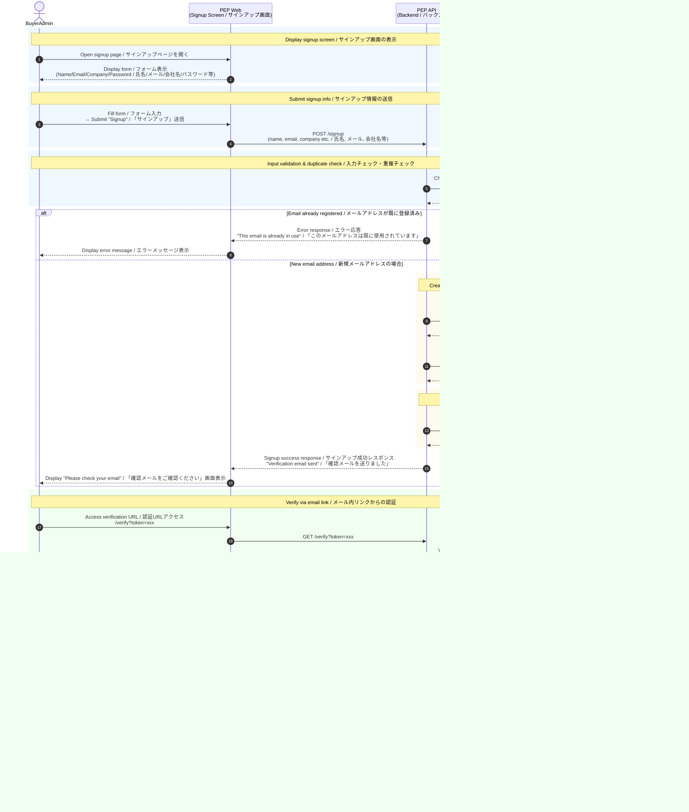

# UC01: Buyer Organization Registration / Buyer組織アカウント登録

```mermaid
sequenceDiagram
    autonumber
    actor BA as BuyerAdmin
    participant Web as PEP Web<br/>(Signup Screen / サインアップ画面)
    participant API as PEP API<br/>(Backend / バックエンド)
    participant DB as PEP DB
    participant Mail as Email Service<br/>(SendGrid etc.)

    rect rgb(240, 248, 255)
        Note over BA, Mail: Display signup screen / サインアップ画面の表示
        BA->>Web: Open signup page / サインアップページを開く
        Web-->>BA: Display form / フォーム表示<br/>(Name/Email/Company/Password / 氏名/メール/会社名/パスワード等)
    end

    rect rgb(240, 248, 255)
        Note over BA, Mail: Submit signup info / サインアップ情報の送信
        BA->>Web: Fill form / フォーム入力<br/>→ Submit "Signup" / 「サインアップ」送信
        Web->>API: POST /signup<br/>(name, email, company etc. / 氏名, メール, 会社名等)
    end

    rect rgb(240, 248, 255)
        Note over BA, Mail: Input validation & duplicate check / 入力チェック・重複チェック
        API->>DB: Check email duplicate / メールアドレス重複確認<br/>+ Check existing org / 既存組織の有無
        DB-->>API: Return result / 結果返却
    end

    alt Email already registered / メールアドレスが既に登録済み
        API-->>Web: Error response / エラー応答<br/>"This email is already in use" / 「このメールアドレスは既に使用されています」
        Web-->>BA: Display error message / エラーメッセージ表示
    else New email address / 新規メールアドレスの場合
        rect rgb(255, 250, 240)
            Note over API, DB: Create provisional org & user / 組織・ユーザの仮作成
            API->>DB: Create org record / 組織レコード作成<br/>(org_type=Buyer,<br/>org_status=Pending,<br/>billing_status=Unsubscribed)
            DB-->>API: Creation complete / 作成完了

            API->>DB: Create user record / ユーザレコード作成<br/>(role=Buyer Admin,<br/>user_status=PendingVerification,<br/>org_id=created org / 作成した組織)
            DB-->>API: Creation complete / 作成完了
        end

        rect rgb(255, 250, 240)
            Note over API, Mail: Send verification email / 認証メールの発行
            API->>Mail: Request verification email / 認証メール送信依頼<br/>(to=BA email / 宛先=BAメール,<br/>URL=verify?token=xxx)
            Mail-->>API: Send complete / 送信完了
        end

        API-->>Web: Signup success response / サインアップ成功レスポンス<br/>"Verification email sent" / 「確認メールを送りました」
        Web-->>BA: Display "Please check your email" / 「確認メールをご確認ください」画面表示
    end

    rect rgb(240, 255, 240)
        Note over BA, Mail: Verify via email link / メール内リンクからの認証
        BA->>Web: Access verification URL / 認証URLアクセス<br/>/verify?token=xxx
        Web->>API: GET /verify?token=xxx

        API->>DB: Validate verification token / 認証トークン検証<br/>(Check expiry & unused / 有効期限・未使用確認)
        DB-->>API: Validation result / 検証結果
    end

    alt Token invalid or expired / トークン無効 or 期限切れ
        API-->>Web: Error response / エラー応答<br/>"Verification link is invalid" / 「認証リンクが無効です」
        Web-->>BA: Display error message / エラーメッセージ表示
    else Token valid / トークン有効
        rect rgb(240, 255, 240)
            Note over API, DB: Activate account & org / アカウント・組織の有効化
            API->>DB: Update user status / ユーザステータス更新<br/>(user_status=Active)
            DB-->>API: Update complete / 更新完了

            API->>DB: Update org status / 組織ステータス更新<br/>(org_status=Active)
            DB-->>API: Update complete / 更新完了
        end

        API-->>Web: Verification success response / 認証成功レスポンス
        Web-->>BA: Display "Registration complete" / 「アカウント登録が完了しました」表示<br/>+ Navigate to login/payment / ログイン/決済への導線
    end
```
