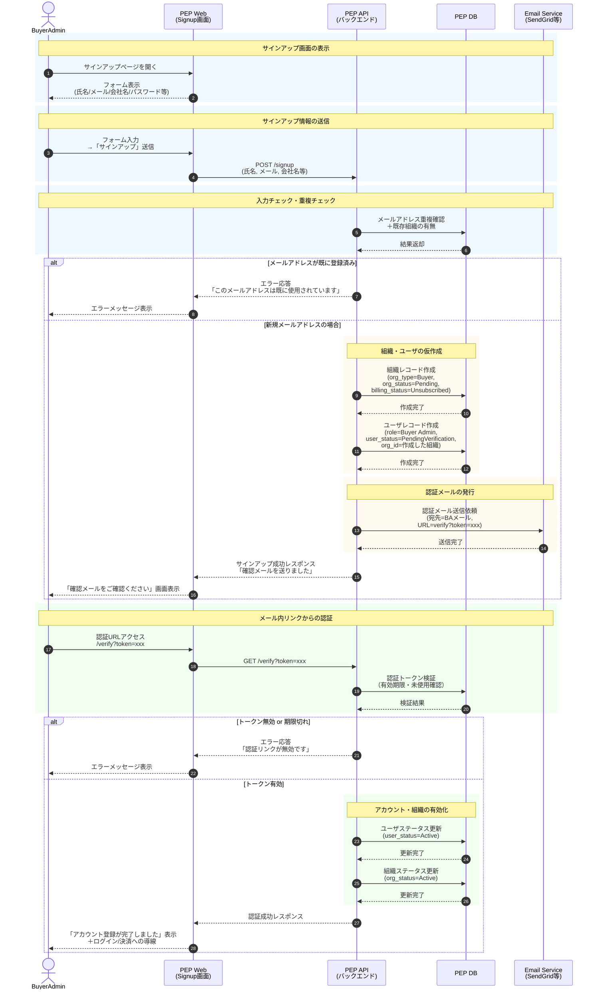

# UC01: Buyer組織アカウント登録

```mermaid
sequenceDiagram
    autonumber
    actor BA as BuyerAdmin
    participant Web as PEP Web<br/>(Signup画面)
    participant API as PEP API<br/>(バックエンド)
    participant DB as PEP DB
    participant Mail as Email Service<br/>(SendGrid等)

    rect rgb(240, 248, 255)
        Note over BA, Mail: サインアップ画面の表示
        BA->>Web: サインアップページを開く
        Web-->>BA: フォーム表示<br/>(氏名/メール/会社名/パスワード等)
    end

    rect rgb(240, 248, 255)
        Note over BA, Mail: サインアップ情報の送信
        BA->>Web: フォーム入力<br/>→「サインアップ」送信
        Web->>API: POST /signup<br/>(氏名, メール, 会社名等)
    end

    rect rgb(240, 248, 255)
        Note over BA, Mail: 入力チェック・重複チェック
        API->>DB: メールアドレス重複確認<br/>＋既存組織の有無
        DB-->>API: 結果返却
    end

    alt メールアドレスが既に登録済み
        API-->>Web: エラー応答<br/>「このメールアドレスは既に使用されています」
        Web-->>BA: エラーメッセージ表示
    else 新規メールアドレスの場合
        rect rgb(255, 250, 240)
            Note over API, DB: 組織・ユーザの仮作成
            API->>DB: 組織レコード作成<br/>(org_type=Buyer,<br/>org_status=Pending,<br/>billing_status=Unsubscribed)
            DB-->>API: 作成完了

            API->>DB: ユーザレコード作成<br/>(role=Buyer Admin,<br/>user_status=PendingVerification,<br/>org_id=作成した組織)
            DB-->>API: 作成完了
        end

        rect rgb(255, 250, 240)
            Note over API, Mail: 認証メールの発行
            API->>Mail: 認証メール送信依頼<br/>(宛先=BAメール,<br/>URL=verify?token=xxx)
            Mail-->>API: 送信完了
        end

        API-->>Web: サインアップ成功レスポンス<br/>「確認メールを送りました」
        Web-->>BA: 「確認メールをご確認ください」画面表示
    end

    rect rgb(240, 255, 240)
        Note over BA, Mail: メール内リンクからの認証
        BA->>Web: 認証URLアクセス<br/>/verify?token=xxx
        Web->>API: GET /verify?token=xxx

        API->>DB: 認証トークン検証<br/>（有効期限・未使用確認）
        DB-->>API: 検証結果
    end

    alt トークン無効 or 期限切れ
        API-->>Web: エラー応答<br/>「認証リンクが無効です」
        Web-->>BA: エラーメッセージ表示
    else トークン有効
        rect rgb(240, 255, 240)
            Note over API, DB: アカウント・組織の有効化
            API->>DB: ユーザステータス更新<br/>(user_status=Active)
            DB-->>API: 更新完了

            API->>DB: 組織ステータス更新<br/>(org_status=Active)
            DB-->>API: 更新完了
        end

        API-->>Web: 認証成功レスポンス
        Web-->>BA: 「アカウント登録が完了しました」表示<br/>＋ログイン/決済への導線
    end
```
