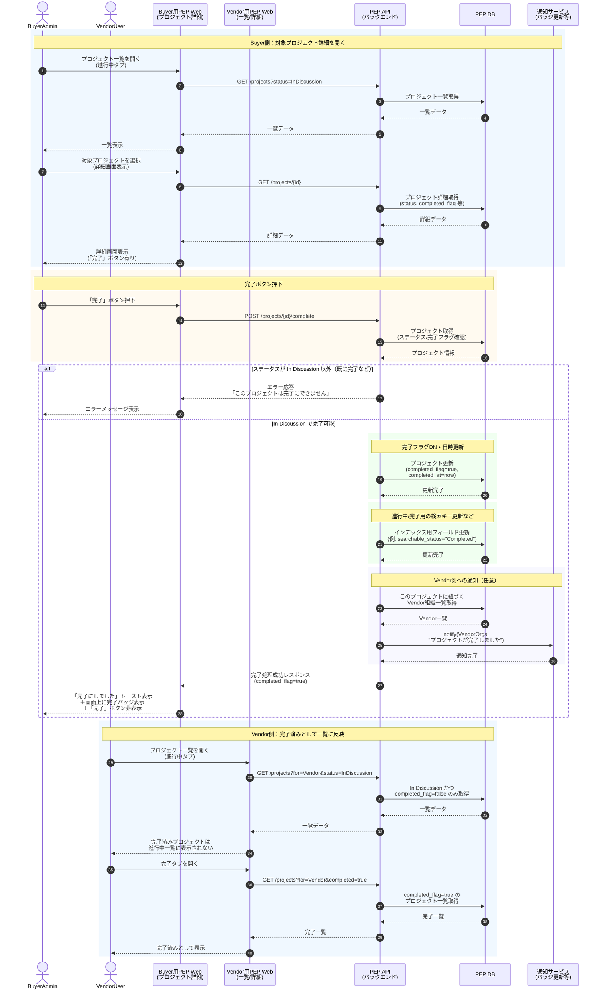

# UC10: プロジェクトの完了（In Discussion + 完了フラグON）

```mermaid
sequenceDiagram
    autonumber
    actor BA as BuyerAdmin
    actor VU as VendorUser
    participant BWeb as Buyer用PEP Web<br/>(プロジェクト詳細)
    participant VWeb as Vendor用PEP Web<br/>(一覧/詳細)
    participant API as PEP API<br/>(バックエンド)
    participant DB as PEP DB
    participant Notif as 通知サービス<br/>(バッジ更新等)

    rect rgb(240, 248, 255)
        Note over BA, Notif: Buyer側：対象プロジェクト詳細を開く
        BA->>BWeb: プロジェクト一覧を開く<br/>(進行中タブ)
        BWeb->>API: GET /projects?status=InDiscussion
        API->>DB: プロジェクト一覧取得
        DB-->>API: 一覧データ
        API-->>BWeb: 一覧データ
        BWeb-->>BA: 一覧表示

        BA->>BWeb: 対象プロジェクトを選択<br/>(詳細画面表示)
        BWeb->>API: GET /projects/{id}
        API->>DB: プロジェクト詳細取得<br/>(status, completed_flag 等)
        DB-->>API: 詳細データ
        API-->>BWeb: 詳細データ
        BWeb-->>BA: 詳細画面表示<br/>(「完了」ボタン有り)
    end

    rect rgb(255, 250, 240)
        Note over BA, DB: 完了ボタン押下
        BA->>BWeb: 「完了」ボタン押下
        BWeb->>API: POST /projects/{id}/complete

        API->>DB: プロジェクト取得<br/>(ステータス/完了フラグ確認)
        DB-->>API: プロジェクト情報
    end

    alt ステータスが In Discussion 以外（既に完了など）
        API-->>BWeb: エラー応答<br/>「このプロジェクトは完了にできません」
        BWeb-->>BA: エラーメッセージ表示
    else In Discussion で完了可能
        rect rgb(240, 255, 240)
            Note over API, DB: 完了フラグON・日時更新
            API->>DB: プロジェクト更新<br/>(completed_flag=true,<br/>completed_at=now)
            DB-->>API: 更新完了
        end

        rect rgb(240, 255, 240)
            Note over API, DB: 進行中/完了用の検索キー更新など
            API->>DB: インデックス用フィールド更新<br/>(例: searchable_status="Completed")
            DB-->>API: 更新完了
        end

        rect rgb(248, 248, 255)
            Note over API, Notif: Vendor側への通知（任意）
            API->>DB: このプロジェクトに紐づく<br/>Vendor組織一覧取得
            DB-->>API: Vendor一覧

            API->>Notif: notify(VendorOrgs,<br/>"プロジェクトが完了しました")
            Notif-->>API: 通知完了
        end

        API-->>BWeb: 完了処理成功レスポンス<br/>(completed_flag=true)
        BWeb-->>BA: 「完了にしました」トースト表示<br/>＋画面上に完了バッジ表示<br/>＋「完了」ボタン非表示
    end

    rect rgb(240, 248, 255)
        Note over VU, DB: Vendor側：完了済みとして一覧に反映
        VU->>VWeb: プロジェクト一覧を開く<br/>(進行中タブ)
        VWeb->>API: GET /projects?for=Vendor&status=InDiscussion
        API->>DB: In Discussion かつ<br/>completed_flag=false のみ取得
        DB-->>API: 一覧データ
        API-->>VWeb: 一覧データ
        VWeb-->>VU: 完了済みプロジェクトは<br/>進行中一覧に表示されない

        VU->>VWeb: 完了タブを開く
        VWeb->>API: GET /projects?for=Vendor&completed=true
        API->>DB: completed_flag=true の<br/>プロジェクト一覧取得
        DB-->>API: 完了一覧
        API-->>VWeb: 完了一覧
        VWeb-->>VU: 完了済みとして表示
    end
```
