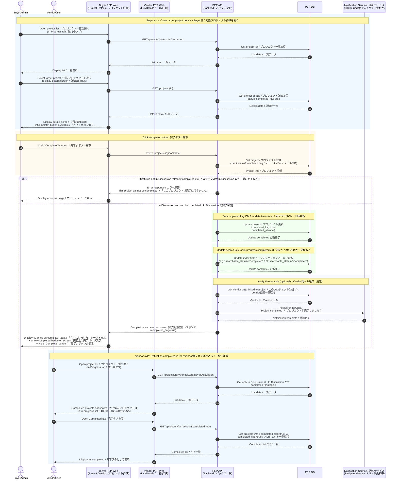

# UC10: Project Completion / プロジェクトの完了（In Discussion + 完了フラグON）

```mermaid
sequenceDiagram
    autonumber
    actor BA as BuyerAdmin
    actor VU as VendorUser
    participant BWeb as Buyer PEP Web<br/>(Project Details / プロジェクト詳細)
    participant VWeb as Vendor PEP Web<br/>(List/Details / 一覧/詳細)
    participant API as PEP API<br/>(Backend / バックエンド)
    participant DB as PEP DB
    participant Notif as Notification Service / 通知サービス<br/>(Badge update etc. / バッジ更新等)

    rect rgb(240, 248, 255)
        Note over BA, Notif: Buyer side: Open target project details / Buyer側：対象プロジェクト詳細を開く
        BA->>BWeb: Open project list / プロジェクト一覧を開く<br/>(In Progress tab / 進行中タブ)
        BWeb->>API: GET /projects?status=InDiscussion
        API->>DB: Get project list / プロジェクト一覧取得
        DB-->>API: List data / 一覧データ
        API-->>BWeb: List data / 一覧データ
        BWeb-->>BA: Display list / 一覧表示

        BA->>BWeb: Select target project / 対象プロジェクトを選択<br/>(display details screen / 詳細画面表示)
        BWeb->>API: GET /projects/{id}
        API->>DB: Get project details / プロジェクト詳細取得<br/>(status, completed_flag etc.)
        DB-->>API: Details data / 詳細データ
        API-->>BWeb: Details data / 詳細データ
        BWeb-->>BA: Display details screen / 詳細画面表示<br/>("Complete" button available / 「完了」ボタン有り)
    end

    rect rgb(255, 250, 240)
        Note over BA, DB: Click complete button / 完了ボタン押下
        BA->>BWeb: Click "Complete" button / 「完了」ボタン押下
        BWeb->>API: POST /projects/{id}/complete

        API->>DB: Get project / プロジェクト取得<br/>(check status/completed flag / ステータス/完了フラグ確認)
        DB-->>API: Project info / プロジェクト情報
    end

    alt Status is not In Discussion (already completed etc.) / ステータスが In Discussion 以外（既に完了など）
        API-->>BWeb: Error response / エラー応答<br/>"This project cannot be completed" / 「このプロジェクトは完了にできません」
        BWeb-->>BA: Display error message / エラーメッセージ表示
    else In Discussion and can be completed / In Discussion で完了可能
        rect rgb(240, 255, 240)
            Note over API, DB: Set completed flag ON & update timestamp / 完了フラグON・日時更新
            API->>DB: Update project / プロジェクト更新<br/>(completed_flag=true,<br/>completed_at=now)
            DB-->>API: Update complete / 更新完了
        end

        rect rgb(240, 255, 240)
            Note over API, DB: Update search key for in-progress/completed / 進行中/完了用の検索キー更新など
            API->>DB: Update index field / インデックス用フィールド更新<br/>(e.g.: searchable_status="Completed" / 例: searchable_status="Completed")
            DB-->>API: Update complete / 更新完了
        end

        rect rgb(248, 248, 255)
            Note over API, Notif: Notify Vendor side (optional) / Vendor側への通知（任意）
            API->>DB: Get Vendor orgs linked to project / このプロジェクトに紐づく<br/>Vendor組織一覧取得
            DB-->>API: Vendor list / Vendor一覧

            API->>Notif: notify(VendorOrgs,<br/>"Project completed" / "プロジェクトが完了しました")
            Notif-->>API: Notification complete / 通知完了
        end

        API-->>BWeb: Completion success response / 完了処理成功レスポンス<br/>(completed_flag=true)
        BWeb-->>BA: Display "Marked as complete" toast / 「完了にしました」トースト表示<br/>+ Show completed badge on screen / 画面上に完了バッジ表示<br/>+ Hide "Complete" button / 「完了」ボタン非表示
    end

    rect rgb(240, 248, 255)
        Note over VU, DB: Vendor side: Reflect as completed in list / Vendor側：完了済みとして一覧に反映
        VU->>VWeb: Open project list / プロジェクト一覧を開く<br/>(In Progress tab / 進行中タブ)
        VWeb->>API: GET /projects?for=Vendor&status=InDiscussion
        API->>DB: Get only In Discussion & / In Discussion かつ<br/>completed_flag=false
        DB-->>API: List data / 一覧データ
        API-->>VWeb: List data / 一覧データ
        VWeb-->>VU: Completed projects not shown / 完了済みプロジェクトは<br/>in in-progress list / 進行中一覧に表示されない

        VU->>VWeb: Open Completed tab / 完了タブを開く
        VWeb->>API: GET /projects?for=Vendor&completed=true
        API->>DB: Get projects with / completed_flag=true の<br/>completed_flag=true / プロジェクト一覧取得
        DB-->>API: Completed list / 完了一覧
        API-->>VWeb: Completed list / 完了一覧
        VWeb-->>VU: Display as completed / 完了済みとして表示
    end
```
