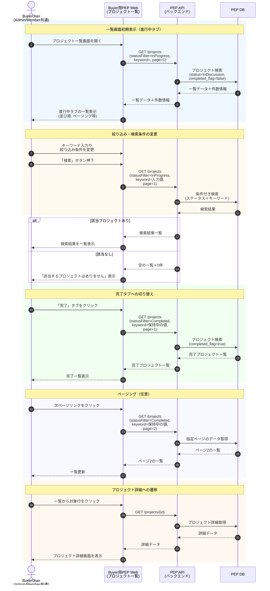

# UC11: プロジェクト一覧・検索（進行中／完了）

```mermaid
sequenceDiagram
    autonumber
    actor BU as BuyerUser<br/>(Admin/Member共通)
    participant BWeb as Buyer用PEP Web<br/>(プロジェクト一覧)
    participant API as PEP API<br/>(バックエンド)
    participant DB as PEP DB

    rect rgb(240, 248, 255)
        Note over BU, DB: 一覧画面初期表示（進行中タブ）
        BU->>BWeb: プロジェクト一覧画面を開く
        BWeb->>API: GET /projects<br/>(statusFilter=InProgress,<br/>keyword=, page=1)
        API->>DB: プロジェクト検索<br/>(status=InDiscussion,<br/>completed_flag=false)
        DB-->>API: 一覧データ＋件数情報
        API-->>BWeb: 一覧データ＋件数情報
        BWeb-->>BU: 進行中タブの一覧表示<br/>(並び順, ページング等)
    end

    rect rgb(255, 250, 240)
        Note over BU, DB: 絞り込み・検索条件の変更
        BU->>BWeb: キーワード入力や<br/>絞り込み条件を変更
        BU->>BWeb: 「検索」ボタン押下
        BWeb->>API: GET /projects<br/>(statusFilter=InProgress,<br/>keyword=入力値,<br/>page=1)
        API->>DB: 条件付き検索<br/>(ステータス＋キーワード)
        DB-->>API: 検索結果
    end

    alt 該当プロジェクトあり
        API-->>BWeb: 検索結果一覧
        BWeb-->>BU: 検索結果を一覧表示
    else 該当なし
        API-->>BWeb: 空の一覧＋0件
        BWeb-->>BU: 「該当するプロジェクトはありません」表示
    end

    rect rgb(240, 255, 240)
        Note over BU, DB: 完了タブへの切り替え
        BU->>BWeb: 「完了」タブをクリック
        BWeb->>API: GET /projects<br/>(statusFilter=Completed,<br/>keyword=保持中の値,<br/>page=1)
        API->>DB: プロジェクト検索<br/>(completed_flag=true)
        DB-->>API: 完了プロジェクト一覧
        API-->>BWeb: 完了プロジェクト一覧
        BWeb-->>BU: 完了一覧表示
    end

    rect rgb(248, 248, 255)
        Note over BU, DB: ページング（任意）
        BU->>BWeb: 次ページリンクをクリック
        BWeb->>API: GET /projects<br/>(statusFilter=Completed,<br/>keyword=保持中の値,<br/>page=2)
        API->>DB: 指定ページのデータ取得
        DB-->>API: ページ2の一覧
        API-->>BWeb: ページ2の一覧
        BWeb-->>BU: 一覧更新
    end

    rect rgb(255, 248, 240)
        Note over BU, DB: プロジェクト詳細への遷移
        BU->>BWeb: 一覧から対象行をクリック
        BWeb->>API: GET /projects/{id}
        API->>DB: プロジェクト詳細取得
        DB-->>API: 詳細データ
        API-->>BWeb: 詳細データ
        BWeb-->>BU: プロジェクト詳細画面を表示
    end
```
