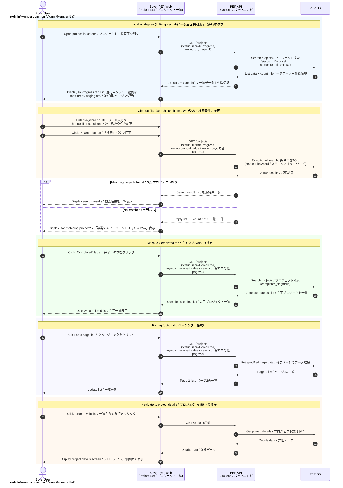

# UC11: Project List & Search / プロジェクト一覧・検索（進行中／完了）

```mermaid
sequenceDiagram
    autonumber
    actor BU as BuyerUser<br/>(Admin/Member common / Admin/Member共通)
    participant BWeb as Buyer PEP Web<br/>(Project List / プロジェクト一覧)
    participant API as PEP API<br/>(Backend / バックエンド)
    participant DB as PEP DB

    rect rgb(240, 248, 255)
        Note over BU, DB: Initial list display (In Progress tab) / 一覧画面初期表示（進行中タブ）
        BU->>BWeb: Open project list screen / プロジェクト一覧画面を開く
        BWeb->>API: GET /projects<br/>(statusFilter=InProgress,<br/>keyword=, page=1)
        API->>DB: Search projects / プロジェクト検索<br/>(status=InDiscussion,<br/>completed_flag=false)
        DB-->>API: List data + count info / 一覧データ＋件数情報
        API-->>BWeb: List data + count info / 一覧データ＋件数情報
        BWeb-->>BU: Display In Progress tab list / 進行中タブの一覧表示<br/>(sort order, paging etc. / 並び順, ページング等)
    end

    rect rgb(255, 250, 240)
        Note over BU, DB: Change filter/search conditions / 絞り込み・検索条件の変更
        BU->>BWeb: Enter keyword or / キーワード入力や<br/>change filter conditions / 絞り込み条件を変更
        BU->>BWeb: Click "Search" button / 「検索」ボタン押下
        BWeb->>API: GET /projects<br/>(statusFilter=InProgress,<br/>keyword=input value / keyword=入力値,<br/>page=1)
        API->>DB: Conditional search / 条件付き検索<br/>(status + keyword / ステータス＋キーワード)
        DB-->>API: Search results / 検索結果
    end

    alt Matching projects found / 該当プロジェクトあり
        API-->>BWeb: Search result list / 検索結果一覧
        BWeb-->>BU: Display search results / 検索結果を一覧表示
    else No matches / 該当なし
        API-->>BWeb: Empty list + 0 count / 空の一覧＋0件
        BWeb-->>BU: Display "No matching projects" / 「該当するプロジェクトはありません」表示
    end

    rect rgb(240, 255, 240)
        Note over BU, DB: Switch to Completed tab / 完了タブへの切り替え
        BU->>BWeb: Click "Completed" tab / 「完了」タブをクリック
        BWeb->>API: GET /projects<br/>(statusFilter=Completed,<br/>keyword=retained value / keyword=保持中の値,<br/>page=1)
        API->>DB: Search projects / プロジェクト検索<br/>(completed_flag=true)
        DB-->>API: Completed project list / 完了プロジェクト一覧
        API-->>BWeb: Completed project list / 完了プロジェクト一覧
        BWeb-->>BU: Display completed list / 完了一覧表示
    end

    rect rgb(248, 248, 255)
        Note over BU, DB: Paging (optional) / ページング（任意）
        BU->>BWeb: Click next page link / 次ページリンクをクリック
        BWeb->>API: GET /projects<br/>(statusFilter=Completed,<br/>keyword=retained value / keyword=保持中の値,<br/>page=2)
        API->>DB: Get specified page data / 指定ページのデータ取得
        DB-->>API: Page 2 list / ページ2の一覧
        API-->>BWeb: Page 2 list / ページ2の一覧
        BWeb-->>BU: Update list / 一覧更新
    end

    rect rgb(255, 248, 240)
        Note over BU, DB: Navigate to project details / プロジェクト詳細への遷移
        BU->>BWeb: Click target row in list / 一覧から対象行をクリック
        BWeb->>API: GET /projects/{id}
        API->>DB: Get project details / プロジェクト詳細取得
        DB-->>API: Details data / 詳細データ
        API-->>BWeb: Details data / 詳細データ
        BWeb-->>BU: Display project details screen / プロジェクト詳細画面を表示
    end
```
