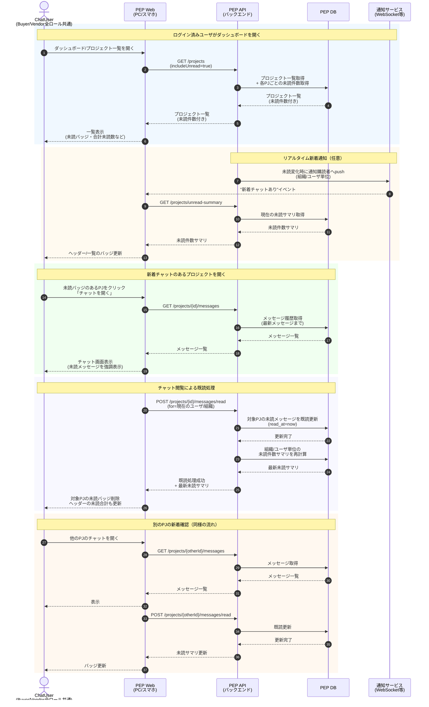

# UC12: チャット新着の確認（PC／スマホ）

```mermaid
sequenceDiagram
    autonumber
    actor U as ChatUser<br/>(Buyer/Vendor全ロール共通)
    participant Web as PEP Web<br/>(PC/スマホ)
    participant API as PEP API<br/>(バックエンド)
    participant DB as PEP DB
    participant Notif as 通知サービス<br/>(WebSocket等)

    rect rgb(240, 248, 255)
        Note over U, Notif: ログイン済みユーザがダッシュボードを開く
        U->>Web: ダッシュボード/プロジェクト一覧を開く
        Web->>API: GET /projects<br/>(includeUnread=true)
        API->>DB: プロジェクト一覧取得<br/>+ 各PJごとの未読件数取得
        DB-->>API: プロジェクト一覧<br/>(未読件数付き)
        API-->>Web: プロジェクト一覧<br/>(未読件数付き)
        Web-->>U: 一覧表示<br/>(未読バッジ・合計未読数など)
    end

    rect rgb(255, 250, 240)
        Note over API, Notif: リアルタイム新着通知（任意）
        API->>Notif: 未読変化時に通知購読者へpush<br/>(組織/ユーザ単位)
        Notif-->>Web: "新着チャットあり"イベント
        Web->>API: GET /projects/unread-summary
        API->>DB: 現在の未読サマリ取得
        DB-->>API: 未読件数サマリ
        API-->>Web: 未読件数サマリ
        Web-->>U: ヘッダー/一覧のバッジ更新
    end

    rect rgb(240, 255, 240)
        Note over U, DB: 新着チャットのあるプロジェクトを開く
        U->>Web: 未読バッジのあるPJをクリック<br/>「チャットを開く」
        Web->>API: GET /projects/{id}/messages
        API->>DB: メッセージ履歴取得<br/>(最新メッセージまで)
        DB-->>API: メッセージ一覧
        API-->>Web: メッセージ一覧
        Web-->>U: チャット画面表示<br/>(未読メッセージを強調表示)
    end

    rect rgb(248, 248, 255)
        Note over U, DB: チャット閲覧による既読処理
        Web->>API: POST /projects/{id}/messages/read<br/>(for=現在のユーザ/組織)
        API->>DB: 対象PJの未読メッセージを既読更新<br/>(read_at=now)
        DB-->>API: 更新完了

        API->>DB: 組織/ユーザ単位の<br/>未読件数サマリを再計算
        DB-->>API: 最新未読サマリ
        API-->>Web: 既読処理成功<br/>+ 最新未読サマリ
        Web-->>U: 対象PJの未読バッジ削除<br/>ヘッダーの未読合計も更新
    end

    rect rgb(255, 248, 240)
        Note over U, DB: 別のPJの新着確認（同様の流れ）
        U->>Web: 他のPJのチャットを開く
        Web->>API: GET /projects/{otherId}/messages
        API->>DB: メッセージ取得
        DB-->>API: メッセージ一覧
        API-->>Web: メッセージ一覧
        Web-->>U: 表示
        Web->>API: POST /projects/{otherId}/messages/read
        API->>DB: 既読更新
        DB-->>API: 更新完了
        API-->>Web: 未読サマリ更新
        Web-->>U: バッジ更新
    end
```
