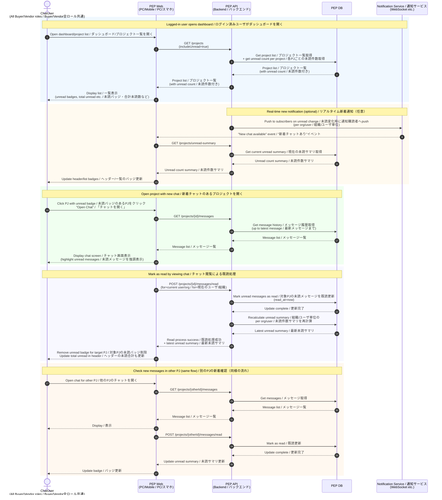

# UC12: New Chat Notification Check / チャット新着の確認（PC／スマホ）

```mermaid
sequenceDiagram
    autonumber
    actor U as ChatUser<br/>(All Buyer/Vendor roles / Buyer/Vendor全ロール共通)
    participant Web as PEP Web<br/>(PC/Mobile / PC/スマホ)
    participant API as PEP API<br/>(Backend / バックエンド)
    participant DB as PEP DB
    participant Notif as Notification Service / 通知サービス<br/>(WebSocket etc.)

    rect rgb(240, 248, 255)
        Note over U, Notif: Logged-in user opens dashboard / ログイン済みユーザがダッシュボードを開く
        U->>Web: Open dashboard/project list / ダッシュボード/プロジェクト一覧を開く
        Web->>API: GET /projects<br/>(includeUnread=true)
        API->>DB: Get project list / プロジェクト一覧取得<br/>+ get unread count per project / 各PJごとの未読件数取得
        DB-->>API: Project list / プロジェクト一覧<br/>(with unread count / 未読件数付き)
        API-->>Web: Project list / プロジェクト一覧<br/>(with unread count / 未読件数付き)
        Web-->>U: Display list / 一覧表示<br/>(unread badges, total unread etc. / 未読バッジ・合計未読数など)
    end

    rect rgb(255, 250, 240)
        Note over API, Notif: Real-time new notification (optional) / リアルタイム新着通知（任意）
        API->>Notif: Push to subscribers on unread change / 未読変化時に通知購読者へpush<br/>(per org/user / 組織/ユーザ単位)
        Notif-->>Web: "New chat available" event / "新着チャットあり"イベント
        Web->>API: GET /projects/unread-summary
        API->>DB: Get current unread summary / 現在の未読サマリ取得
        DB-->>API: Unread count summary / 未読件数サマリ
        API-->>Web: Unread count summary / 未読件数サマリ
        Web-->>U: Update header/list badges / ヘッダー/一覧のバッジ更新
    end

    rect rgb(240, 255, 240)
        Note over U, DB: Open project with new chat / 新着チャットのあるプロジェクトを開く
        U->>Web: Click PJ with unread badge / 未読バッジのあるPJをクリック<br/>"Open Chat" / 「チャットを開く」
        Web->>API: GET /projects/{id}/messages
        API->>DB: Get message history / メッセージ履歴取得<br/>(up to latest message / 最新メッセージまで)
        DB-->>API: Message list / メッセージ一覧
        API-->>Web: Message list / メッセージ一覧
        Web-->>U: Display chat screen / チャット画面表示<br/>(highlight unread messages / 未読メッセージを強調表示)
    end

    rect rgb(248, 248, 255)
        Note over U, DB: Mark as read by viewing chat / チャット閲覧による既読処理
        Web->>API: POST /projects/{id}/messages/read<br/>(for=current user/org / for=現在のユーザ/組織)
        API->>DB: Mark unread messages as read / 対象PJの未読メッセージを既読更新<br/>(read_at=now)
        DB-->>API: Update complete / 更新完了

        API->>DB: Recalculate unread summary / 組織/ユーザ単位の<br/>per org/user / 未読件数サマリを再計算
        DB-->>API: Latest unread summary / 最新未読サマリ
        API-->>Web: Read process success / 既読処理成功<br/>+ latest unread summary / 最新未読サマリ
        Web-->>U: Remove unread badge for target PJ / 対象PJの未読バッジ削除<br/>Update total unread in header / ヘッダーの未読合計も更新
    end

    rect rgb(255, 248, 240)
        Note over U, DB: Check new messages in other PJ (same flow) / 別のPJの新着確認（同様の流れ）
        U->>Web: Open chat for other PJ / 他のPJのチャットを開く
        Web->>API: GET /projects/{otherId}/messages
        API->>DB: Get messages / メッセージ取得
        DB-->>API: Message list / メッセージ一覧
        API-->>Web: Message list / メッセージ一覧
        Web-->>U: Display / 表示
        Web->>API: POST /projects/{otherId}/messages/read
        API->>DB: Mark as read / 既読更新
        DB-->>API: Update complete / 更新完了
        API-->>Web: Update unread summary / 未読サマリ更新
        Web-->>U: Update badge / バッジ更新
    end
```
