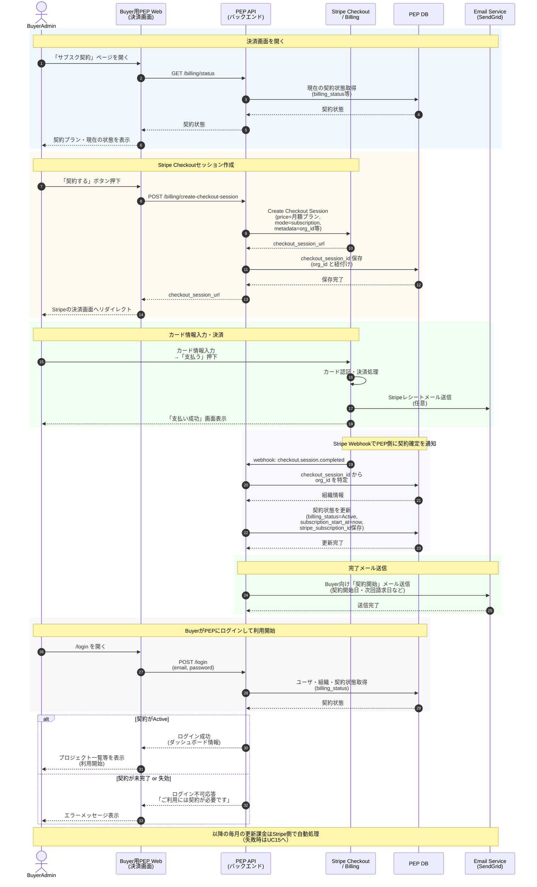

# UC13: Buyerサブスク決済（Stripe）

```mermaid
sequenceDiagram
    autonumber
    actor BA as BuyerAdmin
    participant BWeb as Buyer用PEP Web<br/>(決済画面)
    participant API as PEP API<br/>(バックエンド)
    participant Stripe as Stripe Checkout<br/>/ Billing
    participant DB as PEP DB
    participant Mail as Email Service<br/>(SendGrid)

    rect rgb(240, 248, 255)
        Note over BA, Mail: 決済画面を開く
        BA->>BWeb: 「サブスク契約」ページを開く
        BWeb->>API: GET /billing/status
        API->>DB: 現在の契約状態取得<br/>(billing_status等)
        DB-->>API: 契約状態
        API-->>BWeb: 契約状態
        BWeb-->>BA: 契約プラン・現在の状態を表示
    end

    rect rgb(255, 250, 240)
        Note over BA, Stripe: Stripe Checkoutセッション作成
        BA->>BWeb: 「契約する」ボタン押下
        BWeb->>API: POST /billing/create-checkout-session

        API->>Stripe: Create Checkout Session<br/>(price=月額プラン,<br/>mode=subscription,<br/>metadata=org_id等)
        Stripe-->>API: checkout_session_url

        API->>DB: checkout_session_id 保存<br/>(org_id と紐付け)
        DB-->>API: 保存完了

        API-->>BWeb: checkout_session_url
        BWeb-->>BA: Stripeの決済画面へリダイレクト
    end

    rect rgb(240, 255, 240)
        Note over BA, Stripe: カード情報入力・決済
        BA->>Stripe: カード情報入力<br/>→「支払う」押下
        Stripe->>Stripe: カード認証・決済処理
        Stripe->>Mail: Stripeレシートメール送信<br/>(任意)
        Stripe-->>BA: 「支払い成功」画面表示
    end

    rect rgb(248, 248, 255)
        Note over Stripe, DB: Stripe WebhookでPEP側に契約確定を通知
        Stripe->>API: webhook: checkout.session.completed
        API->>DB: checkout_session_id から<br/>org_id を特定
        DB-->>API: 組織情報

        API->>DB: 契約状態を更新<br/>(billing_status=Active,<br/>subscription_start_at=now,<br/>stripe_subscription_id保存)
        DB-->>API: 更新完了
    end

    rect rgb(240, 255, 240)
        Note over API, Mail: 完了メール送信
        API->>Mail: Buyer向け「契約開始」メール送信<br/>(契約開始日・次回請求日など)
        Mail-->>API: 送信完了
    end

    rect rgb(248, 248, 248)
        Note over BA, DB: BuyerがPEPにログインして利用開始
        BA->>BWeb: /login を開く
        BWeb->>API: POST /login<br/>(email, password)
        API->>DB: ユーザ・組織・契約状態取得<br/>(billing_status)
        DB-->>API: 契約状態
    end

    alt 契約がActive
        API-->>BWeb: ログイン成功<br/>(ダッシュボード情報)
        BWeb-->>BA: プロジェクト一覧等を表示<br/>(利用開始)
    else 契約が未完了 or 失効
        API-->>BWeb: ログイン不可応答<br/>「ご利用には契約が必要です」
        BWeb-->>BA: エラーメッセージ表示
    end

    Note over BA, Mail: 以降の毎月の更新課金はStripe側で自動処理<br/>（失敗時はUC15へ）
```
