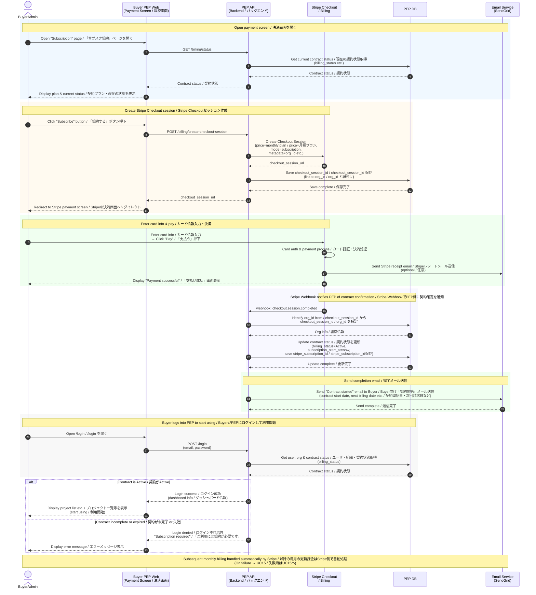

# UC13: Buyer Subscription Payment (Stripe) / Buyerサブスク決済（Stripe）

```mermaid
sequenceDiagram
    autonumber
    actor BA as BuyerAdmin
    participant BWeb as Buyer PEP Web<br/>(Payment Screen / 決済画面)
    participant API as PEP API<br/>(Backend / バックエンド)
    participant Stripe as Stripe Checkout<br/>/ Billing
    participant DB as PEP DB
    participant Mail as Email Service<br/>(SendGrid)

    rect rgb(240, 248, 255)
        Note over BA, Mail: Open payment screen / 決済画面を開く
        BA->>BWeb: Open "Subscription" page / 「サブスク契約」ページを開く
        BWeb->>API: GET /billing/status
        API->>DB: Get current contract status / 現在の契約状態取得<br/>(billing_status etc.)
        DB-->>API: Contract status / 契約状態
        API-->>BWeb: Contract status / 契約状態
        BWeb-->>BA: Display plan & current status / 契約プラン・現在の状態を表示
    end

    rect rgb(255, 250, 240)
        Note over BA, Stripe: Create Stripe Checkout session / Stripe Checkoutセッション作成
        BA->>BWeb: Click "Subscribe" button / 「契約する」ボタン押下
        BWeb->>API: POST /billing/create-checkout-session

        API->>Stripe: Create Checkout Session<br/>(price=monthly plan / price=月額プラン,<br/>mode=subscription,<br/>metadata=org_id etc.)
        Stripe-->>API: checkout_session_url

        API->>DB: Save checkout_session_id / checkout_session_id 保存<br/>(link to org_id / org_id と紐付け)
        DB-->>API: Save complete / 保存完了

        API-->>BWeb: checkout_session_url
        BWeb-->>BA: Redirect to Stripe payment screen / Stripeの決済画面へリダイレクト
    end

    rect rgb(240, 255, 240)
        Note over BA, Stripe: Enter card info & pay / カード情報入力・決済
        BA->>Stripe: Enter card info / カード情報入力<br/>→ Click "Pay" / 「支払う」押下
        Stripe->>Stripe: Card auth & payment process / カード認証・決済処理
        Stripe->>Mail: Send Stripe receipt email / Stripeレシートメール送信<br/>(optional / 任意)
        Stripe-->>BA: Display "Payment successful" / 「支払い成功」画面表示
    end

    rect rgb(248, 248, 255)
        Note over Stripe, DB: Stripe Webhook notifies PEP of contract confirmation / Stripe WebhookでPEP側に契約確定を通知
        Stripe->>API: webhook: checkout.session.completed
        API->>DB: Identify org_id from / checkout_session_id から<br/>checkout_session_id / org_id を特定
        DB-->>API: Org info / 組織情報

        API->>DB: Update contract status / 契約状態を更新<br/>(billing_status=Active,<br/>subscription_start_at=now,<br/>save stripe_subscription_id / stripe_subscription_id保存)
        DB-->>API: Update complete / 更新完了
    end

    rect rgb(240, 255, 240)
        Note over API, Mail: Send completion email / 完了メール送信
        API->>Mail: Send "Contract started" email to Buyer / Buyer向け「契約開始」メール送信<br/>(contract start date, next billing date etc. / 契約開始日・次回請求日など)
        Mail-->>API: Send complete / 送信完了
    end

    rect rgb(248, 248, 248)
        Note over BA, DB: Buyer logs into PEP to start using / BuyerがPEPにログインして利用開始
        BA->>BWeb: Open /login / /login を開く
        BWeb->>API: POST /login<br/>(email, password)
        API->>DB: Get user, org & contract status / ユーザ・組織・契約状態取得<br/>(billing_status)
        DB-->>API: Contract status / 契約状態
    end

    alt Contract is Active / 契約がActive
        API-->>BWeb: Login success / ログイン成功<br/>(dashboard info / ダッシュボード情報)
        BWeb-->>BA: Display project list etc. / プロジェクト一覧等を表示<br/>(start using / 利用開始)
    else Contract incomplete or expired / 契約が未完了 or 失効
        API-->>BWeb: Login denied / ログイン不可応答<br/>"Subscription required" / 「ご利用には契約が必要です」
        BWeb-->>BA: Display error message / エラーメッセージ表示
    end

    Note over BA, Mail: Subsequent monthly billing handled automatically by Stripe / 以降の毎月の更新課金はStripe側で自動処理<br/>(On failure → UC15 / 失敗時はUC15へ)
```
