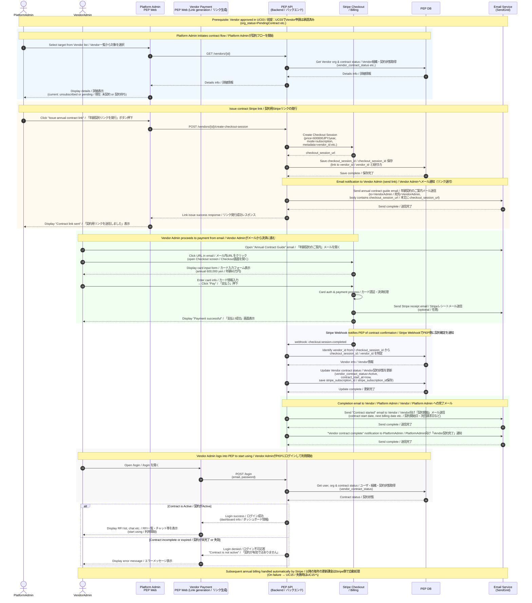

# UC14: Vendor Annual Contract & Billing / Vendor年額契約・請求（Stripe or 請求書PDF）

```mermaid
sequenceDiagram
    autonumber
    actor PA as PlatformAdmin
    actor VA as VendorAdmin
    participant AWeb as Platform Admin<br/>PEP Web
    participant VWeb as Vendor Payment<br/>PEP Web (Link generation / リンク生成)
    participant API as PEP API<br/>(Backend / バックエンド)
    participant Stripe as Stripe Checkout<br/>/ Billing
    participant DB as PEP DB
    participant Mail as Email Service<br/>(SendGrid)

    Note over PA, Mail: Prerequisite: Vendor approved in UC03 / 前提：UC03でVendor申請は承認済み<br/>(org_status=PendingContract etc.)

    rect rgb(240, 248, 255)
        Note over PA, DB: Platform Admin initiates contract flow / Platform Adminが契約フローを開始
        PA->>AWeb: Select target from Vendor list / Vendor一覧から対象を選択
        AWeb->>API: GET /vendors/{id}
        API->>DB: Get Vendor org & contract status / Vendor組織・契約状態取得<br/>(vendor_contract_status etc.)
        DB-->>API: Details info / 詳細情報
        API-->>AWeb: Details info / 詳細情報
        AWeb-->>PA: Display details / 詳細表示<br/>(current: unsubscribed or pending / 現在: 未契約 or 契約待ち)
    end

    rect rgb(255, 250, 240)
        Note over PA, Mail: Issue contract Stripe link / 契約用Stripeリンクの発行
        PA->>AWeb: Click "Issue annual contract link" / 「年額契約リンクを発行」ボタン押下
        AWeb->>API: POST /vendors/{id}/create-checkout-session

        API->>Stripe: Create Checkout Session<br/>(price=600000JPY/year,<br/>mode=subscription,<br/>metadata=vendor_id etc.)
        Stripe-->>API: checkout_session_url
        API->>DB: Save checkout_session_id / checkout_session_id 保存<br/>(link to vendor_id / vendor_id と紐付け)
        DB-->>API: Save complete / 保存完了

        Note over API, Mail: Email notification to Vendor Admin (send link) / Vendor Adminへメール通知（リンク送付）
        API->>Mail: Send annual contract guide email / 年額契約のご案内メール送信<br/>(to=VendorAdmin / 宛先=VendorAdmin,<br/>body contains checkout_session_url / 本文に checkout_session_url)
        Mail-->>API: Send complete / 送信完了

        API-->>AWeb: Link issue success response / リンク発行成功レスポンス
        AWeb-->>PA: Display "Contract link sent" / 「契約用リンクを送信しました」表示
    end

    rect rgb(240, 255, 240)
        Note over VA, Stripe: Vendor Admin proceeds to payment from email / Vendor Adminがメールから決済に進む
        VA->>Mail: Open "Annual Contract Guide" email / 「年額契約のご案内」メールを開く
        VA->>Stripe: Click URL in email / メール内URLをクリック<br/>(open Checkout screen / Checkout画面を開く)
        Stripe-->>VA: Display card input form / カード入力フォーム表示<br/>(annual 600,000 yen / 年額60万円)

        VA->>Stripe: Enter card info / カード情報入力<br/>→ Click "Pay" / 「支払う」押下
        Stripe->>Stripe: Card auth & payment process / カード認証・決済処理
        Stripe->>Mail: Send Stripe receipt email / Stripeレシートメール送信<br/>(optional / 任意)
        Stripe-->>VA: Display "Payment successful" / 「支払い成功」画面表示
    end

    rect rgb(248, 248, 255)
        Note over Stripe, DB: Stripe Webhook notifies PEP of contract confirmation / Stripe WebhookでPEP側に契約確定を通知
        Stripe->>API: webhook: checkout.session.completed
        API->>DB: Identify vendor_id from / checkout_session_id から<br/>checkout_session_id / vendor_id を特定
        DB-->>API: Vendor info / Vendor情報

        API->>DB: Update Vendor contract status / Vendor契約状態を更新<br/>(vendor_contract_status=Active,<br/>contract_start_at=now,<br/>save stripe_subscription_id / stripe_subscription_id保存)
        DB-->>API: Update complete / 更新完了
    end

    rect rgb(240, 255, 240)
        Note over API, Mail: Completion email to Vendor / Platform Admin / Vendor / Platform Admin への完了メール
        API->>Mail: Send "Contract started" email to Vendor / Vendor向け「契約開始」メール送信<br/>(contract start date, next billing date etc. / 契約開始日・次回請求日など)
        Mail-->>API: Send complete / 送信完了

        API->>Mail: "Vendor contract complete" notification to PlatformAdmin / PlatformAdmin向け「Vendor契約完了」通知
        Mail-->>API: Send complete / 送信完了
    end

    rect rgb(248, 248, 248)
        Note over VA, DB: Vendor Admin logs into PEP to start using / Vendor AdminがPEPにログインして利用開始
        VA->>VWeb: Open /login / /login を開く
        VWeb->>API: POST /login<br/>(email, password)
        API->>DB: Get user, org & contract status / ユーザ・組織・契約状態取得<br/>(vendor_contract_status)
        DB-->>API: Contract status / 契約状態
    end

    alt Contract is Active / 契約がActive
        API-->>VWeb: Login success / ログイン成功<br/>(dashboard info / ダッシュボード情報)
        VWeb-->>VA: Display RFI list, chat etc. / RFI一覧・チャット等を表示<br/>(start using / 利用開始)
    else Contract incomplete or expired / 契約が未完了 or 失効
        API-->>VWeb: Login denied / ログイン不可応答<br/>"Contract is not active" / 「契約が有効ではありません」
        VWeb-->>VA: Display error message / エラーメッセージ表示
    end

    Note over VA, Mail: Subsequent annual billing handled automatically by Stripe / 以降の毎年の更新課金はStripe側で自動処理<br/>(On failure → UC15 / 失敗時はUC15へ)
```
