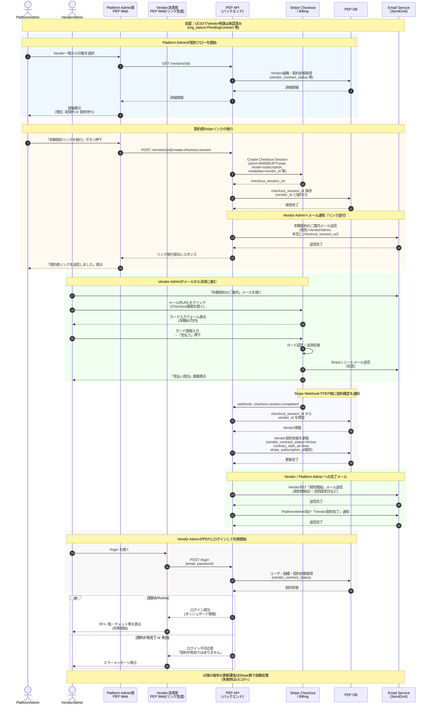

# UC14: Vendor年額契約・請求（Stripe or 請求書PDF）

```mermaid
sequenceDiagram
    autonumber
    actor PA as PlatformAdmin
    actor VA as VendorAdmin
    participant AWeb as Platform Admin用<br/>PEP Web
    participant VWeb as Vendor決済用<br/>PEP Web(リンク生成)
    participant API as PEP API<br/>(バックエンド)
    participant Stripe as Stripe Checkout<br/>/ Billing
    participant DB as PEP DB
    participant Mail as Email Service<br/>(SendGrid)

    Note over PA, Mail: 前提：UC03でVendor申請は承認済み<br/>(org_status=PendingContract 等)

    rect rgb(240, 248, 255)
        Note over PA, DB: Platform Adminが契約フローを開始
        PA->>AWeb: Vendor一覧から対象を選択
        AWeb->>API: GET /vendors/{id}
        API->>DB: Vendor組織・契約状態取得<br/>(vendor_contract_status 等)
        DB-->>API: 詳細情報
        API-->>AWeb: 詳細情報
        AWeb-->>PA: 詳細表示<br/>(現在: 未契約 or 契約待ち)
    end

    rect rgb(255, 250, 240)
        Note over PA, Mail: 契約用Stripeリンクの発行
        PA->>AWeb: 「年額契約リンクを発行」ボタン押下
        AWeb->>API: POST /vendors/{id}/create-checkout-session

        API->>Stripe: Create Checkout Session<br/>(price=600000JPY/year,<br/>mode=subscription,<br/>metadata=vendor_id 等)
        Stripe-->>API: checkout_session_url
        API->>DB: checkout_session_id 保存<br/>(vendor_id と紐付け)
        DB-->>API: 保存完了

        Note over API, Mail: Vendor Adminへメール通知（リンク送付）
        API->>Mail: 年額契約のご案内メール送信<br/>(宛先=VendorAdmin,<br/>本文に checkout_session_url)
        Mail-->>API: 送信完了

        API-->>AWeb: リンク発行成功レスポンス
        AWeb-->>PA: 「契約用リンクを送信しました」表示
    end

    rect rgb(240, 255, 240)
        Note over VA, Stripe: Vendor Adminがメールから決済に進む
        VA->>Mail: 「年額契約のご案内」メールを開く
        VA->>Stripe: メール内URLをクリック<br/>(Checkout画面を開く)
        Stripe-->>VA: カード入力フォーム表示<br/>(年額60万円)

        VA->>Stripe: カード情報入力<br/>→「支払う」押下
        Stripe->>Stripe: カード認証・決済処理
        Stripe->>Mail: Stripeレシートメール送信<br/>(任意)
        Stripe-->>VA: 「支払い成功」画面表示
    end

    rect rgb(248, 248, 255)
        Note over Stripe, DB: Stripe WebhookでPEP側に契約確定を通知
        Stripe->>API: webhook: checkout.session.completed
        API->>DB: checkout_session_id から<br/>vendor_id を特定
        DB-->>API: Vendor情報

        API->>DB: Vendor契約状態を更新<br/>(vendor_contract_status=Active,<br/>contract_start_at=now,<br/>stripe_subscription_id保存)
        DB-->>API: 更新完了
    end

    rect rgb(240, 255, 240)
        Note over API, Mail: Vendor / Platform Admin への完了メール
        API->>Mail: Vendor向け「契約開始」メール送信<br/>(契約開始日・次回請求日など)
        Mail-->>API: 送信完了

        API->>Mail: PlatformAdmin向け「Vendor契約完了」通知
        Mail-->>API: 送信完了
    end

    rect rgb(248, 248, 248)
        Note over VA, DB: Vendor AdminがPEPにログインして利用開始
        VA->>VWeb: /login を開く
        VWeb->>API: POST /login<br/>(email, password)
        API->>DB: ユーザ・組織・契約状態取得<br/>(vendor_contract_status)
        DB-->>API: 契約状態
    end

    alt 契約がActive
        API-->>VWeb: ログイン成功<br/>(ダッシュボード情報)
        VWeb-->>VA: RFI一覧・チャット等を表示<br/>(利用開始)
    else 契約が未完了 or 失効
        API-->>VWeb: ログイン不可応答<br/>「契約が有効ではありません」
        VWeb-->>VA: エラーメッセージ表示
    end

    Note over VA, Mail: 以降の毎年の更新課金はStripe側で自動処理<br/>（失敗時はUC15へ）
```
