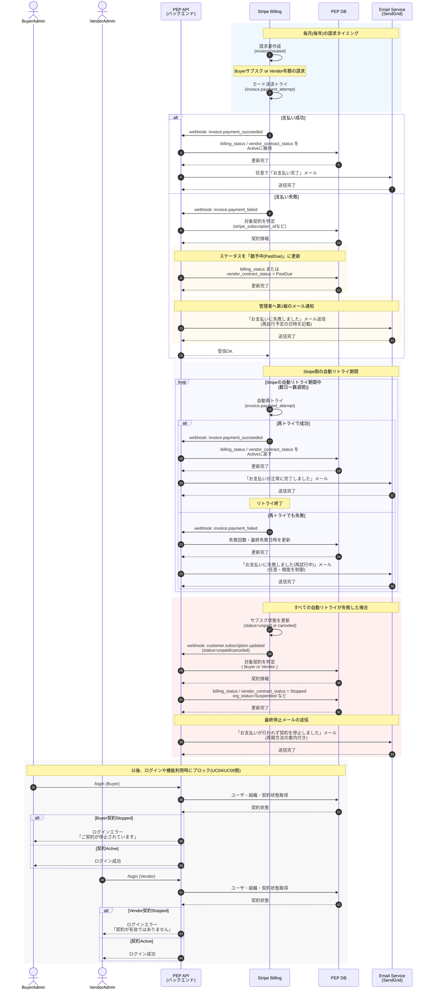

# UC15: 支払い失敗時の自動停止

```mermaid
sequenceDiagram
    autonumber
    actor BA as BuyerAdmin
    actor VA as VendorAdmin
    participant API as PEP API<br/>(バックエンド)
    participant Stripe as Stripe Billing
    participant DB as PEP DB
    participant Mail as Email Service<br/>(SendGrid)

    rect rgb(240, 248, 255)
        Note over Stripe, Mail: 毎月(毎年)の請求タイミング
        Stripe->>Stripe: 請求書作成<br/>(invoice.created)
        Note over Stripe: Buyerサブスク or Vendor年額の請求

        Stripe->>Stripe: カード決済トライ<br/>(invoice.payment_attempt)
    end

    alt 支払い成功
        Stripe->>API: webhook: invoice.payment_succeeded
        API->>DB: billing_status / vendor_contract_status を<br/>Activeに維持
        DB-->>API: 更新完了
        API->>Mail: 任意で「お支払い完了」メール
        Mail-->>API: 送信完了
    else 支払い失敗
        Stripe->>API: webhook: invoice.payment_failed
        API->>DB: 対象契約を特定<br/>(stripe_subscription_idなど)
        DB-->>API: 契約情報

        rect rgb(255, 250, 240)
            Note over API, DB: ステータスを「猶予中(PastDue)」に更新
            API->>DB: billing_status または<br/>vendor_contract_status = PastDue
            DB-->>API: 更新完了
        end

        rect rgb(255, 250, 240)
            Note over API, Mail: 管理者へ第1報のメール通知
            API->>Mail: 「お支払いに失敗しました」メール送信<br/>(再試行予定の日時を記載)
            Mail-->>API: 送信完了
        end

        API-->>Stripe: 受信OK
    end

    rect rgb(248, 248, 255)
        Note over Stripe, Mail: Stripe側の自動リトライ期間
        loop Stripeの自動リトライ期間中<br/>(数日〜数週間)
            Stripe->>Stripe: 自動再トライ<br/>(invoice.payment_attempt)

            alt 再トライで成功
                Stripe->>API: webhook: invoice.payment_succeeded
                API->>DB: billing_status / vendor_contract_status を<br/>Activeに戻す
                DB-->>API: 更新完了

                API->>Mail: 「お支払いが正常に完了しました」メール
                Mail-->>API: 送信完了
                Note over Stripe: リトライ終了
            else 再トライでも失敗
                Stripe->>API: webhook: invoice.payment_failed
                API->>DB: 失敗回数・最終失敗日時を更新
                DB-->>API: 更新完了

                API->>Mail: 「お支払いに失敗しました(再試行中)」メール<br/>(任意・頻度を制御)
                Mail-->>API: 送信完了
            end
        end
    end

    rect rgb(255, 240, 240)
        Note over Stripe, Mail: すべての自動リトライが失敗した場合
        Stripe->>Stripe: サブスク状態を更新<br/>(status=unpaid or canceled)
        Stripe->>API: webhook: customer.subscription.updated<br/>(status=unpaid/canceled)

        API->>DB: 対象契約を特定<br/>( Buyer or Vendor )
        DB-->>API: 契約情報

        API->>DB: billing_status / vendor_contract_status = Stopped<br/>org_status=Suspended など
        DB-->>API: 更新完了

        Note over API, Mail: 最終停止メールの送信
        API->>Mail: 「お支払いが行われず契約を停止しました」メール<br/>(再開方法の案内付き)
        Mail-->>API: 送信完了
    end

    rect rgb(248, 248, 248)
        Note over BA, DB: 以後、ログインや機能利用時にブロック(UC04/UC05側)
        BA->>API: /login (Buyer)
        API->>DB: ユーザ・組織・契約状態取得
        DB-->>API: 契約状態
        alt Buyer契約Stopped
            API-->>BA: ログインエラー<br/>「ご契約が停止されています」
        else 契約Active
            API-->>BA: ログイン成功
        end

        VA->>API: /login (Vendor)
        API->>DB: ユーザ・組織・契約状態取得
        DB-->>API: 契約状態
        alt Vendor契約Stopped
            API-->>VA: ログインエラー<br/>「契約が有効ではありません」
        else 契約Active
            API-->>VA: ログイン成功
        end
    end
```
