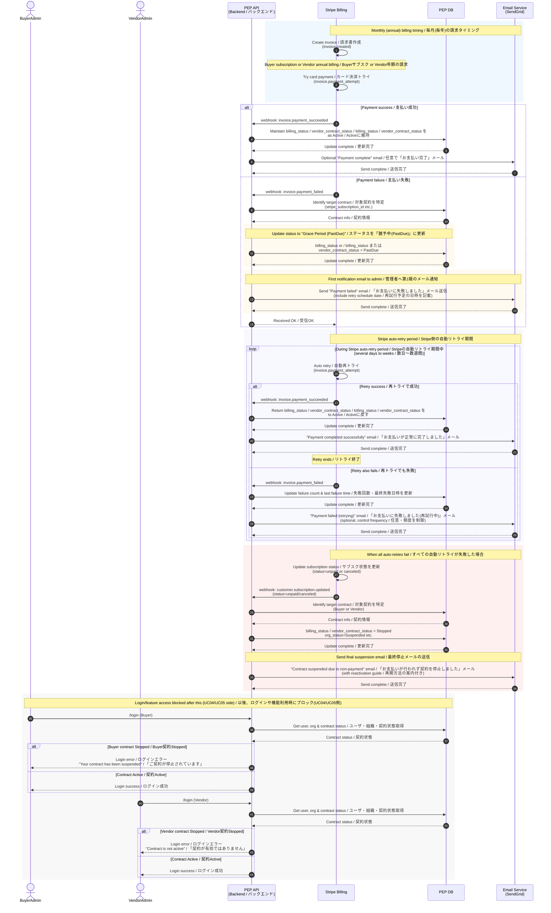

# UC15: Auto Suspend on Payment Failure / 支払い失敗時の自動停止

```mermaid
sequenceDiagram
    autonumber
    actor BA as BuyerAdmin
    actor VA as VendorAdmin
    participant API as PEP API<br/>(Backend / バックエンド)
    participant Stripe as Stripe Billing
    participant DB as PEP DB
    participant Mail as Email Service<br/>(SendGrid)

    rect rgb(240, 248, 255)
        Note over Stripe, Mail: Monthly (annual) billing timing / 毎月(毎年)の請求タイミング
        Stripe->>Stripe: Create invoice / 請求書作成<br/>(invoice.created)
        Note over Stripe: Buyer subscription or Vendor annual billing / Buyerサブスク or Vendor年額の請求

        Stripe->>Stripe: Try card payment / カード決済トライ<br/>(invoice.payment_attempt)
    end

    alt Payment success / 支払い成功
        Stripe->>API: webhook: invoice.payment_succeeded
        API->>DB: Maintain billing_status / vendor_contract_status / billing_status / vendor_contract_status を<br/>as Active / Activeに維持
        DB-->>API: Update complete / 更新完了
        API->>Mail: Optional "Payment complete" email / 任意で「お支払い完了」メール
        Mail-->>API: Send complete / 送信完了
    else Payment failure / 支払い失敗
        Stripe->>API: webhook: invoice.payment_failed
        API->>DB: Identify target contract / 対象契約を特定<br/>(stripe_subscription_id etc.)
        DB-->>API: Contract info / 契約情報

        rect rgb(255, 250, 240)
            Note over API, DB: Update status to "Grace Period (PastDue)" / ステータスを「猶予中(PastDue)」に更新
            API->>DB: billing_status or / billing_status または<br/>vendor_contract_status = PastDue
            DB-->>API: Update complete / 更新完了
        end

        rect rgb(255, 250, 240)
            Note over API, Mail: First notification email to admin / 管理者へ第1報のメール通知
            API->>Mail: Send "Payment failed" email / 「お支払いに失敗しました」メール送信<br/>(include retry schedule date / 再試行予定の日時を記載)
            Mail-->>API: Send complete / 送信完了
        end

        API-->>Stripe: Received OK / 受信OK
    end

    rect rgb(248, 248, 255)
        Note over Stripe, Mail: Stripe auto-retry period / Stripe側の自動リトライ期間
        loop During Stripe auto-retry period / Stripeの自動リトライ期間中<br/>(several days to weeks / 数日〜数週間)
            Stripe->>Stripe: Auto retry / 自動再トライ<br/>(invoice.payment_attempt)

            alt Retry success / 再トライで成功
                Stripe->>API: webhook: invoice.payment_succeeded
                API->>DB: Return billing_status / vendor_contract_status / billing_status / vendor_contract_status を<br/>to Active / Activeに戻す
                DB-->>API: Update complete / 更新完了

                API->>Mail: "Payment completed successfully" email / 「お支払いが正常に完了しました」メール
                Mail-->>API: Send complete / 送信完了
                Note over Stripe: Retry ends / リトライ終了
            else Retry also fails / 再トライでも失敗
                Stripe->>API: webhook: invoice.payment_failed
                API->>DB: Update failure count & last failure time / 失敗回数・最終失敗日時を更新
                DB-->>API: Update complete / 更新完了

                API->>Mail: "Payment failed (retrying)" email / 「お支払いに失敗しました(再試行中)」メール<br/>(optional, control frequency / 任意・頻度を制御)
                Mail-->>API: Send complete / 送信完了
            end
        end
    end

    rect rgb(255, 240, 240)
        Note over Stripe, Mail: When all auto-retries fail / すべての自動リトライが失敗した場合
        Stripe->>Stripe: Update subscription status / サブスク状態を更新<br/>(status=unpaid or canceled)
        Stripe->>API: webhook: customer.subscription.updated<br/>(status=unpaid/canceled)

        API->>DB: Identify target contract / 対象契約を特定<br/>(Buyer or Vendor)
        DB-->>API: Contract info / 契約情報

        API->>DB: billing_status / vendor_contract_status = Stopped<br/>org_status=Suspended etc.
        DB-->>API: Update complete / 更新完了

        Note over API, Mail: Send final suspension email / 最終停止メールの送信
        API->>Mail: "Contract suspended due to non-payment" email / 「お支払いが行われず契約を停止しました」メール<br/>(with reactivation guide / 再開方法の案内付き)
        Mail-->>API: Send complete / 送信完了
    end

    rect rgb(248, 248, 248)
        Note over BA, DB: Login/feature access blocked after this (UC04/UC05 side) / 以後、ログインや機能利用時にブロック(UC04/UC05側)
        BA->>API: /login (Buyer)
        API->>DB: Get user, org & contract status / ユーザ・組織・契約状態取得
        DB-->>API: Contract status / 契約状態
        alt Buyer contract Stopped / Buyer契約Stopped
            API-->>BA: Login error / ログインエラー<br/>"Your contract has been suspended" / 「ご契約が停止されています」
        else Contract Active / 契約Active
            API-->>BA: Login success / ログイン成功
        end

        VA->>API: /login (Vendor)
        API->>DB: Get user, org & contract status / ユーザ・組織・契約状態取得
        DB-->>API: Contract status / 契約状態
        alt Vendor contract Stopped / Vendor契約Stopped
            API-->>VA: Login error / ログインエラー<br/>"Contract is not active" / 「契約が有効ではありません」
        else Contract Active / 契約Active
            API-->>VA: Login success / ログイン成功
        end
    end
```
