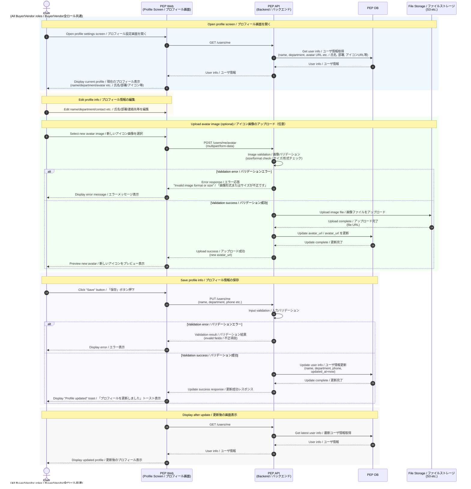

# UC16: Profile Edit / プロフィール編集

```mermaid
sequenceDiagram
    autonumber
    actor U as User<br/>(All Buyer/Vendor roles / Buyer/Vendor全ロール共通)
    participant Web as PEP Web<br/>(Profile Screen / プロフィール画面)
    participant API as PEP API<br/>(Backend / バックエンド)
    participant DB as PEP DB
    participant Storage as File Storage / ファイルストレージ<br/>(S3 etc.)

    rect rgb(240, 248, 255)
        Note over U, Storage: Open profile screen / プロフィール画面を開く
        U->>Web: Open profile settings screen / プロフィール設定画面を開く
        Web->>API: GET /users/me
        API->>DB: Get user info / ユーザ情報取得<br/>(name, department, avatar URL etc. / 氏名, 部署, アイコンURL等)
        DB-->>API: User info / ユーザ情報
        API-->>Web: User info / ユーザ情報
        Web-->>U: Display current profile / 現在のプロフィール表示<br/>(name/department/avatar etc. / 氏名/部署/アイコン等)
    end

    rect rgb(255, 250, 240)
        Note over U, Web: Edit profile info / プロフィール情報の編集
        U->>Web: Edit name/department/contact etc. / 氏名/部署/連絡先等を編集
    end

    rect rgb(240, 255, 240)
        Note over U, Storage: Upload avatar image (optional) / アイコン画像のアップロード（任意）
        U->>Web: Select new avatar image / 新しいアイコン画像を選択
        Web->>API: POST /users/me/avatar<br/>(multipart/form-data)

        API->>API: Image validation / 画像バリデーション<br/>(size/format check / サイズ/形式チェック)

        alt Validation error / バリデーションエラー
            API-->>Web: Error response / エラー応答<br/>"Invalid image format or size" / 「画像形式またはサイズが不正です」
            Web-->>U: Display error message / エラーメッセージ表示
        else Validation success / バリデーション成功
            API->>Storage: Upload image file / 画像ファイルをアップロード
            Storage-->>API: Upload complete / アップロード完了<br/>(file URL)

            API->>DB: Update avatar_url / avatar_url を更新
            DB-->>API: Update complete / 更新完了

            API-->>Web: Upload success / アップロード成功<br/>(new avatar_url)
            Web-->>U: Preview new avatar / 新しいアイコンをプレビュー表示
        end
    end

    rect rgb(248, 248, 255)
        Note over U, DB: Save profile info / プロフィール情報の保存
        U->>Web: Click "Save" button / 「保存」ボタン押下
        Web->>API: PUT /users/me<br/>(name, department, phone etc.)

        API->>API: Input validation / 入力バリデーション

        alt Validation error / バリデーションエラー
            API-->>Web: Validation result / バリデーション結果<br/>(invalid fields / 不正項目)
            Web-->>U: Display error / エラー表示
        else Validation success / バリデーション成功
            API->>DB: Update user info / ユーザ情報更新<br/>(name, department, phone,<br/>updated_at=now)
            DB-->>API: Update complete / 更新完了

            API-->>Web: Update success response / 更新成功レスポンス
            Web-->>U: Display "Profile updated" toast / 「プロフィールを更新しました」トースト表示
        end
    end

    rect rgb(248, 248, 248)
        Note over U, DB: Display after update / 更新後の画面表示
        Web->>API: GET /users/me
        API->>DB: Get latest user info / 最新ユーザ情報取得
        DB-->>API: User info / ユーザ情報
        API-->>Web: User info / ユーザ情報
        Web-->>U: Display updated profile / 更新後のプロフィール表示
    end
```
