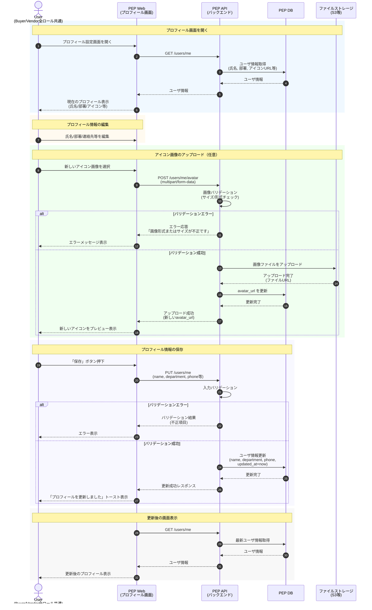

# UC16: プロフィール編集

```mermaid
sequenceDiagram
    autonumber
    actor U as User<br/>(Buyer/Vendor全ロール共通)
    participant Web as PEP Web<br/>(プロフィール画面)
    participant API as PEP API<br/>(バックエンド)
    participant DB as PEP DB
    participant Storage as ファイルストレージ<br/>(S3等)

    rect rgb(240, 248, 255)
        Note over U, Storage: プロフィール画面を開く
        U->>Web: プロフィール設定画面を開く
        Web->>API: GET /users/me
        API->>DB: ユーザ情報取得<br/>(氏名, 部署, アイコンURL等)
        DB-->>API: ユーザ情報
        API-->>Web: ユーザ情報
        Web-->>U: 現在のプロフィール表示<br/>(氏名/部署/アイコン等)
    end

    rect rgb(255, 250, 240)
        Note over U, Web: プロフィール情報の編集
        U->>Web: 氏名/部署/連絡先等を編集
    end

    rect rgb(240, 255, 240)
        Note over U, Storage: アイコン画像のアップロード（任意）
        U->>Web: 新しいアイコン画像を選択
        Web->>API: POST /users/me/avatar<br/>(multipart/form-data)

        API->>API: 画像バリデーション<br/>(サイズ/形式チェック)

        alt バリデーションエラー
            API-->>Web: エラー応答<br/>「画像形式またはサイズが不正です」
            Web-->>U: エラーメッセージ表示
        else バリデーション成功
            API->>Storage: 画像ファイルをアップロード
            Storage-->>API: アップロード完了<br/>(ファイルURL)

            API->>DB: avatar_url を更新
            DB-->>API: 更新完了

            API-->>Web: アップロード成功<br/>(新しいavatar_url)
            Web-->>U: 新しいアイコンをプレビュー表示
        end
    end

    rect rgb(248, 248, 255)
        Note over U, DB: プロフィール情報の保存
        U->>Web: 「保存」ボタン押下
        Web->>API: PUT /users/me<br/>(name, department, phone等)

        API->>API: 入力バリデーション

        alt バリデーションエラー
            API-->>Web: バリデーション結果<br/>(不正項目)
            Web-->>U: エラー表示
        else バリデーション成功
            API->>DB: ユーザ情報更新<br/>(name, department, phone,<br/>updated_at=now)
            DB-->>API: 更新完了

            API-->>Web: 更新成功レスポンス
            Web-->>U: 「プロフィールを更新しました」トースト表示
        end
    end

    rect rgb(248, 248, 248)
        Note over U, DB: 更新後の画面表示
        Web->>API: GET /users/me
        API->>DB: 最新ユーザ情報取得
        DB-->>API: ユーザ情報
        API-->>Web: ユーザ情報
        Web-->>U: 更新後のプロフィール表示
    end
```
