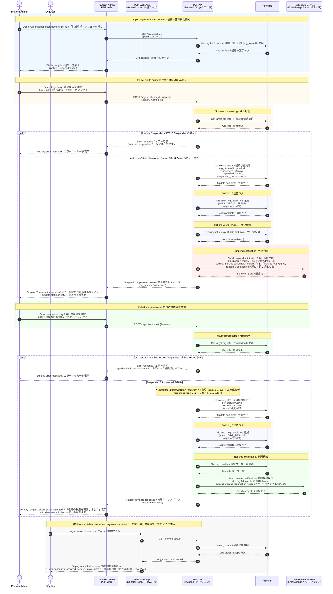

# UC17: Organization Suspend/Resume / 組織の停止・再開（Platform Admin）

```mermaid
sequenceDiagram
    autonumber
    actor PA as PlatformAdmin
    actor OU as OrgUser
    participant AWeb as Platform Admin<br/>PEP Web
    participant UWeb as PEP Web/App<br/>(General User / 一般ユーザ)
    participant API as PEP API<br/>(Backend / バックエンド)
    participant DB as PEP DB
    participant Notif as Notification Service<br/>(Email/Badge / メール/バッジ)

    rect rgb(240, 248, 255)
        Note over PA, Notif: Open organization list screen / 組織一覧画面を開く
        PA->>AWeb: Open "Organization Management" menu / 「組織管理」メニューを開く
        AWeb->>API: GET /organizations<br/>?page=1&size=20
        API->>DB: Get org list & status / 組織一覧・状態(org_status等)取得
        DB-->>API: Org list data / 組織一覧データ
        API-->>AWeb: Org list data / 組織一覧データ
        AWeb-->>PA: Display org list / 組織一覧表示<br/>(Active / Suspended etc.)
    end

    rect rgb(255, 250, 240)
        Note over PA, Notif: Select org to suspend / 停止対象組織の選択
        PA->>AWeb: Select target org / 対象組織を選択<br/>Click "Suspend" button / 「停止」ボタン押下
        AWeb->>API: POST /organizations/{id}/suspend<br/>(reason, memo etc.)
    end

    rect rgb(255, 250, 240)
        Note over API, DB: Suspend processing / 停止処理
        API->>DB: Get target org info / 対象組織情報取得
        DB-->>API: Org info / 組織情報
    end

    alt Already Suspended / すでに Suspended の場合
        API-->>AWeb: Error response / エラー応答<br/>"Already suspended" / 「既に停止中です」
        AWeb-->>PA: Display error message / エラーメッセージ表示
    else Active or Active-like status / Active または Active系ステータス
        API->>DB: Update org status / 組織状態更新<br/>org_status=Suspended,<br/>suspended_at=now,<br/>suspended_by=PA,<br/>suspended_reason=reason
        DB-->>API: Update complete / 更新完了

        rect rgb(248, 248, 255)
            Note over API, DB: Audit log / 監査ログ
            API->>DB: Add audit_log / audit_log 追加<br/>(action=ORG_SUSPEND,<br/>orgId, actor=PA)
            DB-->>API: Add complete / 追加完了
        end

        rect rgb(248, 248, 255)
            Note over API, DB: Get org users / 組織ユーザの取得
            API->>DB: Get user list in org / 組織に属するユーザ一覧取得
            DB-->>API: users[Admin/User...]
        end

        rect rgb(255, 240, 240)
            Note over API, Notif: Suspend notification / 停止通知
            API->>Notif: Send suspend notification / 停止通知送信<br/>(to: org Admin mainly / 宛先: 組織Admin中心,<br/>subject: Service suspension notice / 件名: 利用停止のお知らせ,<br/>reason & contact info / 理由・問い合わせ先)
            Notif-->>API: Send complete / 送信完了
        end

        API-->>AWeb: Suspend complete response / 停止完了レスポンス<br/>(org_status=Suspended)
        AWeb-->>PA: Display "Organization suspended" / 「組織を停止しました」表示<br/>+ Update status in list / 一覧上の状態更新
    end

    rect rgb(240, 255, 240)
        Note over PA, Notif: Select org to resume / 再開対象組織の選択
        PA->>AWeb: Select suspended org / 停止中組織を選択<br/>Click "Resume" button / 「再開」ボタン押下
        AWeb->>API: POST /organizations/{id}/resume
    end

    rect rgb(240, 255, 240)
        Note over API, DB: Resume processing / 再開処理
        API->>DB: Get target org info / 対象組織情報取得
        DB-->>API: Org info / 組織情報
    end

    alt org_status is not Suspended / org_status が Suspended 以外
        API-->>AWeb: Error response / エラー応答<br/>"Organization is not suspended" / 「停止中の組織ではありません」
        AWeb-->>PA: Display error message / エラーメッセージ表示
    else Suspended / Suspended の場合
        Note over API: * Check for unpaid/violation resolution / ※必要に応じて未払い・違反解消の<br/>here if needed / チェックなどをここに挟む
        API->>DB: Update org status / 組織状態更新<br/>org_status=Active,<br/>resumed_at=now,<br/>resumed_by=PA
        DB-->>API: Update complete / 更新完了

        rect rgb(248, 248, 255)
            Note over API, DB: Audit log / 監査ログ
            API->>DB: Add audit_log / audit_log 追加<br/>(action=ORG_RESUME,<br/>orgId, actor=PA)
            DB-->>API: Add complete / 追加完了
        end

        rect rgb(240, 255, 240)
            Note over API, Notif: Resume notification / 再開通知
            API->>DB: Get org user list / 組織ユーザ一覧取得
            DB-->>API: User list / ユーザ一覧
            API->>Notif: Send resume notification / 再開通知送信<br/>(to: org Admin / 宛先: 組織Admin,<br/>subject: Service resumption notice / 件名: 利用再開のお知らせ)
            Notif-->>API: Send complete / 送信完了
        end

        API-->>AWeb: Resume complete response / 再開完了レスポンス<br/>(org_status=Active)
        AWeb-->>PA: Display "Organization service resumed" / 「組織の利用を再開しました」表示<br/>+ Update status in list / 一覧上の状態更新
    end

    rect rgb(248, 248, 248)
        Note over OU, API: (Reference) When suspended org user accesses / （参考）停止中組織ユーザのアクセス時
        OU->>UWeb: Login / screen access / ログイン／画面アクセス
        UWeb->>API: GET /me/org-status
        API->>DB: Get org status / 組織状態取得
        DB-->>API: org_status=Suspended
        API-->>UWeb: org_status=Suspended
        UWeb-->>OU: Display restricted screen / 機能制限画面表示<br/>"Organization is suspended, service unavailable" / 「組織が停止中のため利用できません」
    end
```
