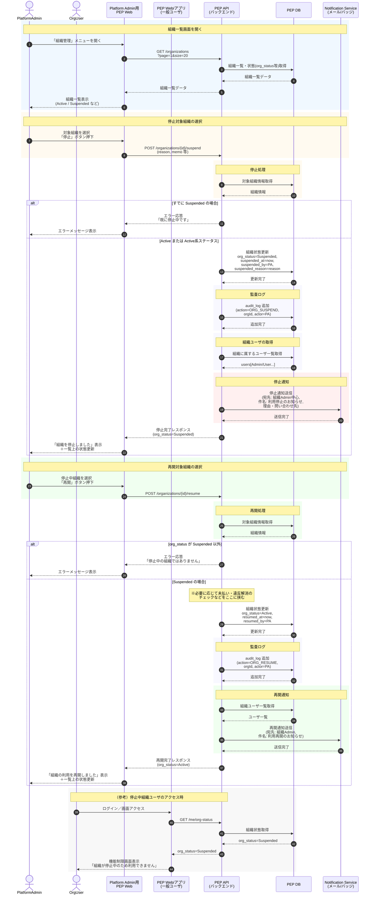

# UC17: 組織の停止・再開（Platform Admin）

```mermaid
sequenceDiagram
    autonumber
    actor PA as PlatformAdmin
    actor OU as OrgUser
    participant AWeb as Platform Admin用<br/>PEP Web
    participant UWeb as PEP Web/アプリ<br/>(一般ユーザ)
    participant API as PEP API<br/>(バックエンド)
    participant DB as PEP DB
    participant Notif as Notification Service<br/>(メール/バッジ)

    rect rgb(240, 248, 255)
        Note over PA, Notif: 組織一覧画面を開く
        PA->>AWeb: 「組織管理」メニューを開く
        AWeb->>API: GET /organizations<br/>?page=1&size=20
        API->>DB: 組織一覧・状態(org_status等)取得
        DB-->>API: 組織一覧データ
        API-->>AWeb: 組織一覧データ
        AWeb-->>PA: 組織一覧表示<br/>(Active / Suspended など)
    end

    rect rgb(255, 250, 240)
        Note over PA, Notif: 停止対象組織の選択
        PA->>AWeb: 対象組織を選択<br/>「停止」ボタン押下
        AWeb->>API: POST /organizations/{id}/suspend<br/>(reason, memo 等)
    end

    rect rgb(255, 250, 240)
        Note over API, DB: 停止処理
        API->>DB: 対象組織情報取得
        DB-->>API: 組織情報
    end

    alt すでに Suspended の場合
        API-->>AWeb: エラー応答<br/>「既に停止中です」
        AWeb-->>PA: エラーメッセージ表示
    else Active または Active系ステータス
        API->>DB: 組織状態更新<br/>org_status=Suspended,<br/>suspended_at=now,<br/>suspended_by=PA,<br/>suspended_reason=reason
        DB-->>API: 更新完了

        rect rgb(248, 248, 255)
            Note over API, DB: 監査ログ
            API->>DB: audit_log 追加<br/>(action=ORG_SUSPEND,<br/>orgId, actor=PA)
            DB-->>API: 追加完了
        end

        rect rgb(248, 248, 255)
            Note over API, DB: 組織ユーザの取得
            API->>DB: 組織に属するユーザ一覧取得
            DB-->>API: users[Admin/User...]
        end

        rect rgb(255, 240, 240)
            Note over API, Notif: 停止通知
            API->>Notif: 停止通知送信<br/>(宛先: 組織Admin中心,<br/>件名: 利用停止のお知らせ,<br/>理由・問い合わせ先)
            Notif-->>API: 送信完了
        end

        API-->>AWeb: 停止完了レスポンス<br/>(org_status=Suspended)
        AWeb-->>PA: 「組織を停止しました」表示<br/>＋一覧上の状態更新
    end

    rect rgb(240, 255, 240)
        Note over PA, Notif: 再開対象組織の選択
        PA->>AWeb: 停止中組織を選択<br/>「再開」ボタン押下
        AWeb->>API: POST /organizations/{id}/resume
    end

    rect rgb(240, 255, 240)
        Note over API, DB: 再開処理
        API->>DB: 対象組織情報取得
        DB-->>API: 組織情報
    end

    alt org_status が Suspended 以外
        API-->>AWeb: エラー応答<br/>「停止中の組織ではありません」
        AWeb-->>PA: エラーメッセージ表示
    else Suspended の場合
        Note over API: ※必要に応じて未払い・違反解消の<br/>チェックなどをここに挟む
        API->>DB: 組織状態更新<br/>org_status=Active,<br/>resumed_at=now,<br/>resumed_by=PA
        DB-->>API: 更新完了

        rect rgb(248, 248, 255)
            Note over API, DB: 監査ログ
            API->>DB: audit_log 追加<br/>(action=ORG_RESUME,<br/>orgId, actor=PA)
            DB-->>API: 追加完了
        end

        rect rgb(240, 255, 240)
            Note over API, Notif: 再開通知
            API->>DB: 組織ユーザ一覧取得
            DB-->>API: ユーザ一覧
            API->>Notif: 再開通知送信<br/>(宛先: 組織Admin,<br/>件名: 利用再開のお知らせ)
            Notif-->>API: 送信完了
        end

        API-->>AWeb: 再開完了レスポンス<br/>(org_status=Active)
        AWeb-->>PA: 「組織の利用を再開しました」表示<br/>＋一覧上の状態更新
    end

    rect rgb(248, 248, 248)
        Note over OU, API: （参考）停止中組織ユーザのアクセス時
        OU->>UWeb: ログイン／画面アクセス
        UWeb->>API: GET /me/org-status
        API->>DB: 組織状態取得
        DB-->>API: org_status=Suspended
        API-->>UWeb: org_status=Suspended
        UWeb-->>OU: 機能制限画面表示<br/>「組織が停止中のため利用できません」
    end
```
