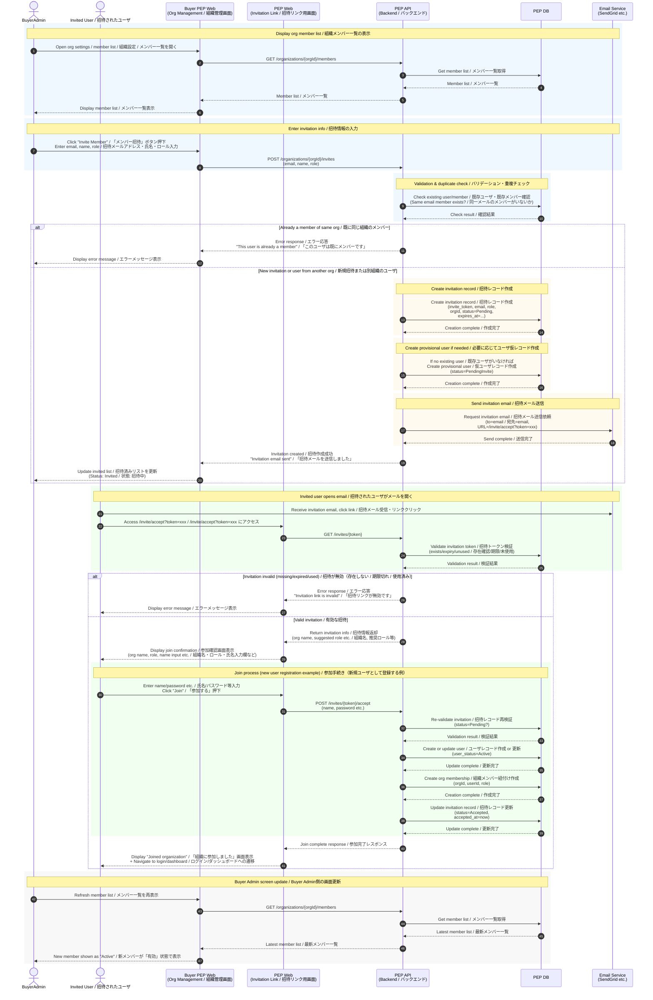

# UC02: Buyer Member Invitation & Authorization / Buyerメンバー招待・権限付与

```mermaid
sequenceDiagram
    autonumber
    actor BA as BuyerAdmin
    actor Inv as Invited User / 招待されたユーザ
    participant BWeb as Buyer PEP Web<br/>(Org Management / 組織管理画面)
    participant IWeb as PEP Web<br/>(Invitation Link / 招待リンク用画面)
    participant API as PEP API<br/>(Backend / バックエンド)
    participant DB as PEP DB
    participant Mail as Email Service<br/>(SendGrid etc.)

    rect rgb(240, 248, 255)
        Note over BA, Mail: Display org member list / 組織メンバー一覧の表示
        BA->>BWeb: Open org settings / member list / 組織設定 / メンバー一覧を開く
        BWeb->>API: GET /organizations/{orgId}/members
        API->>DB: Get member list / メンバー一覧取得
        DB-->>API: Member list / メンバー一覧
        API-->>BWeb: Member list / メンバー一覧
        BWeb-->>BA: Display member list / メンバー一覧表示
    end

    rect rgb(240, 248, 255)
        Note over BA, Mail: Enter invitation info / 招待情報の入力
        BA->>BWeb: Click "Invite Member" / 「メンバー招待」ボタン押下<br/>Enter email, name, role / 招待メールアドレス・氏名・ロール入力
        BWeb->>API: POST /organizations/{orgId}/invites<br/>(email, name, role)
    end

    rect rgb(240, 248, 255)
        Note over API, DB: Validation & duplicate check / バリデーション・重複チェック
        API->>DB: Check existing user/member / 既存ユーザ・既存メンバー確認<br/>(Same email member exists? / 同一メールのメンバーがいないか)
        DB-->>API: Check result / 確認結果
    end

    alt Already a member of same org / 既に同じ組織のメンバー
        API-->>BWeb: Error response / エラー応答<br/>"This user is already a member" / 「このユーザは既にメンバーです」
        BWeb-->>BA: Display error message / エラーメッセージ表示
    else New invitation or user from another org / 新規招待または別組織のユーザ
        rect rgb(255, 250, 240)
            Note over API, DB: Create invitation record / 招待レコード作成
            API->>DB: Create invitation record / 招待レコード作成<br/>(invite_token, email, role,<br/>orgId, status=Pending,<br/>expires_at=...)
            DB-->>API: Creation complete / 作成完了
        end

        rect rgb(255, 250, 240)
            Note over API, DB: Create provisional user if needed / 必要に応じてユーザ仮レコード作成
            API->>DB: If no existing user / 既存ユーザがいなければ<br/>Create provisional user / 仮ユーザレコード作成<br/>(status=PendingInvite)
            DB-->>API: Creation complete / 作成完了
        end

        rect rgb(255, 250, 240)
            Note over API, Mail: Send invitation email / 招待メール送信
            API->>Mail: Request invitation email / 招待メール送信依頼<br/>(to=email / 宛先=email,<br/>URL=/invite/accept?token=xxx)
            Mail-->>API: Send complete / 送信完了
        end

        API-->>BWeb: Invitation created / 招待作成成功<br/>"Invitation email sent" / 「招待メールを送信しました」
        BWeb-->>BA: Update invited list / 招待済みリストを更新<br/>(Status: Invited / 状態: 招待中)
    end

    rect rgb(240, 255, 240)
        Note over Inv, Mail: Invited user opens email / 招待されたユーザがメールを開く
        Inv->>Mail: Receive invitation email, click link / 招待メール受信・リンククリック
        Inv->>IWeb: Access /invite/accept?token=xxx / /invite/accept?token=xxx にアクセス
        IWeb->>API: GET /invites/{token}

        API->>DB: Validate invitation token / 招待トークン検証<br/>(exists/expiry/unused / 存在確認/期限/未使用)
        DB-->>API: Validation result / 検証結果
    end

    alt Invitation invalid (missing/expired/used) / 招待が無効（存在しない / 期限切れ / 使用済み）
        API-->>IWeb: Error response / エラー応答<br/>"Invitation link is invalid" / 「招待リンクが無効です」
        IWeb-->>Inv: Display error message / エラーメッセージ表示
    else Valid invitation / 有効な招待
        API-->>IWeb: Return invitation info / 招待情報返却<br/>(org name, suggested role etc. / 組織名, 推奨ロール等)
        IWeb-->>Inv: Display join confirmation / 参加確認画面表示<br/>(org name, role, name input etc. / 組織名・ロール・氏名入力欄など)

        rect rgb(240, 255, 240)
            Note over Inv, DB: Join process (new user registration example) / 参加手続き（新規ユーザとして登録する例）
            Inv->>IWeb: Enter name/password etc. / 氏名/パスワード等入力<br/>Click "Join" / 「参加する」押下
            IWeb->>API: POST /invites/{token}/accept<br/>(name, password etc.)

            API->>DB: Re-validate invitation / 招待レコード再検証<br/>(status=Pending?)
            DB-->>API: Validation result / 検証結果

            API->>DB: Create or update user / ユーザレコード作成 or 更新<br/>(user_status=Active)
            DB-->>API: Update complete / 更新完了

            API->>DB: Create org membership / 組織メンバー紐付け作成<br/>(orgId, userId, role)
            DB-->>API: Creation complete / 作成完了

            API->>DB: Update invitation record / 招待レコード更新<br/>(status=Accepted,<br/>accepted_at=now)
            DB-->>API: Update complete / 更新完了
        end

        API-->>IWeb: Join complete response / 参加完了レスポンス
        IWeb-->>Inv: Display "Joined organization" / 「組織に参加しました」画面表示<br/>+ Navigate to login/dashboard / ログイン/ダッシュボードへの遷移
    end

    rect rgb(248, 248, 248)
        Note over BA, DB: Buyer Admin screen update / Buyer Admin側の画面更新
        BA->>BWeb: Refresh member list / メンバー一覧を再表示
        BWeb->>API: GET /organizations/{orgId}/members
        API->>DB: Get member list / メンバー一覧取得
        DB-->>API: Latest member list / 最新メンバー一覧
        API-->>BWeb: Latest member list / 最新メンバー一覧
        BWeb-->>BA: New member shown as "Active" / 新メンバーが「有効」状態で表示
    end
```
