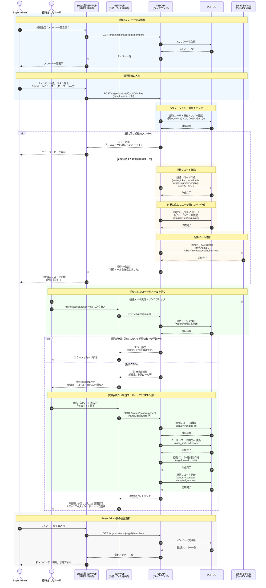

# UC02: Buyerメンバー招待・権限付与

```mermaid
sequenceDiagram
    autonumber
    actor BA as BuyerAdmin
    actor Inv as 招待されたユーザ
    participant BWeb as Buyer用PEP Web<br/>(組織管理画面)
    participant IWeb as PEP Web<br/>(招待リンク用画面)
    participant API as PEP API<br/>(バックエンド)
    participant DB as PEP DB
    participant Mail as Email Service<br/>(SendGrid等)

    rect rgb(240, 248, 255)
        Note over BA, Mail: 組織メンバー一覧の表示
        BA->>BWeb: 組織設定 / メンバー一覧を開く
        BWeb->>API: GET /organizations/{orgId}/members
        API->>DB: メンバー一覧取得
        DB-->>API: メンバー一覧
        API-->>BWeb: メンバー一覧
        BWeb-->>BA: メンバー一覧表示
    end

    rect rgb(240, 248, 255)
        Note over BA, Mail: 招待情報の入力
        BA->>BWeb: 「メンバー招待」ボタン押下<br/>招待メールアドレス・氏名・ロール入力
        BWeb->>API: POST /organizations/{orgId}/invites<br/>(email, name, role)
    end

    rect rgb(240, 248, 255)
        Note over API, DB: バリデーション・重複チェック
        API->>DB: 既存ユーザ・既存メンバー確認<br/>(同一メールのメンバーがいないか)
        DB-->>API: 確認結果
    end

    alt 既に同じ組織のメンバー
        API-->>BWeb: エラー応答<br/>「このユーザは既にメンバーです」
        BWeb-->>BA: エラーメッセージ表示
    else 新規招待または別組織のユーザ
        rect rgb(255, 250, 240)
            Note over API, DB: 招待レコード作成
            API->>DB: 招待レコード作成<br/>(invite_token, email, role,<br/>orgId, status=Pending,<br/>expires_at=...)
            DB-->>API: 作成完了
        end

        rect rgb(255, 250, 240)
            Note over API, DB: 必要に応じてユーザ仮レコード作成
            API->>DB: 既存ユーザがいなければ<br/>仮ユーザレコード作成<br/>(status=PendingInvite)
            DB-->>API: 作成完了
        end

        rect rgb(255, 250, 240)
            Note over API, Mail: 招待メール送信
            API->>Mail: 招待メール送信依頼<br/>(宛先=email,<br/>URL=/invite/accept?token=xxx)
            Mail-->>API: 送信完了
        end

        API-->>BWeb: 招待作成成功<br/>「招待メールを送信しました」
        BWeb-->>BA: 招待済みリストを更新<br/>(状態: 招待中)
    end

    rect rgb(240, 255, 240)
        Note over Inv, Mail: 招待されたユーザがメールを開く
        Inv->>Mail: 招待メール受信・リンククリック
        Inv->>IWeb: /invite/accept?token=xxx にアクセス
        IWeb->>API: GET /invites/{token}

        API->>DB: 招待トークン検証<br/>(存在確認/期限/未使用)
        DB-->>API: 検証結果
    end

    alt 招待が無効（存在しない / 期限切れ / 使用済み）
        API-->>IWeb: エラー応答<br/>「招待リンクが無効です」
        IWeb-->>Inv: エラーメッセージ表示
    else 有効な招待
        API-->>IWeb: 招待情報返却<br/>(組織名, 推奨ロール等)
        IWeb-->>Inv: 参加確認画面表示<br/>(組織名・ロール・氏名入力欄など)

        rect rgb(240, 255, 240)
            Note over Inv, DB: 参加手続き（新規ユーザとして登録する例）
            Inv->>IWeb: 氏名/パスワード等入力<br/>「参加する」押下
            IWeb->>API: POST /invites/{token}/accept<br/>(name, password 等)

            API->>DB: 招待レコード再検証<br/>(status=Pending か)
            DB-->>API: 検証結果

            API->>DB: ユーザレコード作成 or 更新<br/>(user_status=Active)
            DB-->>API: 更新完了

            API->>DB: 組織メンバー紐付け作成<br/>(orgId, userId, role)
            DB-->>API: 作成完了

            API->>DB: 招待レコード更新<br/>(status=Accepted,<br/>accepted_at=now)
            DB-->>API: 更新完了
        end

        API-->>IWeb: 参加完了レスポンス
        IWeb-->>Inv: 「組織に参加しました」画面表示<br/>＋ログイン/ダッシュボードへの遷移
    end

    rect rgb(248, 248, 248)
        Note over BA, DB: Buyer Admin側の画面更新
        BA->>BWeb: メンバー一覧を再表示
        BWeb->>API: GET /organizations/{orgId}/members
        API->>DB: メンバー一覧取得
        DB-->>API: 最新メンバー一覧
        API-->>BWeb: 最新メンバー一覧
        BWeb-->>BA: 新メンバーが「有効」状態で表示
    end
```
