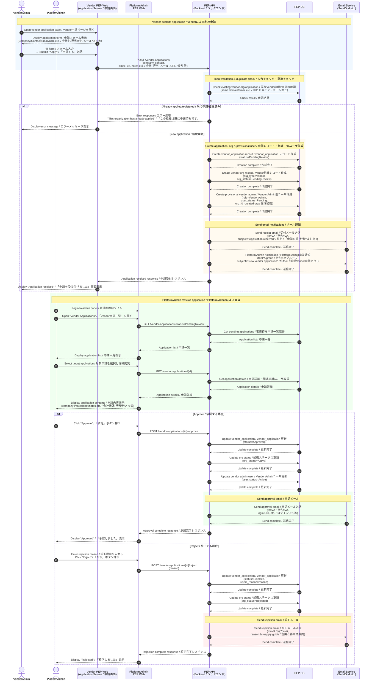

# UC03: Vendor Application & Approval / Vendor申請・承認

```mermaid
sequenceDiagram
    autonumber
    actor VA as VendorAdmin
    actor PA as PlatformAdmin
    participant VWeb as Vendor PEP Web<br/>(Application Screen / 申請画面)
    participant AWeb as Platform Admin<br/>PEP Web
    participant API as PEP API<br/>(Backend / バックエンド)
    participant DB as PEP DB
    participant Mail as Email Service<br/>(SendGrid etc.)

    rect rgb(240, 248, 255)
        Note over VA, Mail: Vendor submits application / Vendorによる利用申請
        VA->>VWeb: Open vendor application page / Vendor申請ページを開く
        VWeb-->>VA: Display application form / 申請フォーム表示<br/>(Company/Contact/Email/URL etc. / 会社名/担当者名/メール/URL等)

        VA->>VWeb: Fill form / フォーム入力<br/>→ Submit "Apply" / 「申請する」送信
        VWeb->>API: POST /vendor-applications<br/>(company, contact,<br/>email, url, notes etc. / 会社, 担当, メール, URL, 備考 等)
    end

    rect rgb(240, 248, 255)
        Note over API, DB: Input validation & duplicate check / 入力チェック・重複チェック
        API->>DB: Check existing vendor org/application / 既存Vendor組織/申請の確認<br/>(same domain/email etc. / 同じドメイン・メールなど)
        DB-->>API: Check result / 確認結果
    end

    alt Already applied/registered / 既に申請/登録済み
        API-->>VWeb: Error response / エラー応答<br/>"This organization has already applied" / 「この組織は既に申請済みです」
        VWeb-->>VA: Display error message / エラーメッセージ表示
    else New application / 新規申請
        rect rgb(255, 250, 240)
            Note over API, DB: Create application, org & provisional user / 申請レコード・組織・仮ユーザ作成
            API->>DB: Create vendor_application record / vendor_application レコード作成<br/>(status=PendingReview)
            DB-->>API: Creation complete / 作成完了

            API->>DB: Create vendor org record / Vendor組織レコード作成<br/>(org_type=Vendor,<br/>org_status=PendingReview)
            DB-->>API: Creation complete / 作成完了

            API->>DB: Create provisional vendor admin / Vendor Admin仮ユーザ作成<br/>(role=Vendor Admin,<br/>user_status=Pending,<br/>org_id=created org / 作成組織)
            DB-->>API: Creation complete / 作成完了
        end

        rect rgb(255, 250, 240)
            Note over API, Mail: Send email notifications / メール通知
            API->>Mail: Send receipt email / 受付メール送信<br/>(to=VA / 宛先=VA,<br/>subject="Application received" / 件名=「申請を受け付けました」)
            Mail-->>API: Send complete / 送信完了

            API->>Mail: Platform Admin notification / Platform Admin向け通知<br/>(to=PA group / 宛先=PAグループ,<br/>subject="New vendor application" / 件名=「新規Vendor申請あり」)
            Mail-->>API: Send complete / 送信完了
        end

        API-->>VWeb: Application received response / 申請受付レスポンス
        VWeb-->>VA: Display "Application received" / 「申請を受け付けました」画面表示
    end

    rect rgb(240, 255, 240)
        Note over PA, Mail: Platform Admin reviews application / Platform Adminによる審査
        PA->>AWeb: Login to admin panel / 管理画面ログイン
        PA->>AWeb: Open "Vendor Applications" / 「Vendor申請一覧」を開く
        AWeb->>API: GET /vendor-applications?status=PendingReview
        API->>DB: Get pending applications / 審査待ち申請一覧取得
        DB-->>API: Application list / 申請一覧
        API-->>AWeb: Application list / 申請一覧
        AWeb-->>PA: Display application list / 申請一覧表示

        PA->>AWeb: Select target application / 対象申請を選択し詳細閲覧
        AWeb->>API: GET /vendor-applications/{id}
        API->>DB: Get application details / 申請詳細・関連組織/ユーザ取得
        DB-->>API: Application details / 申請詳細
        API-->>AWeb: Application details / 申請詳細
        AWeb-->>PA: Display application contents / 申請内容表示<br/>(company info/contact/notes etc. / 会社情報/担当者/メモ等)
    end

    alt Approve / 承認する場合
        PA->>AWeb: Click "Approve" / 「承認」ボタン押下
        AWeb->>API: POST /vendor-applications/{id}/approve

        API->>DB: Update vendor_application / vendor_application 更新<br/>(status=Approved)
        DB-->>API: Update complete / 更新完了

        API->>DB: Update org status / 組織ステータス更新<br/>(org_status=Active)
        DB-->>API: Update complete / 更新完了

        API->>DB: Update vendor admin user / Vendor Adminユーザ更新<br/>(user_status=Active)
        DB-->>API: Update complete / 更新完了

        rect rgb(240, 255, 240)
            Note over API, Mail: Send approval email / 承認メール
            API->>Mail: Send approval email / 承認メール送信<br/>(to=VA / 宛先=VA,<br/>login URL etc. / ログインURL等)
            Mail-->>API: Send complete / 送信完了
        end

        API-->>AWeb: Approval complete response / 承認完了レスポンス
        AWeb-->>PA: Display "Approved" / 「承認しました」表示

    else Reject / 却下する場合
        PA->>AWeb: Enter rejection reason / 却下理由を入力し<br/>Click "Reject" / 「却下」ボタン押下
        AWeb->>API: POST /vendor-applications/{id}/reject<br/>(reason)

        API->>DB: Update vendor_application / vendor_application 更新<br/>(status=Rejected,<br/>reject_reason=reason)
        DB-->>API: Update complete / 更新完了

        API->>DB: Update org status / 組織ステータス更新<br/>(org_status=Rejected)
        DB-->>API: Update complete / 更新完了

        rect rgb(255, 240, 240)
            Note over API, Mail: Send rejection email / 却下メール
            API->>Mail: Send rejection email / 却下メール送信<br/>(to=VA / 宛先=VA,<br/>reason & reapply guide / 理由と再申請案内)
            Mail-->>API: Send complete / 送信完了
        end

        API-->>AWeb: Rejection complete response / 却下完了レスポンス
        AWeb-->>PA: Display "Rejected" / 「却下しました」表示
    end
```
