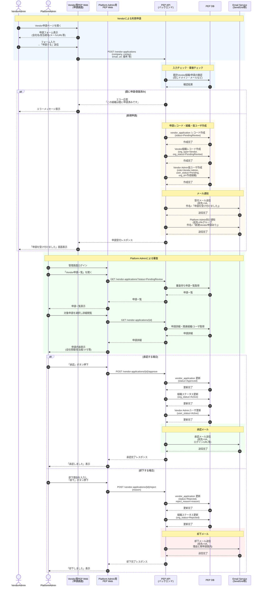

# UC03: Vendor申請・承認

```mermaid
sequenceDiagram
    autonumber
    actor VA as VendorAdmin
    actor PA as PlatformAdmin
    participant VWeb as Vendor用PEP Web<br/>(申請画面)
    participant AWeb as Platform Admin用<br/>PEP Web
    participant API as PEP API<br/>(バックエンド)
    participant DB as PEP DB
    participant Mail as Email Service<br/>(SendGrid等)

    rect rgb(240, 248, 255)
        Note over VA, Mail: Vendorによる利用申請
        VA->>VWeb: Vendor申請ページを開く
        VWeb-->>VA: 申請フォーム表示<br/>(会社名/担当者名/メール/URL等)

        VA->>VWeb: フォーム入力<br/>→「申請する」送信
        VWeb->>API: POST /vendor-applications<br/>(company, contact,<br/>email, url, 備考 等)
    end

    rect rgb(240, 248, 255)
        Note over API, DB: 入力チェック・重複チェック
        API->>DB: 既存Vendor組織/申請の確認<br/>(同じドメイン・メールなど)
        DB-->>API: 確認結果
    end

    alt 既に申請/登録済み
        API-->>VWeb: エラー応答<br/>「この組織は既に申請済みです」
        VWeb-->>VA: エラーメッセージ表示
    else 新規申請
        rect rgb(255, 250, 240)
            Note over API, DB: 申請レコード・組織・仮ユーザ作成
            API->>DB: vendor_application レコード作成<br/>(status=PendingReview)
            DB-->>API: 作成完了

            API->>DB: Vendor組織レコード作成<br/>(org_type=Vendor,<br/>org_status=PendingReview)
            DB-->>API: 作成完了

            API->>DB: Vendor Admin仮ユーザ作成<br/>(role=Vendor Admin,<br/>user_status=Pending,<br/>org_id=作成組織)
            DB-->>API: 作成完了
        end

        rect rgb(255, 250, 240)
            Note over API, Mail: メール通知
            API->>Mail: 受付メール送信<br/>(宛先=VA,<br/>件名=「申請を受け付けました」)
            Mail-->>API: 送信完了

            API->>Mail: Platform Admin向け通知<br/>(宛先=PAグループ,<br/>件名=「新規Vendor申請あり」)
            Mail-->>API: 送信完了
        end

        API-->>VWeb: 申請受付レスポンス
        VWeb-->>VA: 「申請を受け付けました」画面表示
    end

    rect rgb(240, 255, 240)
        Note over PA, Mail: Platform Adminによる審査
        PA->>AWeb: 管理画面ログイン
        PA->>AWeb: 「Vendor申請一覧」を開く
        AWeb->>API: GET /vendor-applications?status=PendingReview
        API->>DB: 審査待ち申請一覧取得
        DB-->>API: 申請一覧
        API-->>AWeb: 申請一覧
        AWeb-->>PA: 申請一覧表示

        PA->>AWeb: 対象申請を選択し詳細閲覧
        AWeb->>API: GET /vendor-applications/{id}
        API->>DB: 申請詳細・関連組織/ユーザ取得
        DB-->>API: 申請詳細
        API-->>AWeb: 申請詳細
        AWeb-->>PA: 申請内容表示<br/>(会社情報/担当者/メモ等)
    end

    alt 承認する場合
        PA->>AWeb: 「承認」ボタン押下
        AWeb->>API: POST /vendor-applications/{id}/approve

        API->>DB: vendor_application 更新<br/>(status=Approved)
        DB-->>API: 更新完了

        API->>DB: 組織ステータス更新<br/>(org_status=Active)
        DB-->>API: 更新完了

        API->>DB: Vendor Adminユーザ更新<br/>(user_status=Active)
        DB-->>API: 更新完了

        rect rgb(240, 255, 240)
            Note over API, Mail: 承認メール
            API->>Mail: 承認メール送信<br/>(宛先=VA,<br/>ログインURL等)
            Mail-->>API: 送信完了
        end

        API-->>AWeb: 承認完了レスポンス
        AWeb-->>PA: 「承認しました」表示

    else 却下する場合
        PA->>AWeb: 却下理由を入力し<br/>「却下」ボタン押下
        AWeb->>API: POST /vendor-applications/{id}/reject<br/>(reason)

        API->>DB: vendor_application 更新<br/>(status=Rejected,<br/>reject_reason=reason)
        DB-->>API: 更新完了

        API->>DB: 組織ステータス更新<br/>(org_status=Rejected)
        DB-->>API: 更新完了

        rect rgb(255, 240, 240)
            Note over API, Mail: 却下メール
            API->>Mail: 却下メール送信<br/>(宛先=VA,<br/>理由と再申請案内)
            Mail-->>API: 送信完了
        end

        API-->>AWeb: 却下完了レスポンス
        AWeb-->>PA: 「却下しました」表示
    end
```
