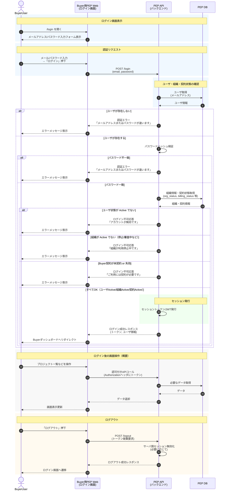

# UC04: Buyerのログイン・ログアウト

```mermaid
sequenceDiagram
    autonumber
    actor BU as BuyerUser
    participant BWeb as Buyer用PEP Web<br/>(ログイン画面)
    participant API as PEP API<br/>(バックエンド)
    participant DB as PEP DB

    rect rgb(240, 248, 255)
        Note over BU, DB: ログイン画面表示
        BU->>BWeb: /login を開く
        BWeb-->>BU: メールアドレス/パスワード入力フォーム表示
    end

    rect rgb(240, 248, 255)
        Note over BU, DB: 認証リクエスト
        BU->>BWeb: メール/パスワード入力<br/>→「ログイン」押下
        BWeb->>API: POST /login<br/>(email, password)
    end

    rect rgb(240, 248, 255)
        Note over API, DB: ユーザ・組織・契約状態の確認
        API->>DB: ユーザ取得<br/>(メールアドレス)
        DB-->>API: ユーザ情報
    end

    alt ユーザが存在しない
        API-->>BWeb: 認証エラー<br/>「メールアドレスまたはパスワードが違います」
        BWeb-->>BU: エラーメッセージ表示
    else ユーザが存在する
        API->>API: パスワードハッシュ検証

        alt パスワード不一致
            API-->>BWeb: 認証エラー<br/>「メールアドレスまたはパスワードが違います」
            BWeb-->>BU: エラーメッセージ表示
        else パスワード一致
            API->>DB: 組織情報・契約状態取得<br/>(org_status, billing_status 等)
            DB-->>API: 組織・契約情報

            alt ユーザ状態が Active でない
                API-->>BWeb: ログイン不可応答<br/>「アカウントが無効です」
                BWeb-->>BU: エラーメッセージ表示
            else 組織が Active でない（停止/審査中など）
                API-->>BWeb: ログイン不可応答<br/>「組織が利用停止中です」
                BWeb-->>BU: エラーメッセージ表示
            else Buyer契約が未契約 or 失効
                API-->>BWeb: ログイン不可応答<br/>「ご利用には契約が必要です」
                BWeb-->>BU: エラーメッセージ表示
            else すべてOK（ユーザActive/組織Active/契約Active）
                rect rgb(240, 255, 240)
                    Note over API, DB: セッション発行
                    API->>API: セッショントークン/JWT発行
                end
                API-->>BWeb: ログイン成功レスポンス<br/>(トークン, ユーザ情報)
                BWeb-->>BU: Buyerダッシュボードへリダイレクト
            end
        end
    end

    rect rgb(248, 248, 248)
        Note over BU, DB: ログイン後の画面操作（概要）
        BU->>BWeb: プロジェクト一覧などを操作
        BWeb->>API: 認可付きAPIコール<br/>(Authorizationヘッダにトークン)
        API->>DB: 必要なデータ取得
        DB-->>API: データ
        API-->>BWeb: データ返却
        BWeb-->>BU: 画面表示更新
    end

    rect rgb(255, 250, 240)
        Note over BU, DB: ログアウト
        BU->>BWeb: 「ログアウト」押下
        BWeb->>API: POST /logout<br/>(トークン破棄要求)
        API->>API: サーバ側セッション無効化<br/>(必要に応じて)
        API-->>BWeb: ログアウト成功レスポンス
        BWeb-->>BU: ログイン画面へ遷移
    end
```
