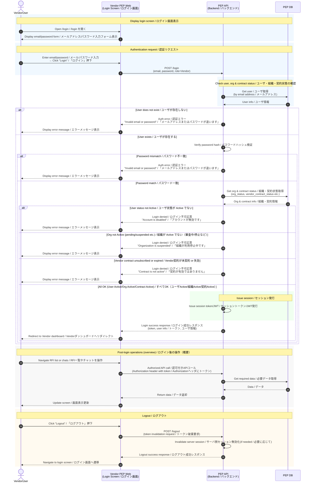

# UC05: Vendor Login/Logout / Vendorのログイン・ログアウト

```mermaid
sequenceDiagram
    autonumber
    actor VU as VendorUser
    participant VWeb as Vendor PEP Web<br/>(Login Screen / ログイン画面)
    participant API as PEP API<br/>(Backend / バックエンド)
    participant DB as PEP DB

    rect rgb(240, 248, 255)
        Note over VU, DB: Display login screen / ログイン画面表示
        VU->>VWeb: Open /login / /login を開く
        VWeb-->>VU: Display email/password form / メールアドレス/パスワード入力フォーム表示
    end

    rect rgb(240, 248, 255)
        Note over VU, DB: Authentication request / 認証リクエスト
        VU->>VWeb: Enter email/password / メール/パスワード入力<br/>→ Click "Login" / 「ログイン」押下
        VWeb->>API: POST /login<br/>(email, password, role=Vendor)
    end

    rect rgb(240, 248, 255)
        Note over API, DB: Check user, org & contract status / ユーザ・組織・契約状態の確認
        API->>DB: Get user / ユーザ取得<br/>(by email address / メールアドレス)
        DB-->>API: User info / ユーザ情報
    end

    alt User does not exist / ユーザが存在しない
        API-->>VWeb: Auth error / 認証エラー<br/>"Invalid email or password" / 「メールアドレスまたはパスワードが違います」
        VWeb-->>VU: Display error message / エラーメッセージ表示
    else User exists / ユーザが存在する
        API->>API: Verify password hash / パスワードハッシュ検証

        alt Password mismatch / パスワード不一致
            API-->>VWeb: Auth error / 認証エラー<br/>"Invalid email or password" / 「メールアドレスまたはパスワードが違います」
            VWeb-->>VU: Display error message / エラーメッセージ表示
        else Password match / パスワード一致
            API->>DB: Get org & contract status / 組織・契約状態取得<br/>(org_status, vendor_contract_status etc.)
            DB-->>API: Org & contract info / 組織・契約情報

            alt User status not Active / ユーザ状態が Active でない
                API-->>VWeb: Login denied / ログイン不可応答<br/>"Account is disabled" / 「アカウントが無効です」
                VWeb-->>VU: Display error message / エラーメッセージ表示
            else Org not Active (pending/suspended etc.) / 組織が Active でない（審査中/停止など）
                API-->>VWeb: Login denied / ログイン不可応答<br/>"Organization is suspended" / 「組織が利用停止中です」
                VWeb-->>VU: Display error message / エラーメッセージ表示
            else Vendor contract unsubscribed or expired / Vendor契約が未契約 or 失効
                API-->>VWeb: Login denied / ログイン不可応答<br/>"Contract is not active" / 「契約が有効ではありません」
                VWeb-->>VU: Display error message / エラーメッセージ表示
            else All OK (User Active/Org Active/Contract Active) / すべてOK（ユーザActive/組織Active/契約Active）
                rect rgb(240, 255, 240)
                    Note over API, DB: Issue session / セッション発行
                    API->>API: Issue session token/JWT / セッショントークン/JWT発行
                end
                API-->>VWeb: Login success response / ログイン成功レスポンス<br/>(token, user info / トークン, ユーザ情報)
                VWeb-->>VU: Redirect to Vendor dashboard / Vendorダッシュボードへリダイレクト
            end
        end
    end

    rect rgb(248, 248, 248)
        Note over VU, DB: Post-login operations (overview) / ログイン後の操作（概要）
        VU->>VWeb: Navigate RFI list or chats / RFI一覧やチャットを操作
        VWeb->>API: Authorized API call / 認可付きAPIコール<br/>(Authorization header with token / Authorizationヘッダにトークン)
        API->>DB: Get required data / 必要データ取得
        DB-->>API: Data / データ
        API-->>VWeb: Return data / データ返却
        VWeb-->>VU: Update screen / 画面表示更新
    end

    rect rgb(255, 250, 240)
        Note over VU, DB: Logout / ログアウト
        VU->>VWeb: Click "Logout" / 「ログアウト」押下
        VWeb->>API: POST /logout<br/>(token invalidation request / トークン破棄要求)
        API->>API: Invalidate server session / サーバ側セッション無効化(if needed / 必要に応じて)
        API-->>VWeb: Logout success response / ログアウト成功レスポンス
        VWeb-->>VU: Navigate to login screen / ログイン画面へ遷移
    end
```
