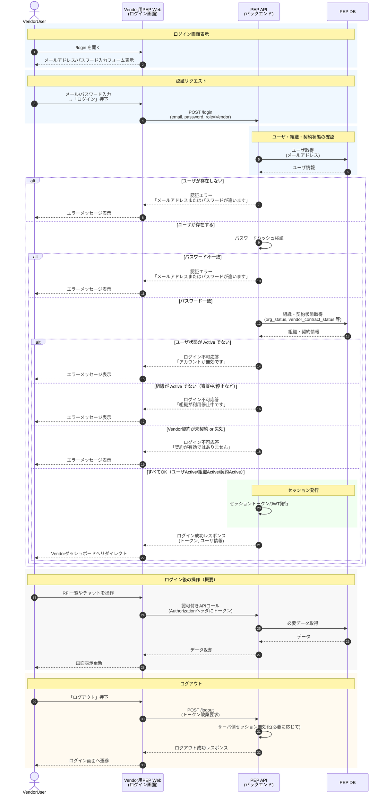

# UC05: Vendorのログイン・ログアウト

```mermaid
sequenceDiagram
    autonumber
    actor VU as VendorUser
    participant VWeb as Vendor用PEP Web<br/>(ログイン画面)
    participant API as PEP API<br/>(バックエンド)
    participant DB as PEP DB

    rect rgb(240, 248, 255)
        Note over VU, DB: ログイン画面表示
        VU->>VWeb: /login を開く
        VWeb-->>VU: メールアドレス/パスワード入力フォーム表示
    end

    rect rgb(240, 248, 255)
        Note over VU, DB: 認証リクエスト
        VU->>VWeb: メール/パスワード入力<br/>→「ログイン」押下
        VWeb->>API: POST /login<br/>(email, password, role=Vendor)
    end

    rect rgb(240, 248, 255)
        Note over API, DB: ユーザ・組織・契約状態の確認
        API->>DB: ユーザ取得<br/>(メールアドレス)
        DB-->>API: ユーザ情報
    end

    alt ユーザが存在しない
        API-->>VWeb: 認証エラー<br/>「メールアドレスまたはパスワードが違います」
        VWeb-->>VU: エラーメッセージ表示
    else ユーザが存在する
        API->>API: パスワードハッシュ検証

        alt パスワード不一致
            API-->>VWeb: 認証エラー<br/>「メールアドレスまたはパスワードが違います」
            VWeb-->>VU: エラーメッセージ表示
        else パスワード一致
            API->>DB: 組織・契約状態取得<br/>(org_status, vendor_contract_status 等)
            DB-->>API: 組織・契約情報

            alt ユーザ状態が Active でない
                API-->>VWeb: ログイン不可応答<br/>「アカウントが無効です」
                VWeb-->>VU: エラーメッセージ表示
            else 組織が Active でない（審査中/停止など）
                API-->>VWeb: ログイン不可応答<br/>「組織が利用停止中です」
                VWeb-->>VU: エラーメッセージ表示
            else Vendor契約が未契約 or 失効
                API-->>VWeb: ログイン不可応答<br/>「契約が有効ではありません」
                VWeb-->>VU: エラーメッセージ表示
            else すべてOK（ユーザActive/組織Active/契約Active）
                rect rgb(240, 255, 240)
                    Note over API, DB: セッション発行
                    API->>API: セッショントークン/JWT発行
                end
                API-->>VWeb: ログイン成功レスポンス<br/>(トークン, ユーザ情報)
                VWeb-->>VU: Vendorダッシュボードへリダイレクト
            end
        end
    end

    rect rgb(248, 248, 248)
        Note over VU, DB: ログイン後の操作（概要）
        VU->>VWeb: RFI一覧やチャットを操作
        VWeb->>API: 認可付きAPIコール<br/>(Authorizationヘッダにトークン)
        API->>DB: 必要データ取得
        DB-->>API: データ
        API-->>VWeb: データ返却
        VWeb-->>VU: 画面表示更新
    end

    rect rgb(255, 250, 240)
        Note over VU, DB: ログアウト
        VU->>VWeb: 「ログアウト」押下
        VWeb->>API: POST /logout<br/>(トークン破棄要求)
        API->>API: サーバ側セッション無効化(必要に応じて)
        API-->>VWeb: ログアウト成功レスポンス
        VWeb-->>VU: ログイン画面へ遷移
    end
```
