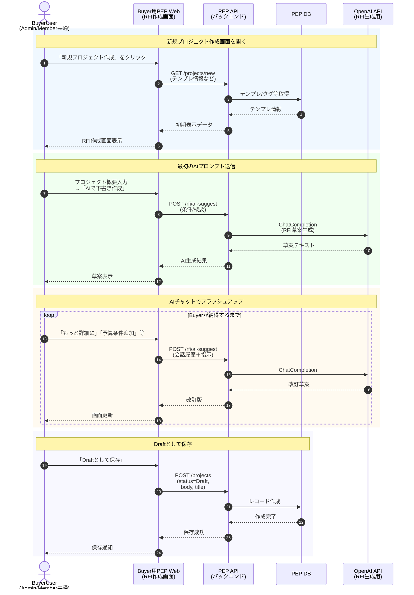

# UC06: RFI草案の作成（AIチャット）

```mermaid
sequenceDiagram
    autonumber
    actor BU as BuyerUser<br/>(Admin/Member共通)
    participant BWeb as Buyer用PEP Web<br/>(RFI作成画面)
    participant API as PEP API<br/>(バックエンド)
    participant DB as PEP DB
    participant AI as OpenAI API<br/>(RFI生成用)

    rect rgb(240, 248, 255)
        Note over BU, AI: 新規プロジェクト作成画面を開く
        BU->>BWeb: 「新規プロジェクト作成」をクリック
        BWeb->>API: GET /projects/new<br/>(テンプレ情報など)
        API->>DB: テンプレ/タグ等取得
        DB-->>API: テンプレ情報
        API-->>BWeb: 初期表示データ
        BWeb-->>BU: RFI作成画面表示
    end

    rect rgb(240, 255, 240)
        Note over BU, AI: 最初のAIプロンプト送信
        BU->>BWeb: プロジェクト概要入力<br/>→「AIで下書き作成」
        BWeb->>API: POST /rfi/ai-suggest<br/>(条件/概要)

        API->>AI: ChatCompletion<br/>(RFI草案生成)
        AI-->>API: 草案テキスト

        API-->>BWeb: AI生成結果
        BWeb-->>BU: 草案表示
    end

    rect rgb(255, 250, 240)
        Note over BU, AI: AIチャットでブラッシュアップ
        loop Buyerが納得するまで
            BU->>BWeb: 「もっと詳細に」「予算条件追加」等
            BWeb->>API: POST /rfi/ai-suggest<br/>(会話履歴＋指示)
            API->>AI: ChatCompletion
            AI-->>API: 改訂草案
            API-->>BWeb: 改訂版
            BWeb-->>BU: 画面更新
        end
    end

    rect rgb(248, 248, 255)
        Note over BU, DB: Draftとして保存
        BU->>BWeb: 「Draftとして保存」
        BWeb->>API: POST /projects<br/>(status=Draft,<br/>body, title)
        API->>DB: レコード作成
        DB-->>API: 作成完了
        API-->>BWeb: 保存成功
        BWeb-->>BU: 保存通知
    end
```
