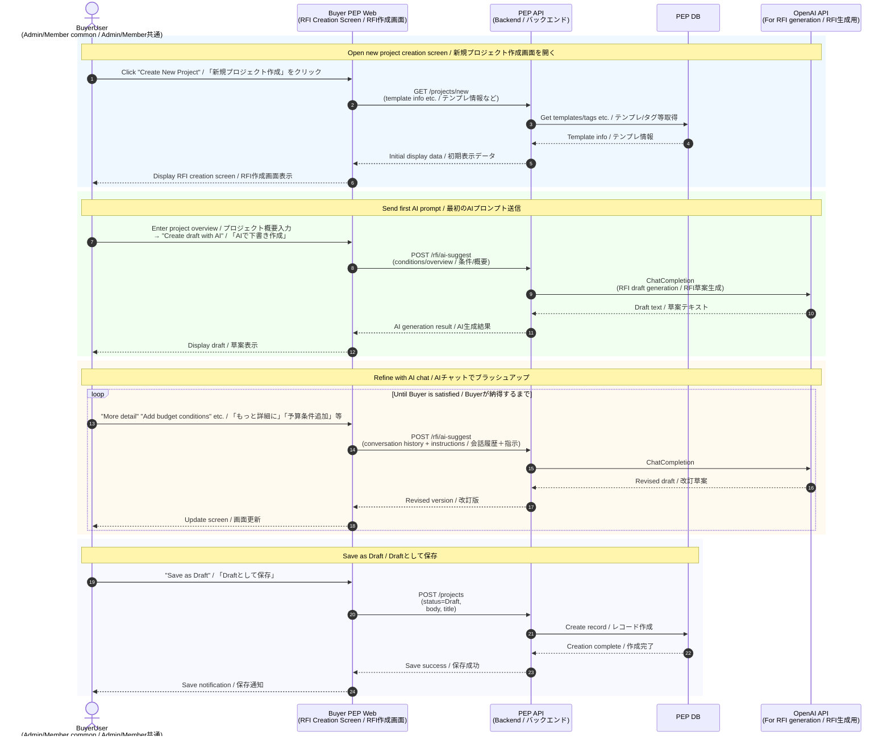

# UC06: RFI Draft Creation (AI Chat) / RFI草案の作成（AIチャット）

```mermaid
sequenceDiagram
    autonumber
    actor BU as BuyerUser<br/>(Admin/Member common / Admin/Member共通)
    participant BWeb as Buyer PEP Web<br/>(RFI Creation Screen / RFI作成画面)
    participant API as PEP API<br/>(Backend / バックエンド)
    participant DB as PEP DB
    participant AI as OpenAI API<br/>(For RFI generation / RFI生成用)

    rect rgb(240, 248, 255)
        Note over BU, AI: Open new project creation screen / 新規プロジェクト作成画面を開く
        BU->>BWeb: Click "Create New Project" / 「新規プロジェクト作成」をクリック
        BWeb->>API: GET /projects/new<br/>(template info etc. / テンプレ情報など)
        API->>DB: Get templates/tags etc. / テンプレ/タグ等取得
        DB-->>API: Template info / テンプレ情報
        API-->>BWeb: Initial display data / 初期表示データ
        BWeb-->>BU: Display RFI creation screen / RFI作成画面表示
    end

    rect rgb(240, 255, 240)
        Note over BU, AI: Send first AI prompt / 最初のAIプロンプト送信
        BU->>BWeb: Enter project overview / プロジェクト概要入力<br/>→ "Create draft with AI" / 「AIで下書き作成」
        BWeb->>API: POST /rfi/ai-suggest<br/>(conditions/overview / 条件/概要)

        API->>AI: ChatCompletion<br/>(RFI draft generation / RFI草案生成)
        AI-->>API: Draft text / 草案テキスト

        API-->>BWeb: AI generation result / AI生成結果
        BWeb-->>BU: Display draft / 草案表示
    end

    rect rgb(255, 250, 240)
        Note over BU, AI: Refine with AI chat / AIチャットでブラッシュアップ
        loop Until Buyer is satisfied / Buyerが納得するまで
            BU->>BWeb: "More detail" "Add budget conditions" etc. / 「もっと詳細に」「予算条件追加」等
            BWeb->>API: POST /rfi/ai-suggest<br/>(conversation history + instructions / 会話履歴＋指示)
            API->>AI: ChatCompletion
            AI-->>API: Revised draft / 改訂草案
            API-->>BWeb: Revised version / 改訂版
            BWeb-->>BU: Update screen / 画面更新
        end
    end

    rect rgb(248, 248, 255)
        Note over BU, DB: Save as Draft / Draftとして保存
        BU->>BWeb: "Save as Draft" / 「Draftとして保存」
        BWeb->>API: POST /projects<br/>(status=Draft,<br/>body, title)
        API->>DB: Create record / レコード作成
        DB-->>API: Creation complete / 作成完了
        API-->>BWeb: Save success / 保存成功
        BWeb-->>BU: Save notification / 保存通知
    end
```
