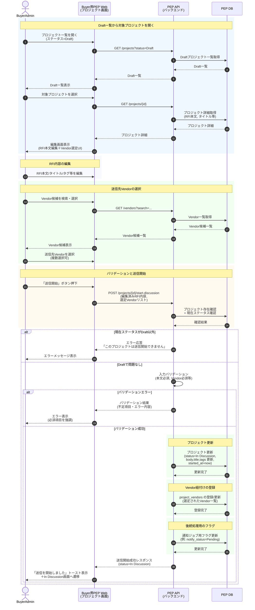

# UC07: RFI編集・送信開始（Draft → In Discussion）

```mermaid
sequenceDiagram
    autonumber
    actor BA as BuyerAdmin
    participant BWeb as Buyer用PEP Web<br/>(プロジェクト画面)
    participant API as PEP API<br/>(バックエンド)
    participant DB as PEP DB

    rect rgb(240, 248, 255)
        Note over BA, DB: Draft一覧から対象プロジェクトを開く
        BA->>BWeb: プロジェクト一覧を開く<br/>(ステータス=Draft)
        BWeb->>API: GET /projects?status=Draft
        API->>DB: Draftプロジェクト一覧取得
        DB-->>API: Draft一覧
        API-->>BWeb: Draft一覧
        BWeb-->>BA: Draft一覧表示

        BA->>BWeb: 対象プロジェクトを選択
        BWeb->>API: GET /projects/{id}
        API->>DB: プロジェクト詳細取得<br/>(RFI本文, タイトル等)
        DB-->>API: プロジェクト詳細
        API-->>BWeb: プロジェクト詳細
        BWeb-->>BA: 編集画面表示<br/>(RFI本文編集＋Vendor選定UI)
    end

    rect rgb(248, 248, 255)
        Note over BA, BWeb: RFI内容の編集
        BA->>BWeb: RFI本文/タイトル/タグ等を編集
    end

    rect rgb(240, 255, 240)
        Note over BA, DB: 送信先Vendorの選択
        BA->>BWeb: Vendor候補を検索・選択
        BWeb->>API: GET /vendors?search=...
        API->>DB: Vendor一覧取得
        DB-->>API: Vendor候補一覧
        API-->>BWeb: Vendor候補一覧
        BWeb-->>BA: Vendor候補表示

        BA->>BWeb: 送信先Vendorを選択<br/>(複数選択可)
    end

    rect rgb(255, 250, 240)
        Note over BA, DB: バリデーションと送信開始
        BA->>BWeb: 「送信開始」ボタン押下
        BWeb->>API: POST /projects/{id}/start-discussion<br/>(編集済みRFI内容,<br/>選定Vendorリスト)

        API->>DB: プロジェクト存在確認<br/>+ 現在ステータス確認
        DB-->>API: 確認結果
    end

    alt 現在ステータスがDraft以外
        API-->>BWeb: エラー応答<br/>「このプロジェクトは送信開始できません」
        BWeb-->>BA: エラーメッセージ表示
    else Draftで問題なし
        API->>API: 入力バリデーション<br/>(本文必須, Vendor必須等)

        alt バリデーションエラー
            API-->>BWeb: バリデーション結果<br/>(不足項目・エラー内容)
            BWeb-->>BA: エラー表示<br/>(必須項目を強調)
        else バリデーション成功
            rect rgb(240, 255, 240)
                Note over API, DB: プロジェクト更新
                API->>DB: プロジェクト更新<br/>(status=In Discussion,<br/>body,title,tags 更新,<br/>started_at=now)
                DB-->>API: 更新完了
            end

            rect rgb(240, 255, 240)
                Note over API, DB: Vendor紐付けの登録
                API->>DB: project_vendors の登録/更新<br/>(選定されたVendor一覧)
                DB-->>API: 登録完了
            end

            rect rgb(240, 255, 240)
                Note over API, DB: 後続処理用のフラグ
                API->>DB: 通知ジョブ用フラグ更新<br/>(例: notify_status=Pending)
                DB-->>API: 更新完了
            end

            API-->>BWeb: 送信開始成功レスポンス<br/>(status=In Discussion)
            BWeb-->>BA: 「送信を開始しました」トースト表示<br/>＋In Discussion画面へ遷移
        end
    end
```
