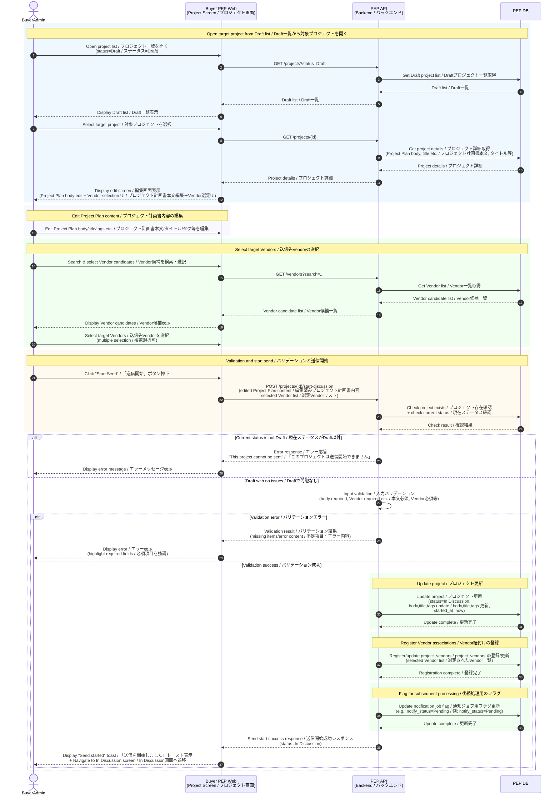

# UC07: Project Plan Edit & Send (Draft → In Discussion) / プロジェクト計画書編集・送信開始（Draft → In Discussion）

```mermaid
sequenceDiagram
    autonumber
    actor BA as BuyerAdmin
    participant BWeb as Buyer PEP Web<br/>(Project Screen / プロジェクト画面)
    participant API as PEP API<br/>(Backend / バックエンド)
    participant DB as PEP DB

    rect rgb(240, 248, 255)
        Note over BA, DB: Open target project from Draft list / Draft一覧から対象プロジェクトを開く
        BA->>BWeb: Open project list / プロジェクト一覧を開く<br/>(status=Draft / ステータス=Draft)
        BWeb->>API: GET /projects?status=Draft
        API->>DB: Get Draft project list / Draftプロジェクト一覧取得
        DB-->>API: Draft list / Draft一覧
        API-->>BWeb: Draft list / Draft一覧
        BWeb-->>BA: Display Draft list / Draft一覧表示

        BA->>BWeb: Select target project / 対象プロジェクトを選択
        BWeb->>API: GET /projects/{id}
        API->>DB: Get project details / プロジェクト詳細取得<br/>(Project Plan body, title etc. / プロジェクト計画書本文, タイトル等)
        DB-->>API: Project details / プロジェクト詳細
        API-->>BWeb: Project details / プロジェクト詳細
        BWeb-->>BA: Display edit screen / 編集画面表示<br/>(Project Plan body edit + Vendor selection UI / プロジェクト計画書本文編集＋Vendor選定UI)
    end

    rect rgb(248, 248, 255)
        Note over BA, BWeb: Edit Project Plan content / プロジェクト計画書内容の編集
        BA->>BWeb: Edit Project Plan body/title/tags etc. / プロジェクト計画書本文/タイトル/タグ等を編集
    end

    rect rgb(240, 255, 240)
        Note over BA, DB: Select target Vendors / 送信先Vendorの選択
        BA->>BWeb: Search & select Vendor candidates / Vendor候補を検索・選択
        BWeb->>API: GET /vendors?search=...
        API->>DB: Get Vendor list / Vendor一覧取得
        DB-->>API: Vendor candidate list / Vendor候補一覧
        API-->>BWeb: Vendor candidate list / Vendor候補一覧
        BWeb-->>BA: Display Vendor candidates / Vendor候補表示

        BA->>BWeb: Select target Vendors / 送信先Vendorを選択<br/>(multiple selection / 複数選択可)
    end

    rect rgb(255, 250, 240)
        Note over BA, DB: Validation and start send / バリデーションと送信開始
        BA->>BWeb: Click "Start Send" / 「送信開始」ボタン押下
        BWeb->>API: POST /projects/{id}/start-discussion<br/>(edited Project Plan content / 編集済みプロジェクト計画書内容,<br/>selected Vendor list / 選定Vendorリスト)

        API->>DB: Check project exists / プロジェクト存在確認<br/>+ check current status / 現在ステータス確認
        DB-->>API: Check result / 確認結果
    end

    alt Current status is not Draft / 現在ステータスがDraft以外
        API-->>BWeb: Error response / エラー応答<br/>"This project cannot be sent" / 「このプロジェクトは送信開始できません」
        BWeb-->>BA: Display error message / エラーメッセージ表示
    else Draft with no issues / Draftで問題なし
        API->>API: Input validation / 入力バリデーション<br/>(body required, Vendor required etc. / 本文必須, Vendor必須等)

        alt Validation error / バリデーションエラー
            API-->>BWeb: Validation result / バリデーション結果<br/>(missing items/error content / 不足項目・エラー内容)
            BWeb-->>BA: Display error / エラー表示<br/>(highlight required fields / 必須項目を強調)
        else Validation success / バリデーション成功
            rect rgb(240, 255, 240)
                Note over API, DB: Update project / プロジェクト更新
                API->>DB: Update project / プロジェクト更新<br/>(status=In Discussion,<br/>body,title,tags update / body,title,tags 更新,<br/>started_at=now)
                DB-->>API: Update complete / 更新完了
            end

            rect rgb(240, 255, 240)
                Note over API, DB: Register Vendor associations / Vendor紐付けの登録
                API->>DB: Register/update project_vendors / project_vendors の登録/更新<br/>(selected Vendor list / 選定されたVendor一覧)
                DB-->>API: Registration complete / 登録完了
            end

            rect rgb(240, 255, 240)
                Note over API, DB: Flag for subsequent processing / 後続処理用のフラグ
                API->>DB: Update notification job flag / 通知ジョブ用フラグ更新<br/>(e.g.: notify_status=Pending / 例: notify_status=Pending)
                DB-->>API: Update complete / 更新完了
            end

            API-->>BWeb: Send start success response / 送信開始成功レスポンス<br/>(status=In Discussion)
            BWeb-->>BA: Display "Send started" toast / 「送信を開始しました」トースト表示<br/>+ Navigate to In Discussion screen / In Discussion画面へ遷移
        end
    end
```
