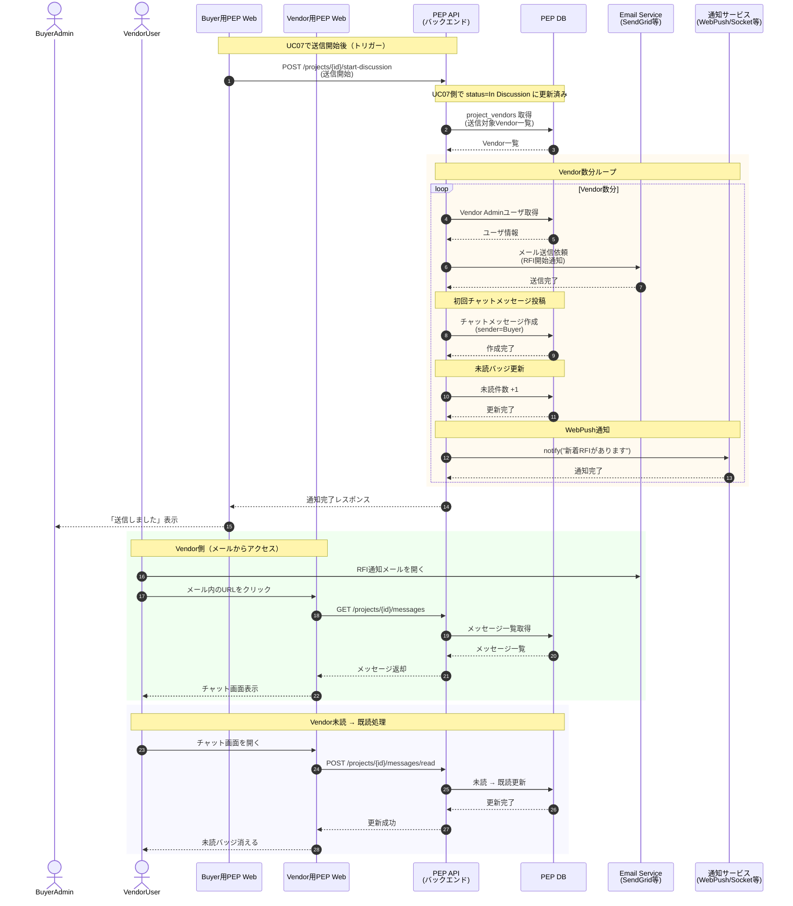

# UC08: ベンダーへのRFI通知（メール／チャット）

```mermaid
sequenceDiagram
    autonumber
    actor BA as BuyerAdmin
    actor VU as VendorUser
    participant BWeb as Buyer用PEP Web
    participant VWeb as Vendor用PEP Web
    participant API as PEP API<br/>(バックエンド)
    participant DB as PEP DB
    participant Mail as Email Service<br/>(SendGrid等)
    participant Notif as 通知サービス<br/>(WebPush/Socket等)

    Note over BWeb, API: UC07で送信開始後（トリガー）
    BWeb->>API: POST /projects/{id}/start-discussion<br/>(送信開始)

    Note over API, DB: UC07側で status=In Discussion に更新済み

    API->>DB: project_vendors 取得<br/>(送信対象Vendor一覧)
    DB-->>API: Vendor一覧

    rect rgb(255, 250, 240)
        Note over API, Notif: Vendor数分ループ
        loop Vendor数分
            API->>DB: Vendor Adminユーザ取得
            DB-->>API: ユーザ情報

            API->>Mail: メール送信依頼<br/>(RFI開始通知)
            Mail-->>API: 送信完了

            Note over API, DB: 初回チャットメッセージ投稿
            API->>DB: チャットメッセージ作成<br/>(sender=Buyer)
            DB-->>API: 作成完了

            Note over API, DB: 未読バッジ更新
            API->>DB: 未読件数 +1
            DB-->>API: 更新完了

            Note over API, Notif: WebPush通知
            API->>Notif: notify("新着RFIがあります")
            Notif-->>API: 通知完了
        end
    end

    API-->>BWeb: 通知完了レスポンス
    BWeb-->>BA: 「送信しました」表示

    rect rgb(240, 255, 240)
        Note over VU, VWeb: Vendor側（メールからアクセス）
        VU->>Mail: RFI通知メールを開く
        VU->>VWeb: メール内のURLをクリック
        VWeb->>API: GET /projects/{id}/messages
        API->>DB: メッセージ一覧取得
        DB-->>API: メッセージ一覧
        API-->>VWeb: メッセージ返却
        VWeb-->>VU: チャット画面表示
    end

    rect rgb(248, 248, 255)
        Note over VU, DB: Vendor未読 → 既読処理
        VU->>VWeb: チャット画面を開く
        VWeb->>API: POST /projects/{id}/messages/read
        API->>DB: 未読 → 既読更新
        DB-->>API: 更新完了
        API-->>VWeb: 更新成功
        VWeb-->>VU: 未読バッジ消える
    end
```
