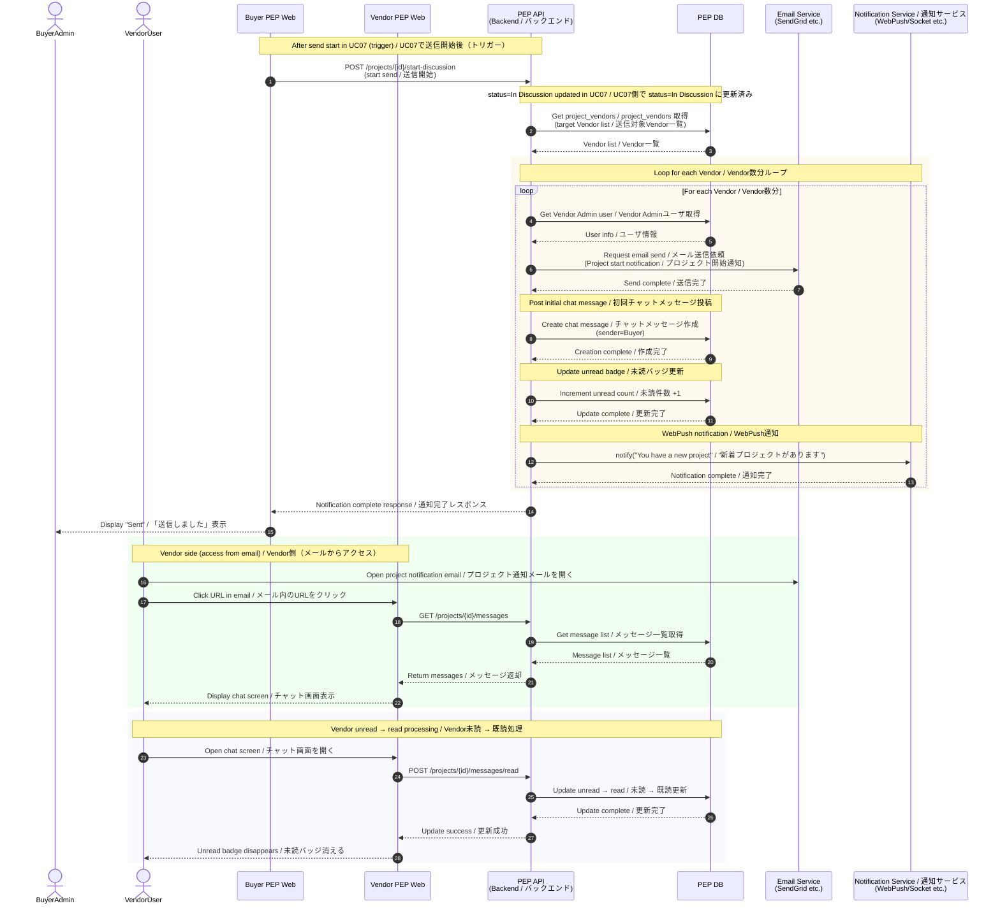

# UC08: Vendor Notification (Email/Chat) / ベンダーへの通知（メール／チャット）

```mermaid
sequenceDiagram
    autonumber
    actor BA as BuyerAdmin
    actor VU as VendorUser
    participant BWeb as Buyer PEP Web
    participant VWeb as Vendor PEP Web
    participant API as PEP API<br/>(Backend / バックエンド)
    participant DB as PEP DB
    participant Mail as Email Service<br/>(SendGrid etc.)
    participant Notif as Notification Service / 通知サービス<br/>(WebPush/Socket etc.)

    Note over BWeb, API: After send start in UC07 (trigger) / UC07で送信開始後（トリガー）
    BWeb->>API: POST /projects/{id}/start-discussion<br/>(start send / 送信開始)

    Note over API, DB: status=In Discussion updated in UC07 / UC07側で status=In Discussion に更新済み

    API->>DB: Get project_vendors / project_vendors 取得<br/>(target Vendor list / 送信対象Vendor一覧)
    DB-->>API: Vendor list / Vendor一覧

    rect rgb(255, 250, 240)
        Note over API, Notif: Loop for each Vendor / Vendor数分ループ
        loop For each Vendor / Vendor数分
            API->>DB: Get Vendor Admin user / Vendor Adminユーザ取得
            DB-->>API: User info / ユーザ情報

            API->>Mail: Request email send / メール送信依頼<br/>(Project start notification / プロジェクト開始通知)
            Mail-->>API: Send complete / 送信完了

            Note over API, DB: Post initial chat message / 初回チャットメッセージ投稿
            API->>DB: Create chat message / チャットメッセージ作成<br/>(sender=Buyer)
            DB-->>API: Creation complete / 作成完了

            Note over API, DB: Update unread badge / 未読バッジ更新
            API->>DB: Increment unread count / 未読件数 +1
            DB-->>API: Update complete / 更新完了

            Note over API, Notif: WebPush notification / WebPush通知
            API->>Notif: notify("You have a new project" / "新着プロジェクトがあります")
            Notif-->>API: Notification complete / 通知完了
        end
    end

    API-->>BWeb: Notification complete response / 通知完了レスポンス
    BWeb-->>BA: Display "Sent" / 「送信しました」表示

    rect rgb(240, 255, 240)
        Note over VU, VWeb: Vendor side (access from email) / Vendor側（メールからアクセス）
        VU->>Mail: Open project notification email / プロジェクト通知メールを開く
        VU->>VWeb: Click URL in email / メール内のURLをクリック
        VWeb->>API: GET /projects/{id}/messages
        API->>DB: Get message list / メッセージ一覧取得
        DB-->>API: Message list / メッセージ一覧
        API-->>VWeb: Return messages / メッセージ返却
        VWeb-->>VU: Display chat screen / チャット画面表示
    end

    rect rgb(248, 248, 255)
        Note over VU, DB: Vendor unread → read processing / Vendor未読 → 既読処理
        VU->>VWeb: Open chat screen / チャット画面を開く
        VWeb->>API: POST /projects/{id}/messages/read
        API->>DB: Update unread → read / 未読 → 既読更新
        DB-->>API: Update complete / 更新完了
        API-->>VWeb: Update success / 更新成功
        VWeb-->>VU: Unread badge disappears / 未読バッジ消える
    end
```
