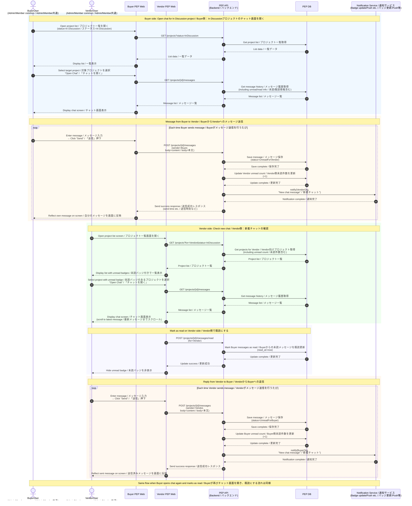

# UC09: Chat Discussion with Vendors (In Discussion) / ベンダーとのチャットでの協議（In Discussion）

```mermaid
sequenceDiagram
    autonumber
    actor BU as BuyerUser<br/>(Admin/Member common / Admin/Member共通)
    actor VU as VendorUser<br/>(Admin/Member common / Admin/Member共通)
    participant BWeb as Buyer PEP Web
    participant VWeb as Vendor PEP Web
    participant API as PEP API<br/>(Backend / バックエンド)
    participant DB as PEP DB
    participant Notif as Notification Service / 通知サービス<br/>(Badge update/Push etc. / バッジ更新/Push等)

    rect rgb(240, 248, 255)
        Note over BU, Notif: Buyer side: Open chat for In Discussion project / Buyer側：In Discussionプロジェクトのチャット画面を開く
        BU->>BWeb: Open project list / プロジェクト一覧を開く<br/>(status=In Discussion / ステータス=In Discussion)
        BWeb->>API: GET /projects?status=InDiscussion
        API->>DB: Get project list / プロジェクト一覧取得
        DB-->>API: List data / 一覧データ
        API-->>BWeb: List data / 一覧データ
        BWeb-->>BU: Display list / 一覧表示

        BU->>BWeb: Select target project / 対象プロジェクトを選択<br/>"Open Chat" / 「チャットを開く」
        BWeb->>API: GET /projects/{id}/messages
        API->>DB: Get message history / メッセージ履歴取得<br/>(including unread/read info / 未読/既読情報含む)
        DB-->>API: Message list / メッセージ一覧
        API-->>BWeb: Message list / メッセージ一覧
        BWeb-->>BU: Display chat screen / チャット画面表示
    end

    rect rgb(255, 250, 240)
        Note over BU, Notif: Message from Buyer to Vendor / BuyerからVendorへのメッセージ送信
        loop Each time Buyer sends message / Buyerがメッセージ送信を行うたび
            BU->>BWeb: Enter message / メッセージ入力<br/>→ Click "Send" / 「送信」押下
            BWeb->>API: POST /projects/{id}/messages<br/>(sender=Buyer,<br/>body=content / body=本文)

            API->>DB: Save message / メッセージ保存<br/>(status=UnreadForVendor)
            DB-->>API: Save complete / 保存完了

            API->>DB: Update Vendor unread count / Vendor側未読件数を更新<br/>(+1)
            DB-->>API: Update complete / 更新完了

            API->>Notif: notify(VendorOrg,<br/>"New chat message" / "新着チャット")
            Notif-->>API: Notification complete / 通知完了

            API-->>BWeb: Send success response / 送信成功レスポンス<br/>(send time etc. / 送信時刻など)
            BWeb-->>BU: Reflect own message on screen / 自分のメッセージを画面に反映
        end
    end

    rect rgb(240, 255, 240)
        Note over VU, Notif: Vendor side: Check new chat / Vendor側：新着チャットの確認
        VU->>VWeb: Open project list screen / プロジェクト一覧画面を開く
        VWeb->>API: GET /projects?for=Vendor&status=InDiscussion
        API->>DB: Get projects for Vendor / Vendor向けプロジェクト取得<br/>(including unread count / 未読件数含む)
        DB-->>API: Project list / プロジェクト一覧
        API-->>VWeb: Project list / プロジェクト一覧
        VWeb-->>VU: Display list with unread badges / 未読バッジ付きで一覧表示

        VU->>VWeb: Select project with unread badge / 未読バッジのあるプロジェクトを選択<br/>"Open Chat" / 「チャットを開く」
        VWeb->>API: GET /projects/{id}/messages
        API->>DB: Get message history / メッセージ履歴取得
        DB-->>API: Message list / メッセージ一覧
        API-->>VWeb: Message list / メッセージ一覧
        VWeb-->>VU: Display chat screen / チャット画面表示<br/>(scroll to latest message / 最新メッセージまでスクロール)
    end

    rect rgb(248, 248, 255)
        Note over VU, DB: Mark as read on Vendor side / Vendor側で既読にする
        VWeb->>API: POST /projects/{id}/messages/read<br/>(for=Vendor)
        API->>DB: Mark Buyer messages as read / Buyerからの未読メッセージを既読更新<br/>(read_at=now)
        DB-->>API: Update complete / 更新完了
        API-->>VWeb: Update success / 更新成功
        VWeb-->>VU: Hide unread badge / 未読バッジを非表示
    end

    rect rgb(255, 248, 240)
        Note over VU, Notif: Reply from Vendor to Buyer / VendorからBuyerへの返信
        loop Each time Vendor sends message / Vendorがメッセージ送信を行うたび
            VU->>VWeb: Enter message / メッセージ入力<br/>→ Click "Send" / 「送信」押下
            VWeb->>API: POST /projects/{id}/messages<br/>(sender=Vendor,<br/>body=content / body=本文)

            API->>DB: Save message / メッセージ保存<br/>(status=UnreadForBuyer)
            DB-->>API: Save complete / 保存完了

            API->>DB: Update Buyer unread count / Buyer側未読件数を更新<br/>(+1)
            DB-->>API: Update complete / 更新完了

            API->>Notif: notify(BuyerOrg,<br/>"New chat message" / "新着チャット")
            Notif-->>API: Notification complete / 通知完了

            API-->>VWeb: Send success response / 送信成功レスポンス
            VWeb-->>VU: Reflect sent message on screen / 送信済みメッセージを画面に反映
        end
    end

    Note over BU, Notif: Same flow when Buyer opens chat again and marks as read / Buyerが再びチャット画面を開き、既読にする流れは同様
```
