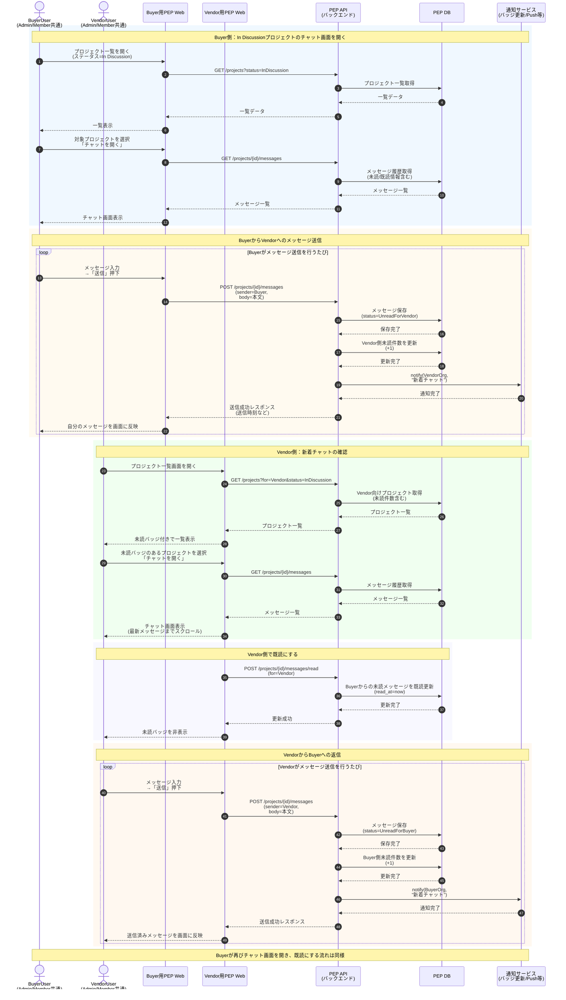

# UC09: ベンダーとのチャットでの協議（In Discussion）

```mermaid
sequenceDiagram
    autonumber
    actor BU as BuyerUser<br/>(Admin/Member共通)
    actor VU as VendorUser<br/>(Admin/Member共通)
    participant BWeb as Buyer用PEP Web
    participant VWeb as Vendor用PEP Web
    participant API as PEP API<br/>(バックエンド)
    participant DB as PEP DB
    participant Notif as 通知サービス<br/>(バッジ更新/Push等)

    rect rgb(240, 248, 255)
        Note over BU, Notif: Buyer側：In Discussionプロジェクトのチャット画面を開く
        BU->>BWeb: プロジェクト一覧を開く<br/>(ステータス=In Discussion)
        BWeb->>API: GET /projects?status=InDiscussion
        API->>DB: プロジェクト一覧取得
        DB-->>API: 一覧データ
        API-->>BWeb: 一覧データ
        BWeb-->>BU: 一覧表示

        BU->>BWeb: 対象プロジェクトを選択<br/>「チャットを開く」
        BWeb->>API: GET /projects/{id}/messages
        API->>DB: メッセージ履歴取得<br/>(未読/既読情報含む)
        DB-->>API: メッセージ一覧
        API-->>BWeb: メッセージ一覧
        BWeb-->>BU: チャット画面表示
    end

    rect rgb(255, 250, 240)
        Note over BU, Notif: BuyerからVendorへのメッセージ送信
        loop Buyerがメッセージ送信を行うたび
            BU->>BWeb: メッセージ入力<br/>→「送信」押下
            BWeb->>API: POST /projects/{id}/messages<br/>(sender=Buyer,<br/>body=本文)

            API->>DB: メッセージ保存<br/>(status=UnreadForVendor)
            DB-->>API: 保存完了

            API->>DB: Vendor側未読件数を更新<br/>(+1)
            DB-->>API: 更新完了

            API->>Notif: notify(VendorOrg,<br/>"新着チャット")
            Notif-->>API: 通知完了

            API-->>BWeb: 送信成功レスポンス<br/>(送信時刻など)
            BWeb-->>BU: 自分のメッセージを画面に反映
        end
    end

    rect rgb(240, 255, 240)
        Note over VU, Notif: Vendor側：新着チャットの確認
        VU->>VWeb: プロジェクト一覧画面を開く
        VWeb->>API: GET /projects?for=Vendor&status=InDiscussion
        API->>DB: Vendor向けプロジェクト取得<br/>(未読件数含む)
        DB-->>API: プロジェクト一覧
        API-->>VWeb: プロジェクト一覧
        VWeb-->>VU: 未読バッジ付きで一覧表示

        VU->>VWeb: 未読バッジのあるプロジェクトを選択<br/>「チャットを開く」
        VWeb->>API: GET /projects/{id}/messages
        API->>DB: メッセージ履歴取得
        DB-->>API: メッセージ一覧
        API-->>VWeb: メッセージ一覧
        VWeb-->>VU: チャット画面表示<br/>(最新メッセージまでスクロール)
    end

    rect rgb(248, 248, 255)
        Note over VU, DB: Vendor側で既読にする
        VWeb->>API: POST /projects/{id}/messages/read<br/>(for=Vendor)
        API->>DB: Buyerからの未読メッセージを既読更新<br/>(read_at=now)
        DB-->>API: 更新完了
        API-->>VWeb: 更新成功
        VWeb-->>VU: 未読バッジを非表示
    end

    rect rgb(255, 248, 240)
        Note over VU, Notif: VendorからBuyerへの返信
        loop Vendorがメッセージ送信を行うたび
            VU->>VWeb: メッセージ入力<br/>→「送信」押下
            VWeb->>API: POST /projects/{id}/messages<br/>(sender=Vendor,<br/>body=本文)

            API->>DB: メッセージ保存<br/>(status=UnreadForBuyer)
            DB-->>API: 保存完了

            API->>DB: Buyer側未読件数を更新<br/>(+1)
            DB-->>API: 更新完了

            API->>Notif: notify(BuyerOrg,<br/>"新着チャット")
            Notif-->>API: 通知完了

            API-->>VWeb: 送信成功レスポンス
            VWeb-->>VU: 送信済みメッセージを画面に反映
        end
    end

    Note over BU, Notif: Buyerが再びチャット画面を開き、既読にする流れは同様
```
