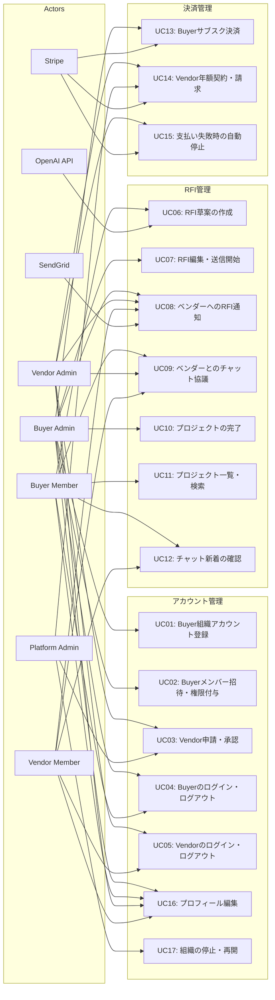

# ユースケース一覧

## ユースケース図

## ユースケース一覧表

| ID | シナリオ名 | 主なアクター | 概要（何を達成するか） |
|----|-----------|-------------|----------------------|
| UC01 | Buyer組織アカウント登録 | Buyer Admin | BuyerがPEPに初回登録し、組織を作成して管理者アカウントを有効化する |
| UC02 | Buyerメンバー招待・権限付与 | Buyer Admin | 既存組織の管理者が、メンバーをメール招待し、Buyer Member権限を付与する |
| UC03 | Vendor申請・承認 | Vendor Admin / Platform Admin | Vendorが利用申請を行い、Platform Adminが審査・承認して利用開始できるようにする |
| UC04 | Buyerのログイン・ログアウト | Buyer Admin/Member | BuyerユーザがPEPにログインし、自分のダッシュボードにアクセス／ログアウトする |
| UC05 | Vendorのログイン・ログアウト | Vendor Admin/Member | VendorユーザがPEPにログインし、自分宛のRFI・チャット一覧にアクセスする |
| UC06 | RFI草案の作成（AIチャット） | Buyer Admin/Member, OpenAI API | Buyerが新規プロジェクトとしてAIチャットを使ってRFI草案を作成し、Draft 状態で保存する |
| UC07 | RFI編集・送信開始（Draft → In Discussion） | Buyer Admin | Draft状態のRFIを編集し、送信先ベンダーを決めてプロジェクトを開始（ステータスをIn Discussionにする） |
| UC08 | ベンダーへのRFI通知（メール／チャット） | Buyer Admin, Vendor Admin/Member, SendGrid | RFI開始時に、選定されたVendorに対してメール通知／システム内チャットの初回メッセージを送る |
| UC09 | ベンダーとのチャットでの協議（In Discussion） | Buyer Admin/Member, Vendor Admin/Member | In Discussion状態で、発注者とベンダーがチャットを通じて要件のすり合わせを行う |
| UC10 | プロジェクトの完了（In Discussion + 完了フラグON） | Buyer Admin | 協議が完了したプロジェクトに対して、Buyer Adminが「完了」を押し、完了フラグをONにする（一覧上では"完了済み"として扱う） |
| UC11 | プロジェクト一覧・検索（進行中／完了） | Buyer Admin/Member | Buyerが、自分の組織のプロジェクトを「進行中」「完了済み」で絞り込み、詳細を参照する |
| UC12 | チャット新着の確認（PC／スマホ） | Buyer/Vendor 全ロール | 新着チャットがあるプロジェクトを一覧・バッジ表示し、PC／スマホで詳細を確認する |
| UC13 | Buyerサブスク決済（Stripe） | Buyer Admin, Stripe | Buyerの管理者がクレジットカードでサブスク契約を行い、Stripeで毎月自動課金される |
| UC14 | Vendor年額契約・請求（Stripe or 請求書PDF） | Vendor Admin, Platform Admin, Stripe | Vendorの年額契約を開始し、トライアル終了後に年額課金（Stripe or 請求書PDF）を行う |
| UC15 | 支払い失敗時の自動停止 | Buyer Admin / Vendor Admin, Stripe | 支払いが失敗した際に、自動リトライと通知を実行し、一定期間後に契約状態を「停止」にする |
| UC16 | プロフィール編集 | Buyer/Vendor 全ロール | ユーザが自分のプロフィール情報（氏名・部署・アイコン等）を更新する |
| UC17 | 組織の停止・再開（Platform Admin） | Platform Admin | 違反／未払いなどの場合、Platform Adminが特定組織の利用を停止・再開する |
