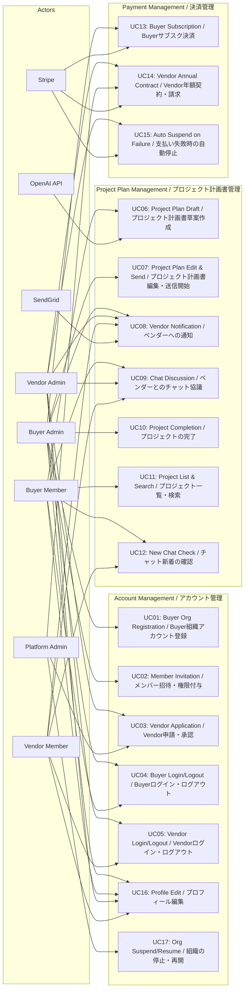

# Use Case List / ユースケース一覧

## Use Case Diagram / ユースケース図

## Use Case List Table / ユースケース一覧表

| ID | Scenario Name / シナリオ名 | Primary Actor / 主なアクター | Summary / 概要 |
|----|---------------------------|------------------------------|----------------|
| [UC01](./UC1.md) | Buyer Organization Registration / Buyer組織アカウント登録 | Buyer Admin | Buyer registers on PEP, creates organization, and activates admin account / BuyerがPEPに初回登録し、組織を作成して管理者アカウントを有効化する |
| [UC02](./UC2.md) | Buyer Member Invitation & Authorization / Buyerメンバー招待・権限付与 | Buyer Admin | Organization admin invites members via email and grants Buyer Member permissions / 既存組織の管理者が、メンバーをメール招待し、Buyer Member権限を付与する |
| [UC03](./UC3.md) | Vendor Application & Approval / Vendor申請・承認 | Vendor Admin / Platform Admin | Vendor submits application, Platform Admin reviews and approves for access / Vendorが利用申請を行い、Platform Adminが審査・承認して利用開始できるようにする |
| [UC04](./UC4.md) | Buyer Login/Logout / Buyerのログイン・ログアウト | Buyer Admin/Member | Buyer user logs into PEP, accesses dashboard, and logs out / BuyerユーザがPEPにログインし、自分のダッシュボードにアクセス／ログアウトする |
| [UC05](./UC5.md) | Vendor Login/Logout / Vendorのログイン・ログアウト | Vendor Admin/Member | Vendor user logs into PEP and accesses their project/chat list / VendorユーザがPEPにログインし、自分宛のプロジェクト・チャット一覧にアクセスする |
| [UC06](./UC6.md) | Project Plan Draft (AI Chat) / プロジェクト計画書草案作成（AIチャット） | Buyer Admin/Member, OpenAI API | Buyer creates new project using AI chat to draft Project Plan and saves as Draft / Buyerが新規プロジェクトとしてAIチャットを使ってプロジェクト計画書草案を作成し、Draft 状態で保存する |
| [UC07](./UC7.md) | Project Plan Edit & Send (Draft → In Discussion) / プロジェクト計画書編集・送信開始 | Buyer Admin | Edit Draft Project Plan, select target vendors, and start project (status → In Discussion) / Draft状態のプロジェクト計画書を編集し、送信先ベンダーを決めてプロジェクトを開始（ステータスをIn Discussionにする） |
| [UC08](./UC8.md) | Vendor Notification (Email/Chat) / ベンダーへの通知 | Buyer Admin, Vendor Admin/Member, SendGrid | Send email notification and initial chat message to selected vendors when project starts / プロジェクト開始時に、選定されたVendorに対してメール通知／システム内チャットの初回メッセージを送る |
| [UC09](./UC9.md) | Chat Discussion with Vendors (In Discussion) / ベンダーとのチャット協議 | Buyer Admin/Member, Vendor Admin/Member | Buyer and vendor align requirements through chat during In Discussion status / In Discussion状態で、発注者とベンダーがチャットを通じて要件のすり合わせを行う |
| [UC10](./UC10.md) | Project Completion / プロジェクトの完了 | Buyer Admin | Buyer Admin marks completed project as "Complete" (completion flag ON) / 協議が完了したプロジェクトに対して、Buyer Adminが「完了」を押し、完了フラグをONにする |
| [UC11](./UC11.md) | Project List & Search / プロジェクト一覧・検索 | Buyer Admin/Member | Buyer filters and views organization's projects by "In Progress" or "Completed" / Buyerが、自分の組織のプロジェクトを「進行中」「完了済み」で絞り込み、詳細を参照する |
| [UC12](./UC12.md) | New Chat Notification Check / チャット新着の確認 | Buyer/Vendor All Roles | List projects with new chat messages with badge, view details on PC/mobile / 新着チャットがあるプロジェクトを一覧・バッジ表示し、PC／スマホで詳細を確認する |
| [UC13](./UC13.md) | Buyer Subscription Payment (Stripe) / Buyerサブスク決済 | Buyer Admin, Stripe | Buyer admin subscribes with credit card, Stripe handles monthly auto-billing / Buyerの管理者がクレジットカードでサブスク契約を行い、Stripeで毎月自動課金される |
| [UC14](./UC14.md) | Vendor Annual Contract & Billing / Vendor年額契約・請求 | Vendor Admin, Platform Admin, Stripe | Start vendor annual contract, annual billing via Stripe or PDF invoice after trial / Vendorの年額契約を開始し、トライアル終了後に年額課金（Stripe or 請求書PDF）を行う |
| [UC15](./UC15.md) | Auto Suspend on Payment Failure / 支払い失敗時の自動停止 | Buyer Admin / Vendor Admin, Stripe | Execute auto-retry and notification on payment failure, suspend after grace period / 支払いが失敗した際に、自動リトライと通知を実行し、一定期間後に契約状態を「停止」にする |
| [UC16](./UC16.md) | Profile Edit / プロフィール編集 | Buyer/Vendor All Roles | User updates their profile information (name, department, icon, etc.) / ユーザが自分のプロフィール情報（氏名・部署・アイコン等）を更新する |
| [UC17](./UC17.md) | Organization Suspend/Resume / 組織の停止・再開 | Platform Admin | Platform Admin suspends/resumes specific organization access for violations or non-payment / 違反／未払いなどの場合、Platform Adminが特定組織の利用を停止・再開する |
