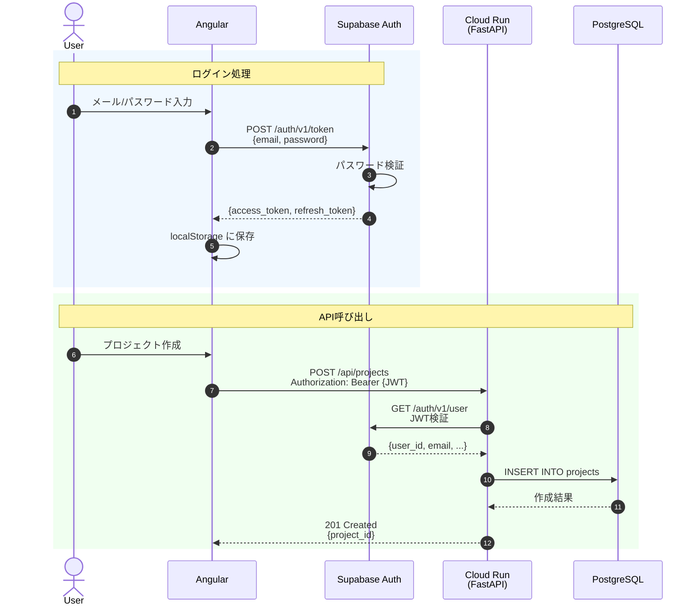
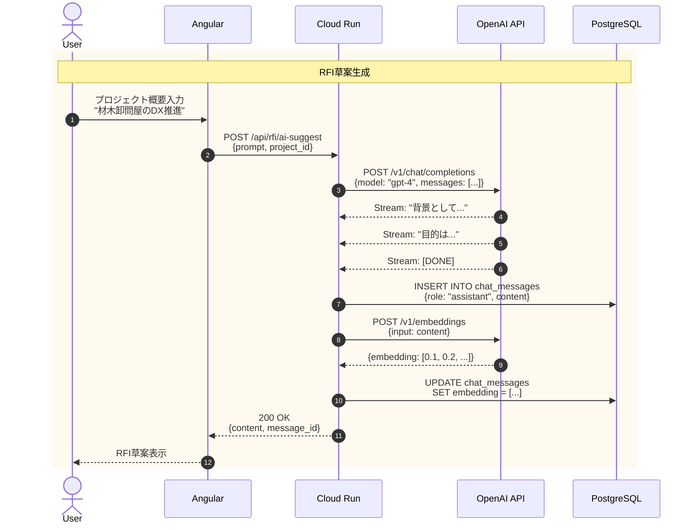
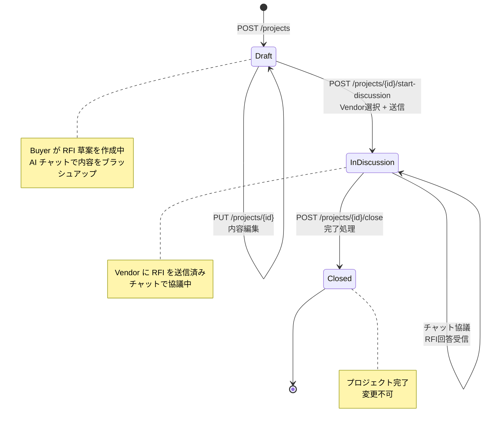
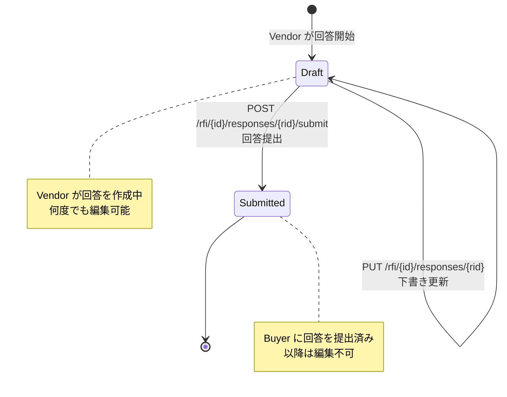
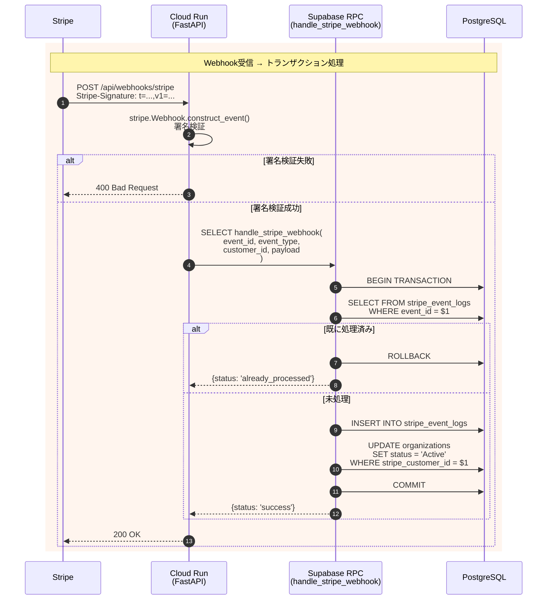
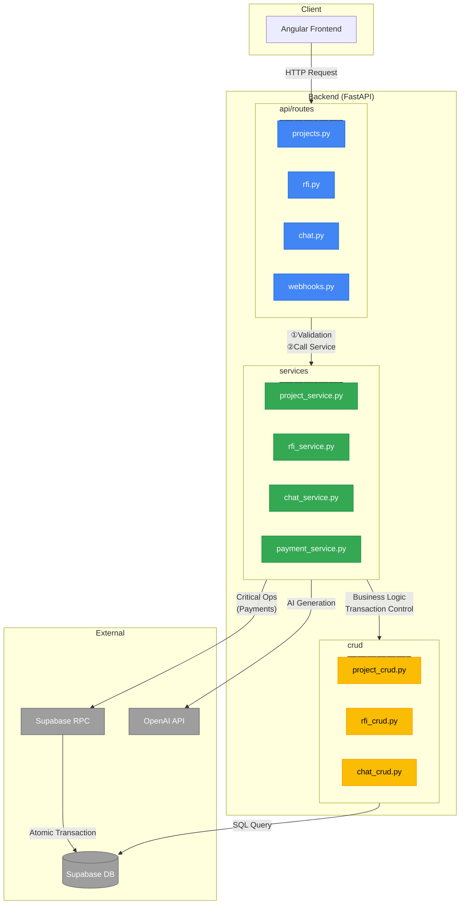
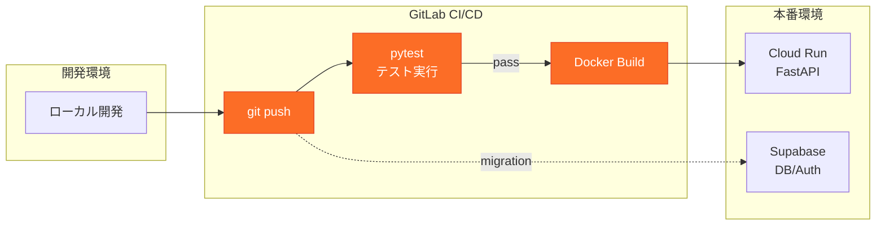

# PEP アーキテクチャ設計書

## 1. システム構成図

**技術選定の理由:**
- **Cloud Run**: サーバーレス・従量課金・自動スケール (0→N)
- **Supabase**: DB/Auth/Storage/Realtimeを一括提供、運用コスト削減
- **OpenAI**: GPT-4によるRFI草案生成の品質


---

## 2. データベース設計 (ER図)

**制約事項:**
- すべてのテーブルに **RLS (Row Level Security)** 必須
- 主キーは **UUID** を使用
- `auth.users` は Supabase Auth が管理（直接操作不可）


---

## 3. 認証フロー

**ポイント:**
- JWTは **Supabase Auth** が発行・検証
- バックエンドは **Service Role Key** でDB操作



---

## 4. RFI生成フロー (AI連携)

**ポイント:**
- OpenAI API は **ストリーミング対応**
- 生成結果は **embedding** として保存（将来の類似検索用）



---

## 5. プロジェクト状態遷移

**制約:**
- `Draft → InDiscussion`: Vendor選択必須
- `InDiscussion → Closed`: 手動のみ（自動クローズなし）
- 一度 `Closed` になると再オープン不可



---

## 6. RFI回答の状態遷移



---

## 7. 決済・サブスクリプション (Payments)

**設計方針:**
- Stripe Webhook処理は **Supabase RPC (Stored Function)** でトランザクションと冪等性を担保
- FastAPI側は署名検証とRPC呼び出しのみ（複数回のDB操作禁止）
- RPC関数は `SECURITY INVOKER` で実装（Service Role Keyで呼び出すためDEFINER不要）

**テーブル構成:**
- `stripe_event_logs`: 処理済みイベントID記録（重複処理防止）
- `organizations.stripe_customer_id`: Stripe顧客ID紐付け



**対応イベント:**

| Event Type | 処理内容 |
|------------|----------|
| `invoice.payment_succeeded` | 組織ステータスを `Active` に更新 |
| `invoice.payment_failed` | 組織ステータスを `PaymentFailed` に更新 |
| `customer.subscription.deleted` | 組織ステータスを `Cancelled` に更新 |

---

## 8. ソフトウェアアーキテクチャ (レイヤー構成)

**設計方針:**
- **3層構造**を採用（Controller / Service / Data Access）
- `logic` フォルダは作成せず、ビジネスロジックは `services` に統合
- 各層の責務を明確に分離し、上位層から下位層への一方向依存のみ許可



**各層の責務:**

| 層 | フォルダ | 責務 | 備考 |
|----|----------|------|------|
| **Controller** | `api/routes/` | リクエスト受付、Validation、レスポンス整形 | Pydanticでバリデーション |
| **Service** | `services/` | ビジネスロジック、トランザクション制御、複数CRUDの統括 | ※Logic層はここに統合 |
| **Data Access** | `crud/` | DB操作のみ（SELECT/INSERT/UPDATE/DELETE） | 単純なCRUD操作 |

**トランザクション制御方針:**

| 操作タイプ | 制御場所 | 理由 |
|------------|----------|------|
| 単一CRUD | Service層 → CRUD | シンプルな操作はそのまま実行 |
| 複数テーブル操作 | Supabase RPC | supabase-pyはトランザクション非対応のため |
| 決済・課金 | Supabase RPC | 冪等性・原子性を SQL Function で担保 |
| バッチ更新 | Supabase RPC | 大量データの一括処理はDB側で実行 |

> **Note**: `supabase-py` は REST API ベースのため、Python側での `BEGIN/COMMIT` トランザクションはサポートされていません。複数テーブルへの操作が必要な場合は RPC を使用してください。

**コード例:**

```python
# api/routes/projects.py (Controller)
@router.post("/projects")
async def create_project(
    data: ProjectCreate,  # Pydantic Validation
    user: User = Depends(get_current_user)
):
    return await project_service.create_project(data, user)

# services/project_service.py (Service)
async def create_project(data: ProjectCreate, user: User) -> Project:
    # ビジネスロジック (権限チェック等)
    if not await can_create_project(user):
        raise HTTPException(403, "Project limit reached")

    # 単一操作: そのままCRUD
    return await project_crud.create(data, user.id)

async def create_project_with_vendors(
    data: ProjectCreate, user: User, vendor_ids: list[UUID]
) -> Project:
    # 複数操作: RPCを使用
    result = await supabase.rpc(
        "create_project_with_vendors",
        {
            "p_title": data.title,
            "p_user_id": str(user.id),
            "p_vendor_ids": [str(v) for v in vendor_ids]
        }
    ).execute()
    return result.data

# crud/project_crud.py (Data Access)
async def create(data: ProjectCreate, user_id: UUID) -> Project:
    result = await supabase.from_("projects").insert({
        "title": data.title,
        "created_by": str(user_id)
    }).execute()
    return result.data[0]
```

---

## 9. API エンドポイント一覧

| Method | Path | Description | UC |
|--------|------|-------------|-----|
| `GET` | `/api/projects` | プロジェクト一覧 | UC11 |
| `POST` | `/api/projects` | プロジェクト作成 | UC06 |
| `GET` | `/api/projects/{id}` | プロジェクト詳細 | UC07 |
| `PUT` | `/api/projects/{id}` | プロジェクト更新 | UC07 |
| `POST` | `/api/projects/{id}/start-discussion` | 送信開始 | UC07 |
| `POST` | `/api/projects/{id}/close` | 完了 | UC10 |
| `POST` | `/api/rfi/ai-suggest` | AI草案生成 | UC06 |
| `GET` | `/api/rfi/{project_id}/responses` | 回答一覧 | UC10 |
| `POST` | `/api/rfi/{project_id}/responses` | 回答提出 | UC08 |
| `POST` | `/api/chat/sessions` | セッション作成 | - |
| `POST` | `/api/chat/sessions/{id}/messages` | メッセージ送信 | UC06, UC09 |
| `POST` | `/api/slides/generate` | スライド生成 | - |
| `POST` | `/api/webhooks/stripe` | Stripe通知 | UC13-15 |

---

## 9. CI/CD パイプライン



---

## 10. セキュリティチェックリスト

- [ ] Supabase RLSポリシー設定（全テーブル）
- [ ] Cloud Run IAM設定（最小権限）
- [ ] CORS設定（許可オリジン限定）
- [ ] Stripe Webhook署名検証
- [ ] 環境変数の秘匿管理（Secret Manager）
- [ ] Rate Limiting（API Gateway or Cloud Armor）

---

## 11. コスト見積もり

| 規模 | Supabase | Cloud Run | 合計/月 |
|------|----------|-----------|---------|
| ~100 users | $0 | $0 | **$0** |
| ~1,000 users | $25 | ~$10 | **~$35** |
| ~10,000 users | $25 | ~$50 | **~$75** |

※ OpenAI API は従量課金（別途）

---

## 参考資料

- [ユースケース一覧](./UC/index.md)
- [Supabase Docs](https://supabase.com/docs)
- [Cloud Run Docs](https://cloud.google.com/run/docs)
- [FastAPI Docs](https://fastapi.tiangolo.com/)
