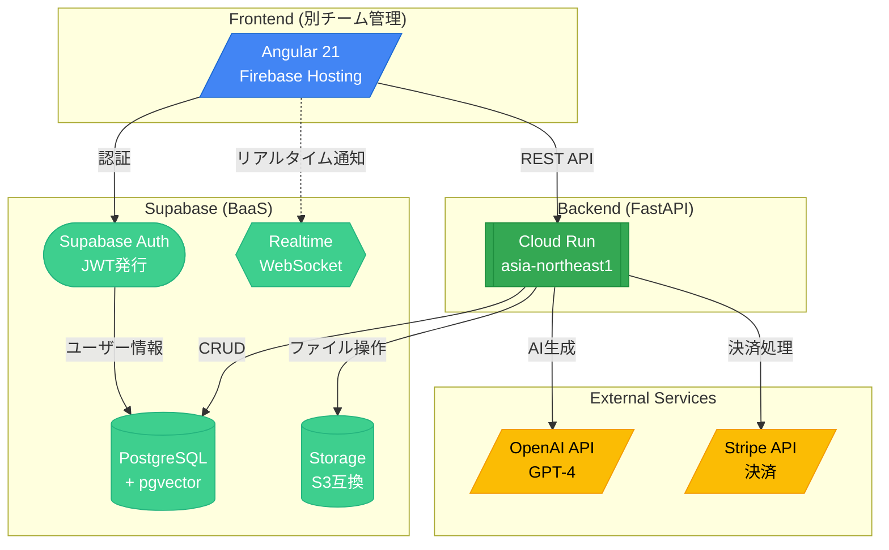
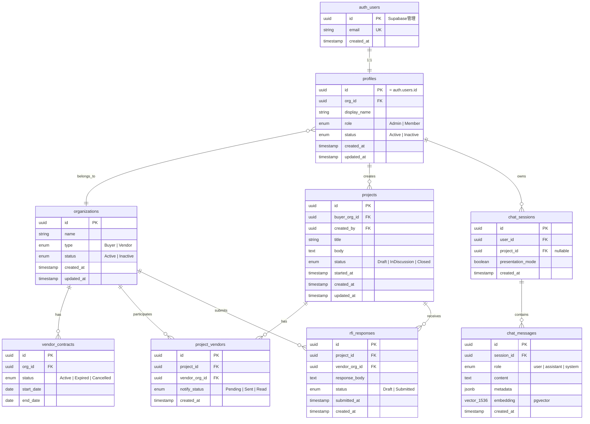
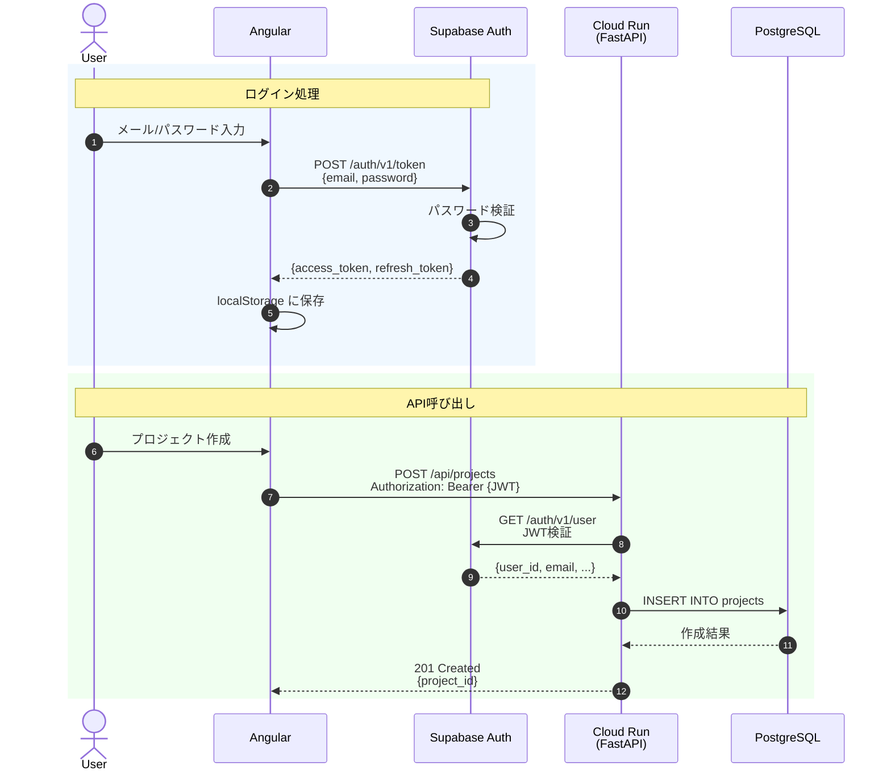
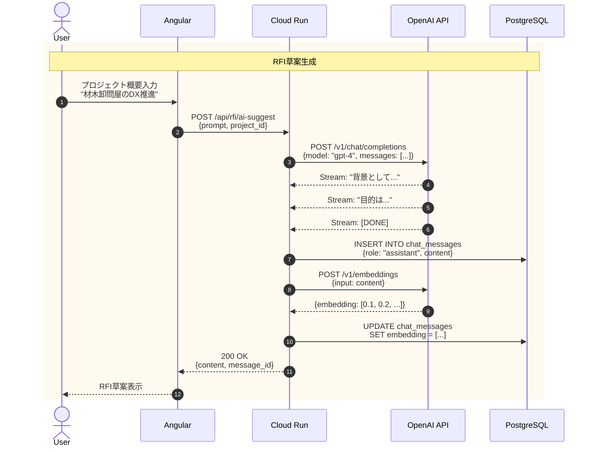
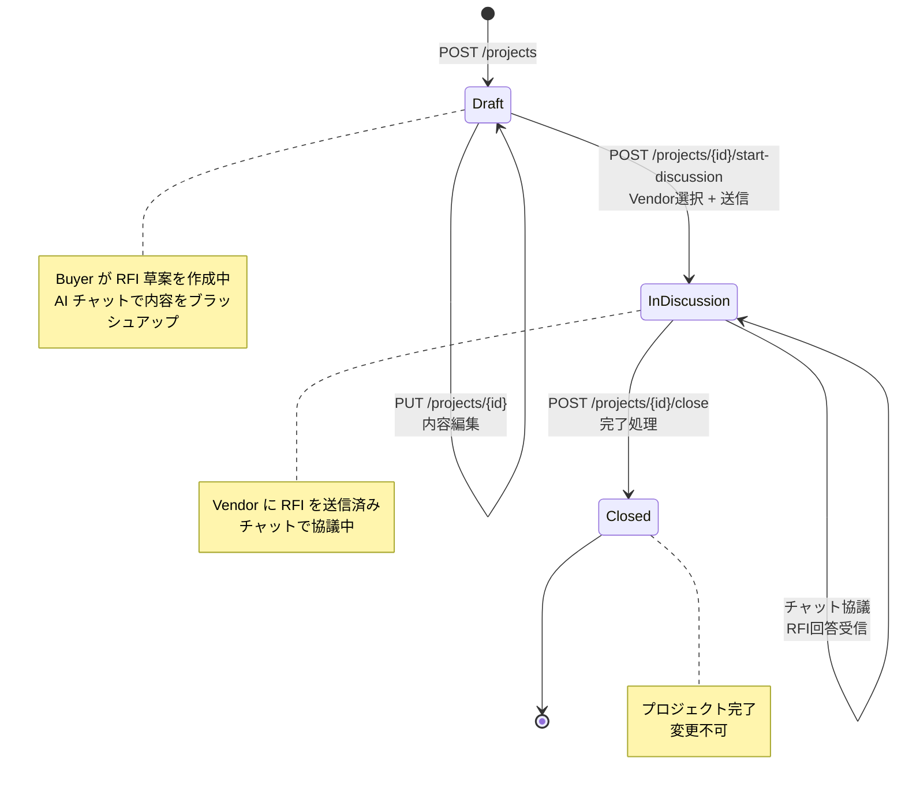
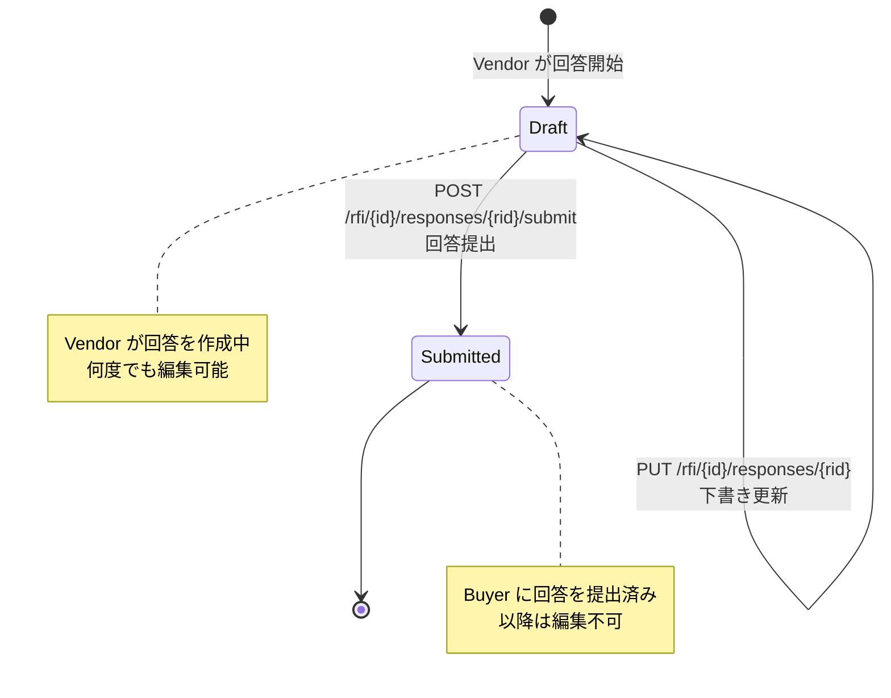
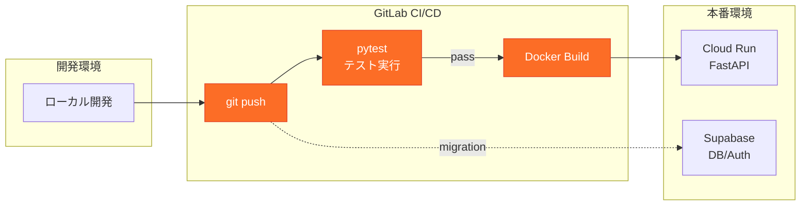

# PEP アーキテクチャ設計書

## 1. システム構成図

**技術選定の理由:**
- **Cloud Run**: サーバーレス・従量課金・自動スケール (0→N)
- **Supabase**: DB/Auth/Storage/Realtimeを一括提供、運用コスト削減
- **OpenAI**: GPT-4によるRFI草案生成の品質

---

## 2. データベース設計 (ER図)

**制約事項:**
- すべてのテーブルに **RLS (Row Level Security)** 必須
- 主キーは **UUID** を使用
- `auth.users` は Supabase Auth が管理（直接操作不可）

---

## 3. 認証フロー

**ポイント:**
- JWTは **Supabase Auth** が発行・検証
- バックエンドは **Service Role Key** でDB操作

---

## 4. RFI生成フロー (AI連携)

**ポイント:**
- OpenAI API は **ストリーミング対応**
- 生成結果は **embedding** として保存（将来の類似検索用）

---

## 5. プロジェクト状態遷移

**制約:**
- `Draft → InDiscussion`: Vendor選択必須
- `InDiscussion → Closed`: 手動のみ（自動クローズなし）
- 一度 `Closed` になると再オープン不可

---

## 6. RFI回答の状態遷移

---

## 7. API エンドポイント一覧

| Method | Path | Description | UC |
|--------|------|-------------|-----|
| `GET` | `/api/projects` | プロジェクト一覧 | UC11 |
| `POST` | `/api/projects` | プロジェクト作成 | UC06 |
| `GET` | `/api/projects/{id}` | プロジェクト詳細 | UC07 |
| `PUT` | `/api/projects/{id}` | プロジェクト更新 | UC07 |
| `POST` | `/api/projects/{id}/start-discussion` | 送信開始 | UC07 |
| `POST` | `/api/projects/{id}/close` | 完了 | UC10 |
| `POST` | `/api/rfi/ai-suggest` | AI草案生成 | UC06 |
| `GET` | `/api/rfi/{project_id}/responses` | 回答一覧 | UC10 |
| `POST` | `/api/rfi/{project_id}/responses` | 回答提出 | UC08 |
| `POST` | `/api/chat/sessions` | セッション作成 | - |
| `POST` | `/api/chat/sessions/{id}/messages` | メッセージ送信 | UC06, UC09 |
| `POST` | `/api/slides/generate` | スライド生成 | - |
| `POST` | `/api/webhooks/stripe` | Stripe通知 | UC13-15 |

---

## 8. CI/CD パイプライン

---

## 9. セキュリティチェックリスト

- [ ] Supabase RLSポリシー設定（全テーブル）
- [ ] Cloud Run IAM設定（最小権限）
- [ ] CORS設定（許可オリジン限定）
- [ ] Stripe Webhook署名検証
- [ ] 環境変数の秘匿管理（Secret Manager）
- [ ] Rate Limiting（API Gateway or Cloud Armor）

---

## 10. コスト見積もり

| 規模 | Supabase | Cloud Run | 合計/月 |
|------|----------|-----------|---------|
| ~100 users | $0 | $0 | **$0** |
| ~1,000 users | $25 | ~$10 | **~$35** |
| ~10,000 users | $25 | ~$50 | **~$75** |

※ OpenAI API は従量課金（別途）

---

## 参考資料

- [ユースケース一覧](./UC/index.md)
- [Supabase Docs](https://supabase.com/docs)
- [Cloud Run Docs](https://cloud.google.com/run/docs)
- [FastAPI Docs](https://fastapi.tiangolo.com/)
