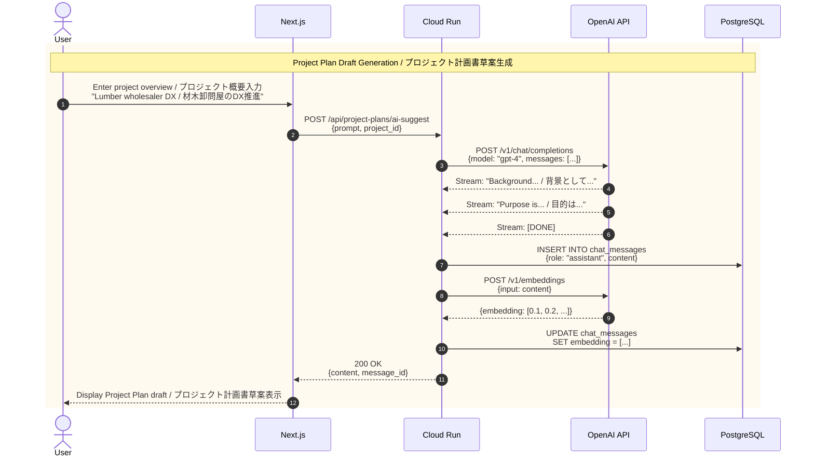

# 4. Project Plan Generation Flow (AI Integration) / プロジェクト計画書生成フロー (AI連携)

[← Back to Index / 目次に戻る](./index.md)

---

**Key Points / ポイント:**
- OpenAI API supports **streaming** / OpenAI API は **ストリーミング対応**
- Generated results are saved as **embeddings** (for future similarity search) / 生成結果は **embedding** として保存（将来の類似検索用）

---

[← Previous: Authentication Flow / 前へ: 認証フロー](./auth.md) | [Next: State Machines / 次へ: 状態遷移 →](./state-machine.md)
