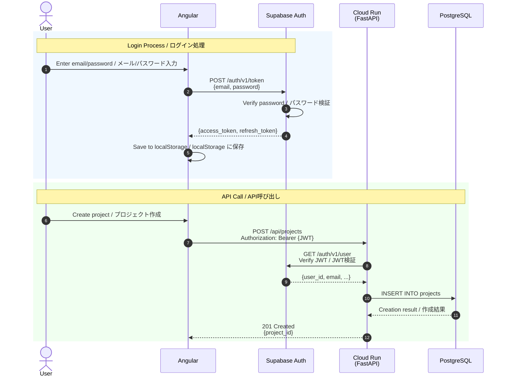

# 3. Authentication Flow / 認証フロー

[← Back to Index / 目次に戻る](./index.md)

---

**Key Points / ポイント:**
- JWT is issued and verified by **Supabase Auth** / JWTは **Supabase Auth** が発行・検証
- Backend uses **Service Role Key** for DB operations / バックエンドは **Service Role Key** でDB操作

---

[← Previous: Database Design / 前へ: データベース設計](./database.md) | [Next: AI Integration / 次へ: AI連携 →](./ai-integration.md)
