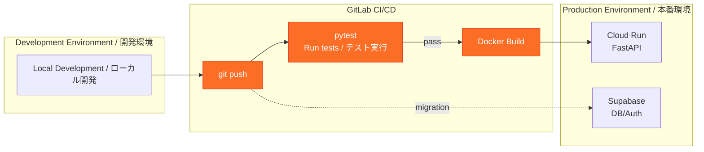

# 9. CI/CD Pipeline / CI/CD パイプライン

[← Back to Index / 目次に戻る](./index.md)

---

---

[← Previous: API Endpoints / 前へ: API エンドポイント](./api-endpoints.md) | [Next: Security / 次へ: セキュリティ →](./security.md)
