# 2. Database Design (ER Diagram) / データベース設計 (ER図)

[← Back to Index / 目次に戻る](./index.md)

---

**Constraints / 制約事項:**
- **RLS (Row Level Security)** required for all tables / すべてのテーブルに **RLS (Row Level Security)** 必須
- Use **UUID** for primary keys / 主キーは **UUID** を使用
- `auth.users` is managed by Supabase Auth (no direct manipulation) / `auth.users` は Supabase Auth が管理（直接操作不可）

**User Model / ユーザーモデル: Platform Organization Unified Model**

All users belong to exactly one organization. User types are determined by `organizations.type`:
全ユーザーは必ず1つの組織に所属。ユーザー種別は `organizations.type` で判定:

| User Type | organizations.type | Description |
|-----------|-------------------|-------------|
| Buyer | `buyer` | Buyer organization users / Buyer組織のユーザー |
| Vendor | `vendor` | Vendor organization users / Vendor組織のユーザー |
| Platform Admin | `platform` | Platform admin users / プラットフォーム管理者 |

**Common Audit Fields / 共通監査フィールド:**

All tables (except `auth_users`) include the following audit fields:
`auth_users` 以外の全テーブルに以下の監査フィールドを含める:

| Field | Type | Description |
|-------|------|-------------|
| `created_by` | uuid FK | Creator (profiles.id) / 作成者 |
| `created_at` | timestamp | Creation time / 作成日時 |
| `updated_by` | uuid FK nullable | Last updater (profiles.id) / 更新者 |
| `updated_at` | timestamp | Last update time / 更新日時 |
| `is_deleted` | boolean | Soft delete flag (default: false) / 削除フラグ |

---

## ER Diagram / ER図

```mermaid
erDiagram
    %% ===== Account Management / アカウント管理 =====
    auth_users ||--|| profiles : "1:1"
    organizations ||--o{ profiles : "has_many"
    organizations ||--o| buyer_org_details : "has (if buyer)"
    organizations ||--o| vendor_org_details : "has (if vendor)"
    organizations ||--o{ invitations : "sends"
    organizations ||--o{ buyer_applications : "applies (Buyer)"
    organizations ||--o{ vendor_applications : "applies (Vendor)"

    %% ===== Project Plan Management / プロジェクト計画書管理 =====
    organizations ||--o{ projects : "owns (Buyer)"
    profiles ||--o{ projects : "creates"
    projects ||--o{ project_vendors : "targets"
    organizations ||--o{ project_vendors : "receives (Vendor)"
    projects ||--o{ project_attachments : "has"
    projects ||--o{ project_plans : "has"
    ai_chat_sessions ||--o{ project_plans : "generates"
    project_plans ||--o{ project_plan_vendors : "sent_to"
    organizations ||--o{ project_plan_vendors : "receives (Vendor)"

    %% ===== Chat / チャット =====
    projects ||--o{ chat_rooms : "has"
    organizations ||--o{ chat_rooms : "participates"
    chat_rooms ||--o{ chat_room_members : "has"
    profiles ||--o{ chat_room_members : "joins"
    chat_rooms ||--o{ chat_messages : "contains"
    profiles ||--o{ chat_messages : "sends"
    chat_rooms ||--o{ chat_read_status : "tracks"
    profiles ||--o{ chat_read_status : "reads"

    %% ===== AI Chat Sessions / AIチャットセッション =====
    profiles ||--o{ ai_chat_sessions : "owns"
    projects ||--o{ ai_chat_sessions : "relates"
    ai_chat_sessions ||--o{ ai_chat_messages : "contains"

    %% ===== Billing / 決済 =====
    organizations ||--o{ subscriptions : "subscribes (Buyer)"
    organizations ||--o{ usage_records : "consumes"
    subscriptions ||--o{ usage_records : "tracks"
    organizations ||--o{ invoices : "receives"
    organizations ||--o{ stripe_event_logs : "receives"

    %% ===== Notifications / 通知 =====
    profiles ||--o{ notifications : "receives"
    organizations ||--o{ notifications : "scope"

    %% ===== Audit / 監査ログ =====
    profiles ||--o{ audit_logs : "performs"
    organizations ||--o{ audit_logs : "scope"

    %% ========================================
    %% Table Definitions / テーブル定義
    %% ========================================

    auth_users {
        uuid id PK "Managed by Supabase / Supabase管理"
        string email UK
        timestamp created_at
    }

    profiles {
        uuid id PK "= auth.users.id"
        uuid org_id FK "NOT NULL"
        string email "from auth.users"
        string display_name
        string department "nullable"
        string avatar_url "nullable"
        string avatar_color "nullable, アバター背景色"
        enum role "owner | admin | member"
        enum status "active | inactive | pending"
        boolean is_platform_admin "default false, Platform Admin flag"
        uuid created_by FK "profiles.id, nullable for self-signup"
        timestamp created_at
        uuid updated_by FK "profiles.id, nullable"
        timestamp updated_at
        boolean is_deleted "default false"
        timestamp deleted_at "nullable, soft delete timestamp"
    }

    organizations {
        uuid id PK
        string name
        enum type "buyer | vendor | platform"
        enum status "active | inactive | pending | suspended"
        string billing_customer_id "nullable, Stripe Customer ID"
        string billing_email "nullable, 請求書送付先メール"
        enum payment_method_type "card | invoice, nullable"
        uuid created_by FK "profiles.id, nullable for seed"
        timestamp created_at
        uuid updated_by FK "profiles.id, nullable"
        timestamp updated_at
        boolean is_deleted "default false"
    }

    buyer_org_details {
        uuid org_id PK,FK "organizations.id"
        string industry "nullable, 業種"
        string employee_count "nullable, 従業員規模"
        text purpose "nullable, 利用目的"
        uuid created_by FK "profiles.id"
        timestamp created_at
        uuid updated_by FK "profiles.id, nullable"
        timestamp updated_at
        boolean is_deleted "default false"
    }

    vendor_org_details {
        uuid org_id PK,FK "organizations.id"
        string industry "nullable, 業種"
        string employee_count "nullable, 従業員規模"
        text business_description "nullable, 事業内容"
        text service_description "nullable, 提供サービス"
        string website_url "nullable, Webサイト"
        uuid created_by FK "profiles.id"
        timestamp created_at
        uuid updated_by FK "profiles.id, nullable"
        timestamp updated_at
        boolean is_deleted "default false"
    }

    invitations {
        uuid id PK
        uuid org_id FK
        string email
        enum role "admin | member"
        string token UK "for email link"
        enum status "pending | accepted | expired"
        timestamp expires_at
        timestamp accepted_at "nullable, when invitation was accepted"
        uuid created_by FK "profiles.id (= invited_by)"
        timestamp created_at
        uuid updated_by FK "profiles.id, nullable"
        timestamp updated_at
        boolean is_deleted "default false"
    }

    buyer_applications {
        uuid id PK
        uuid org_id FK
        string company_name
        string contact_email
        string industry "nullable, 業種"
        string employee_count "nullable, 従業員規模"
        text purpose "nullable, 利用目的"
        enum status "pending | approved | rejected"
        uuid reviewed_by FK "profiles.id, nullable"
        text review_note "nullable"
        timestamp reviewed_at "nullable"
        uuid created_by FK "profiles.id"
        timestamp created_at
        uuid updated_by FK "profiles.id, nullable"
        timestamp updated_at
        boolean is_deleted "default false"
    }

    vendor_applications {
        uuid id PK
        uuid org_id FK
        string company_name
        string contact_email
        string industry "nullable, 業種"
        string employee_count "nullable, 従業員規模"
        text business_description "nullable, 事業内容"
        text service_description "nullable, 提供サービス"
        string website_url "nullable"
        enum status "pending | approved | rejected"
        uuid reviewed_by FK "profiles.id, nullable"
        text review_note "nullable"
        timestamp reviewed_at "nullable"
        uuid created_by FK "profiles.id"
        timestamp created_at
        uuid updated_by FK "profiles.id, nullable"
        timestamp updated_at
        boolean is_deleted "default false"
    }

    projects {
        uuid id PK
        uuid buyer_org_id FK
        string title
        text description "nullable"
        enum status "draft | in_discussion | closed"
        timestamp started_at "nullable"
        timestamp closed_at "nullable"
        uuid created_by FK "profiles.id"
        timestamp created_at
        uuid updated_by FK "profiles.id, nullable"
        timestamp updated_at
        boolean is_deleted "default false"
    }

    project_vendors {
        uuid id PK
        uuid project_id FK
        uuid vendor_org_id FK
        enum status "pending | notified | read"
        timestamp notified_at "nullable"
        timestamp read_at "nullable"
        uuid created_by FK "profiles.id"
        timestamp created_at
        uuid updated_by FK "profiles.id, nullable"
        timestamp updated_at
        boolean is_deleted "default false"
    }

    project_attachments {
        uuid id PK
        uuid project_id FK
        string file_name
        string file_path "Supabase Storage path"
        string mime_type
        int file_size "bytes"
        uuid created_by FK "profiles.id (= uploaded_by)"
        timestamp created_at
        uuid updated_by FK "profiles.id, nullable"
        timestamp updated_at
        boolean is_deleted "default false"
    }

    project_plans {
        uuid id PK
        uuid project_id FK
        uuid ai_session_id FK "nullable, 生成元AIセッション"
        string title
        string file_path "Supabase Storage path"
        string file_name
        string mime_type
        int file_size "bytes"
        uuid created_by FK "profiles.id"
        timestamp created_at
        uuid updated_by FK "profiles.id, nullable"
        timestamp updated_at
        boolean is_deleted "default false"
    }

    project_plan_vendors {
        uuid id PK
        uuid plan_id FK "project_plans.id"
        uuid vendor_org_id FK "organizations.id"
        timestamp sent_at
        uuid created_by FK "profiles.id"
        timestamp created_at
        uuid updated_by FK "profiles.id, nullable"
        timestamp updated_at
        boolean is_deleted "default false"
    }

    chat_rooms {
        uuid id PK
        uuid project_id FK
        uuid buyer_org_id FK
        uuid vendor_org_id FK
        uuid created_by FK "profiles.id"
        timestamp created_at
        uuid updated_by FK "profiles.id, nullable"
        timestamp updated_at
        boolean is_deleted "default false"
    }

    chat_room_members {
        uuid id PK
        uuid room_id FK
        uuid user_id FK "profiles.id"
        uuid created_by FK "profiles.id (= added_by)"
        timestamp created_at
        uuid updated_by FK "profiles.id, nullable"
        timestamp updated_at
        boolean is_deleted "default false"
    }

    chat_messages {
        uuid id PK
        uuid room_id FK
        uuid sender_id FK "profiles.id"
        text content
        enum message_type "text | file | system"
        string file_url "nullable"
        uuid created_by FK "profiles.id (= sender_id)"
        timestamp created_at
        uuid updated_by FK "profiles.id, nullable"
        timestamp updated_at
        boolean is_deleted "default false"
    }

    chat_read_status {
        uuid id PK
        uuid room_id FK
        uuid user_id FK "profiles.id"
        timestamp last_read_at
        uuid created_by FK "profiles.id"
        timestamp created_at
        uuid updated_by FK "profiles.id, nullable"
        timestamp updated_at
        boolean is_deleted "default false"
    }

    ai_chat_sessions {
        uuid id PK
        uuid user_id FK "profiles.id (owner)"
        uuid project_id FK "nullable"
        string title "nullable"
        boolean is_presentation_mode "for slide generation"
        uuid created_by FK "profiles.id"
        timestamp created_at
        uuid updated_by FK "profiles.id, nullable"
        timestamp updated_at
        boolean is_deleted "default false"
    }

    ai_chat_messages {
        uuid id PK
        uuid session_id FK
        enum role "user | assistant | system"
        text content
        jsonb metadata "nullable"
        vector embedding "pgvector, 1536 dim"
        uuid created_by FK "profiles.id, nullable for assistant"
        timestamp created_at
        uuid updated_by FK "profiles.id, nullable"
        timestamp updated_at
        boolean is_deleted "default false"
    }

    subscriptions {
        uuid id PK
        uuid organization_id FK "organizations.id"
        string stripe_subscription_id UK "Stripe sub_xxxx"
        string stripe_subscription_item_id "Stripe si_xxxx, for metered billing"
        enum status "active | past_due | canceled | trialing | incomplete"
        timestamp current_period_start
        timestamp current_period_end "次回更新日"
        string plan_id "内部プランID"
        jsonb metadata "nullable, 追加情報"
        uuid created_by FK "profiles.id, nullable"
        timestamp created_at
        uuid updated_by FK "profiles.id, nullable"
        timestamp updated_at
        boolean is_deleted "default false"
    }

    usage_records {
        uuid id PK
        uuid organization_id FK "organizations.id"
        uuid subscription_id FK "subscriptions.id, nullable"
        enum usage_type "document_generation"
        int quantity "default 1"
        string description "nullable, 生成内容の説明"
        string stripe_usage_record_id "nullable, Stripe報告後に設定"
        timestamp reported_at "nullable, Stripe報告日時"
        uuid created_by FK "profiles.id"
        timestamp created_at
    }

    invoices {
        uuid id PK
        uuid organization_id FK "organizations.id"
        string stripe_invoice_id UK "Stripe inv_xxxx"
        enum status "draft | open | paid | void | uncollectible"
        int amount_due "請求金額 (cents)"
        int amount_paid "支払済金額 (cents)"
        string currency "jpy"
        string invoice_number "nullable, 請求書番号"
        string description "nullable"
        string invoice_pdf "nullable, PDF URL"
        string hosted_invoice_url "nullable, Stripe決済ページ"
        timestamp due_date "nullable, 支払期限"
        timestamp paid_at "nullable, 支払完了日時"
        timestamp period_start "nullable, 請求対象期間開始"
        timestamp period_end "nullable, 請求対象期間終了"
        timestamp created_at
        timestamp updated_at
    }

    stripe_event_logs {
        uuid id PK
        uuid organization_id FK "organizations.id, nullable"
        string event_id UK "Stripe event ID (evt_xxxx)"
        string event_type "invoice.paid, subscription.updated 等"
        jsonb payload "Webhook生データ"
        enum processing_status "pending | processed | failed | skipped"
        text error_message "nullable, エラー時のメッセージ"
        timestamp processed_at "nullable, 処理完了日時"
        timestamp created_at
    }

    notifications {
        uuid id PK
        uuid user_id FK "profiles.id, 通知先ユーザー"
        uuid org_id FK "organizations.id, nullable"
        enum type "project_created | chat_message | payment_failed | application_approved | invitation_received | system"
        string title
        text body "nullable"
        string link_url "nullable, クリック時の遷移先"
        uuid reference_id "nullable, 関連エンティティID"
        string reference_type "nullable, project | chat_room | invoice 等"
        boolean is_read "default false"
        timestamp read_at "nullable"
        timestamp created_at
    }

    audit_logs {
        uuid id PK
        uuid actor_id FK "profiles.id, nullable (system)"
        uuid org_id FK "organizations.id, nullable"
        string action "create | update | delete | login | logout 等"
        string resource_type "profiles | organizations | projects 等"
        uuid resource_id "nullable, 対象リソースID"
        jsonb old_values "nullable, 変更前の値"
        jsonb new_values "nullable, 変更後の値"
        string ip_address "nullable"
        string user_agent "nullable"
        timestamp created_at
    }
```

---

## Table Summary / テーブル一覧

| Category | Table | Description | Related UC |
|----------|-------|-------------|------------|
| Account | `profiles` | User profiles linked to auth.users / auth.usersに紐づくユーザープロフィール | UC01, UC16 |
| Account | `organizations` | Buyer/Vendor/Platform organizations / Buyer/Vendor/Platform組織 | UC01, UC03, UC17 |
| Account | `buyer_org_details` | Buyer organization details (1:1) / Buyer組織の詳細情報 | UC01 |
| Account | `vendor_org_details` | Vendor organization details (1:1) / Vendor組織の詳細情報 | UC03 |
| Account | `invitations` | Member invitation tokens / メンバー招待トークン | UC02 |
| Account | `buyer_applications` | Buyer application for approval / Buyer利用申請 | UC01 |
| Account | `vendor_applications` | Vendor application for approval / Vendor利用申請 | UC03 |
| Project | `projects` | Projects (Draft → In Discussion → Closed) / プロジェクト | UC06, UC07, UC10, UC11 |
| Project | `project_vendors` | Project-Vendor assignments / プロジェクトとVendorの紐付け | UC07, UC08 |
| Project | `project_attachments` | Manually attached files / 手動添付ファイル | UC06, UC07 |
| Project | `project_plans` | Project plans generated by AI / AI生成のプロジェクト計画書 | UC06 |
| Project | `project_plan_vendors` | Plan-Vendor delivery records / 計画書のVendor送信記録 | UC07, UC08 |
| Chat | `chat_rooms` | Buyer-Vendor chat rooms per project / プロジェクト毎のBuyer-Vendorチャットルーム | UC09 |
| Chat | `chat_room_members` | Chat room participants / チャットルーム参加者 | UC09 |
| Chat | `chat_messages` | Chat messages / チャットメッセージ | UC09 |
| Chat | `chat_read_status` | Read status for unread badge / 既読状態（未読バッジ用） | UC12 |
| AI | `ai_chat_sessions` | AI chat sessions for Project Plan drafting / プロジェクト計画書作成用AIチャットセッション | UC06 |
| AI | `ai_chat_messages` | AI chat messages with embeddings / embedding付きAIチャットメッセージ | UC06 |
| Billing | `subscriptions` | Buyer subscription management / Buyerサブスクリプション管理 | UC13 |
| Billing | `usage_records` | Metered usage tracking / 従量課金の利用記録 | UC13 |
| Billing | `invoices` | Invoice history (synced from Stripe) / 請求書履歴 | UC14, UC15 |
| Billing | `stripe_event_logs` | Stripe webhook event logs / Stripeイベントログ | UC13, UC14, UC15 |
| System | `notifications` | In-app notifications / アプリ内通知 | UC12 |
| System | `audit_logs` | Operation audit logs / 操作監査ログ | - |

---

## Notes / 備考

1. **Platform Organization**: A single `platform` type organization is created as seed data. Platform Admin users belong to this organization.
   / `platform` タイプの組織は初期データとして1つ作成。Platform Adminユーザーはこの組織に所属。

2. **Stripe Integration**: Billing information (invoice number, address, phone) is managed in Stripe Customer. `billing_customer_id` stores the Stripe Customer ID.
   / 請求情報（インボイス番号、住所、電話番号）は Stripe Customer で管理。`billing_customer_id` に Stripe Customer ID を保持。

3. **Billing Models / 決済モデル**:
   - **Buyer**: Subscription + Metered Billing (サブスクリプション + 従量課金)
   - **Vendor**: Invoice Payment (請求書払い)
   - **Common**: One-time Payment (単発決済)
   / Buyer はサブスクリプション＋従量課金、Vendor は請求書払い、共通で単発決済に対応。

4. **Payment Retry Handling / 支払いリトライ処理**:
   - **Retry Logic**: Configured in Stripe Dashboard (Settings → Billing → Subscriptions → Manage failed payments)
   - **Smart Retries**: Stripe automatically retries at optimal times using ML
   - **App Responsibility**: Receive `invoice.payment_failed` webhook → Update `subscriptions.status` to `past_due` → Show payment update UI to user
   - **Event Flow**: `invoice.payment_failed` → Stripe retries (3-4 times) → Success: `invoice.paid` / Fail: `customer.subscription.deleted`
   / リトライロジックはStripe側で設定。アプリはWebhook受信→ステータス更新→ユーザー通知を担当。

5. **Card Auto-Update (洗い替え)**:
   - **Automatic Card Updater**: Stripe automatically updates expired cards (Visa/Mastercard/Amex supported)
   - **Network Token**: Enables continued billing even when card number changes
   - **App Responsibility**: Provide Stripe Customer Portal or custom UI with `SetupIntent` for manual card updates when auto-update fails
   - **Webhook**: `payment_method.automatically_updated` notifies when card info is updated
   / カード情報の自動更新はStripeが処理。失敗時のフォールバックとしてCustomer Portalまたはカード更新UIを用意。

6. **Metered Billing / 従量課金**:
   - **Usage Type**: Document generation count (ドキュメント生成数)
   - **Free Tier**: First 5 documents/month are free (configured in Stripe Price as graduated tiers)
   - **Stripe Price Tiers**: Tier 1 (1-5) @ ¥0, Tier 2 (6+) @ ¥XX per document
   - **Flow**: Generate document → INSERT to `usage_records` → Report ALL usage to Stripe → Stripe applies tiers automatically
   - **Stripe API**: `stripe.subscription_items.create_usage_record(subscription_item_id, quantity, timestamp)`
   - **Reporting Strategy**: Real-time or batch (configurable)
   - **Display**: Query `usage_records` for current period usage display to user (show "X/5 free used")
   - **Config**: Free tier limit stored in environment variable (e.g., `DOCUMENT_FREE_TIER_LIMIT=5`) for UI display
   / 月5件まで無料、6件目以降は従量課金。Stripe の段階料金で無料枠を設定。全利用を報告し、Stripe が自動計算。無料枠の表示用に環境変数で件数を管理。

7. **Invoice Payment (Vendor) / 請求書払い**:
   - **Target**: Vendor organizations (platform fees, etc.)
   - **Flow**: Platform creates invoice via Stripe API → Stripe sends email → Vendor pays (bank transfer or card) → Webhook `invoice.paid` → Update `invoices` table
   - **Stripe API**: `stripe.Invoice.create(collection_method='send_invoice', days_until_due=30)`
   - **Sync**: `invoices` table synced via `invoice.created`, `invoice.paid`, `invoice.payment_failed` webhooks
   - **Access Control**: Platform Admin manually updates `organizations.status` based on `invoices.status` (suspended if unpaid)
   - **Display**: Query local `invoices` table for fast invoice history display
   / Vendor向け請求書払い。Stripe Invoice APIで請求書作成・送付。Webhookで`invoices`テーブルを同期。未払い時はPlatform Adminが手動で`organizations.status`を更新してアクセス制御。

8. **Subscription Access Control (Buyer) / サブスクリプションアクセス制御（Buyer）**:
   - **Target**: Buyer organizations only (automatic control based on subscription status)
   - **Grace Period**: Controlled via environment variable (e.g., `SUBSCRIPTION_GRACE_PERIOD_DAYS=7`)
   - **Status Check**: App checks `subscriptions.status` + `current_period_end` on each request
   - **Access Logic**: Allow access if `status = 'active'` OR (`status = 'past_due'` AND within grace period)
   - **Blocked State**: When grace period expires, automatically show payment update screen and restrict access
   - **No DB Table**: Grace period settings managed via config/environment variables, not database
   / Buyer専用。サブスクリプションステータスに基づく自動制御。猶予期間超過で自動的にアクセス制限。

9. **RLS Policies**: Each table requires RLS policies based on `org_id` and user role.
   / 各テーブルには `org_id` とユーザーロールに基づくRLSポリシーが必要。

10. **Soft Delete**: All tables use `is_deleted` flag for soft delete. Queries should filter `WHERE is_deleted = false`.
    / 全テーブルは `is_deleted` フラグで論理削除。クエリ時は `WHERE is_deleted = false` でフィルタすること。

11. **Audit Fields**: Some tables have semantic aliases (e.g., `sender_id` = `created_by` in `chat_messages`). See comments in table definitions.
    / 一部テーブルには意味的な別名あり（例: `chat_messages` の `sender_id` = `created_by`）。テーブル定義のコメント参照。

12. **Notifications / 通知**:
    - **Purpose**: In-app notifications for users (not email, which is handled separately)
    - **Types**: project_created, chat_message, payment_failed, application_approved, invitation_received, system
    - **Read Status**: `is_read` flag for unread badge, `read_at` for analytics
    - **Reference**: `reference_id` + `reference_type` for linking to related entity (e.g., project, chat_room)
    - **Retention**: Consider periodic cleanup of old read notifications (e.g., > 90 days)
    / アプリ内通知用。メール通知は別途処理。reference_id/typeで関連エンティティにリンク。古い既読通知は定期削除を検討。

13. **Audit Logs / 監査ログ**:
    - **Purpose**: Track important operations for security and compliance
    - **Actions**: create, update, delete, login, logout, export, etc.
    - **Resource Types**: All major entities (profiles, organizations, projects, etc.)
    - **Values**: `old_values` / `new_values` store JSON diff for changes
    - **Actor**: `actor_id` is nullable for system-initiated actions
    - **Retention**: Retain for compliance period (e.g., 7 years for financial data)
    - **No RLS**: Platform admins only access via service role
    / セキュリティ・コンプライアンス用の操作ログ。old/new_valuesで変更差分を記録。長期保存が必要。

---

[← Previous: System Architecture / 前へ: システム構成図](./system.md) | [Next: Authentication Flow / 次へ: 認証フロー →](./auth.md)
