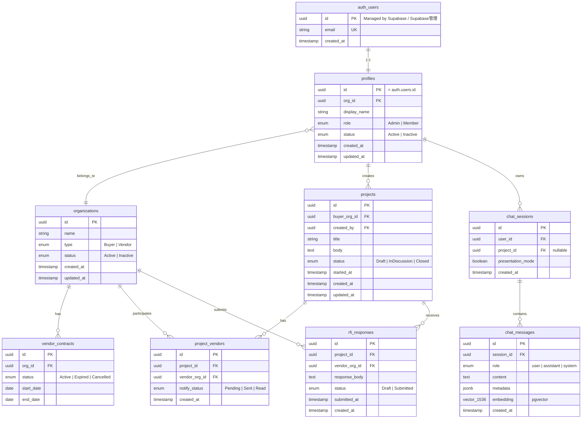

# 2. Database Design (ER Diagram) / データベース設計 (ER図)

[← Back to Index / 目次に戻る](./index.md)

---

**Constraints / 制約事項:**
- **RLS (Row Level Security)** required for all tables / すべてのテーブルに **RLS (Row Level Security)** 必須
- Use **UUID** for primary keys / 主キーは **UUID** を使用
- `auth.users` is managed by Supabase Auth (no direct manipulation) / `auth.users` は Supabase Auth が管理（直接操作不可）

---

[← Previous: System Architecture / 前へ: システム構成図](./system.md) | [Next: Authentication Flow / 次へ: 認証フロー →](./auth.md)
