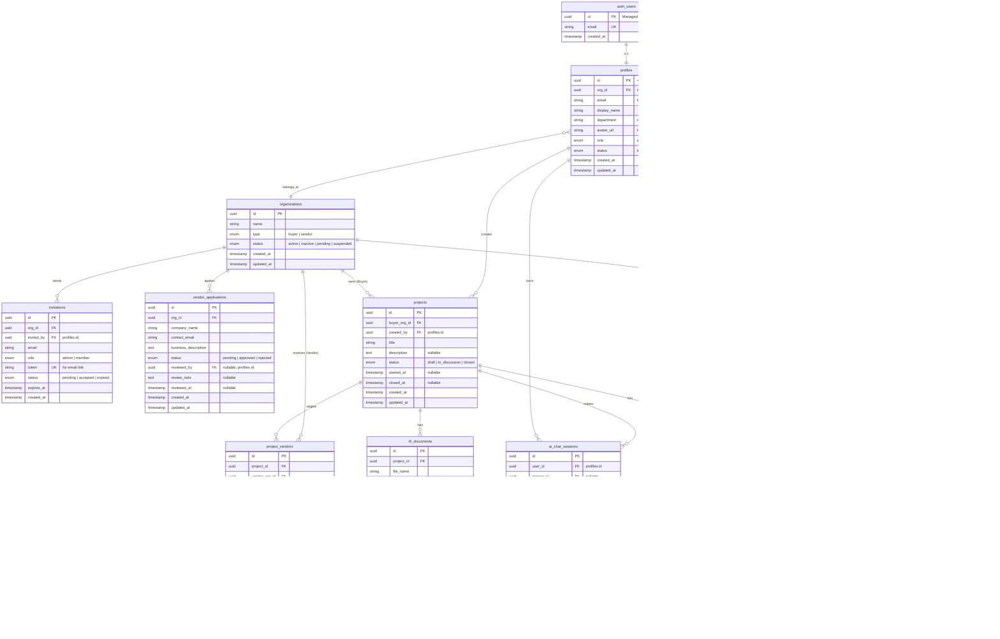

# 2. Database Design (ER Diagram) / データベース設計 (ER図)

[← Back to Index / 目次に戻る](./index.md)

---

**Constraints / 制約事項:**
- **RLS (Row Level Security)** required for all tables / すべてのテーブルに **RLS (Row Level Security)** 必須
- Use **UUID** for primary keys / 主キーは **UUID** を使用
- `auth.users` is managed by Supabase Auth (no direct manipulation) / `auth.users` は Supabase Auth が管理（直接操作不可）
- All tables include `created_at`, `updated_at` timestamps / 全テーブルに `created_at`, `updated_at` を含める

---

## ER Diagram / ER図

---

## Table Summary / テーブル一覧

| Category | Table | Description | Related UC |
|----------|-------|-------------|------------|
| Account | `profiles` | User profiles linked to auth.users / auth.usersに紐づくユーザープロフィール | UC01, UC16 |
| Account | `organizations` | Buyer/Vendor organizations / Buyer/Vendor組織 | UC01, UC03, UC17 |
| Account | `invitations` | Member invitation tokens / メンバー招待トークン | UC02 |
| Account | `vendor_applications` | Vendor application for approval / Vendor利用あ申請 | UC03 |
| RFI | `projects` | RFI projects (Draft → In Discussion → Closed) / RFIプロジェクト | UC06, UC07, UC10, UC11 |
| RFI | `project_vendors` | Project-Vendor assignments / プロジェクトとVendorの紐付け | UC07, UC08 |
| RFI | `rfi_documents` | Attached files / 添付ファイル | UC06, UC07 |
| Chat | `chat_rooms` | Buyer-Vendor chat rooms per project / プロジェクト毎のBuyer-Vendorチャットルーム | UC09 |
| Chat | `chat_messages` | Chat messages / チャットメッセージ | UC09 |
| Chat | `chat_read_status` | Read status for unread badge / 既読状態（未読バッジ用） | UC12 |
| AI | `ai_chat_sessions` | AI chat sessions for RFI drafting / RFI草案作成用AIチャットセッション | UC06 |
| AI | `ai_chat_messages` | AI chat messages with embeddings / embedding付きAIチャットメッセージ | UC06 |

---

## Notes / 備考

1. **Vendor Contracts & Payments**: Payment-related tables (`subscriptions`, `stripe_event_logs`, etc.) will be added separately.
   / 決済関連テーブル（`subscriptions`, `stripe_event_logs` 等）は別途追加予定。

2. **RLS Policies**: Each table requires RLS policies based on `org_id` and user role.
   / 各テーブルには `org_id` とユーザーロールに基づくRLSポリシーが必要。

3. **Soft Delete**: Consider adding `deleted_at` for soft delete if needed.
   / 必要に応じて `deleted_at` による論理削除を検討。

---

[← Previous: System Architecture / 前へ: システム構成図](./system.md) | [Next: Authentication Flow / 次へ: 認証フロー →](./auth.md)
