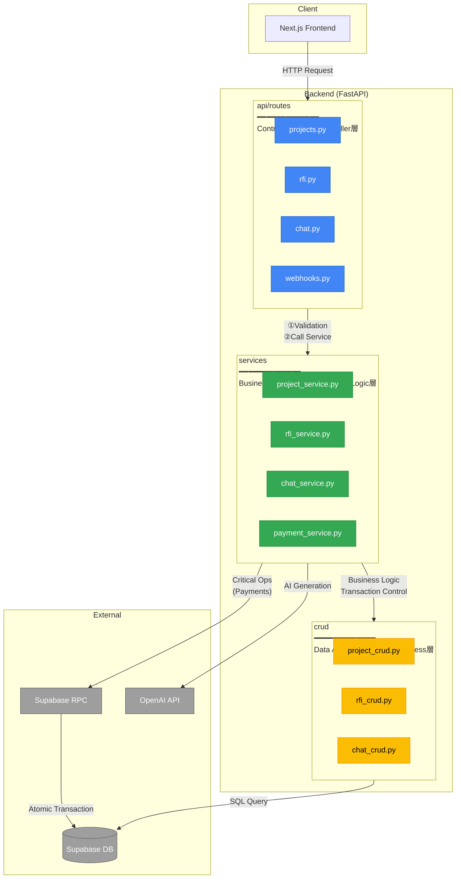

# 7. Software Architecture (Layer Structure) / ソフトウェアアーキテクチャ (レイヤー構成)

[← Back to Index / 目次に戻る](./index.md)

---

**Design Policy / 設計方針:**
- Adopt **3-layer architecture** (Controller / Service / Data Access) / **3層構造**を採用（Controller / Service / Data Access）
- Do not create `logic` folder; business logic goes in `services` / `logic` フォルダは作成せず、ビジネスロジックは `services` に統合
- Clear separation of responsibilities, only top-down dependencies allowed / 各層の責務を明確に分離し、上位層から下位層への一方向依存のみ許可



---

## Layer Responsibilities / 各層の責務

| Layer / 層 | Folder / フォルダ | Responsibility / 責務 | Notes / 備考 |
|------------|------------------|----------------------|--------------|
| **Controller** | `api/routes/` | Request handling, Validation, Response formatting / リクエスト受付、Validation、レスポンス整形 | Validation with Pydantic / Pydanticでバリデーション |
| **Service** | `services/` | Business logic, Transaction control, Orchestrate multiple CRUDs / ビジネスロジック、トランザクション制御、複数CRUDの統括 | Logic layer merged here / ※Logic層はここに統合 |
| **Data Access** | `crud/` | DB operations only (SELECT/INSERT/UPDATE/DELETE) / DB操作のみ（SELECT/INSERT/UPDATE/DELETE） | Simple CRUD operations / 単純なCRUD操作 |

---

## Transaction Control Policy / トランザクション制御方針

| Operation Type / 操作タイプ | Control Location / 制御場所 | Reason / 理由 |
|----------------------------|---------------------------|---------------|
| Single CRUD / 単一CRUD | Service → CRUD | Simple operations execute directly / シンプルな操作はそのまま実行 |
| Multi-table operations / 複数テーブル操作 | Supabase RPC | supabase-py doesn't support transactions / supabase-pyはトランザクション非対応のため |
| Payments & billing / 決済・課金 | Supabase RPC | Ensure idempotency and atomicity with SQL Function / 冪等性・原子性を SQL Function で担保 |
| Batch updates / バッチ更新 | Supabase RPC | Execute bulk data processing on DB side / 大量データの一括処理はDB側で実行 |

> **Note**: `supabase-py` is REST API based, so Python-side `BEGIN/COMMIT` transactions are not supported. Use RPC for operations involving multiple tables.
>
> `supabase-py` は REST API ベースのため、Python側での `BEGIN/COMMIT` トランザクションはサポートされていません。複数テーブルへの操作が必要な場合は RPC を使用してください。

---

## Code Example / コード例

```python
# api/routes/projects.py (Controller)
@router.post("/projects")
async def create_project(
    data: ProjectCreate,  # Pydantic Validation
    user: User = Depends(get_current_user)
):
    return await project_service.create_project(data, user)

# services/project_service.py (Service)
async def create_project(data: ProjectCreate, user: User) -> Project:
    # Business logic (permission check, etc.) / ビジネスロジック (権限チェック等)
    if not await can_create_project(user):
        raise HTTPException(403, "Project limit reached")

    # Single operation: direct CRUD / 単一操作: そのままCRUD
    return await project_crud.create(data, user.id)

async def create_project_with_vendors(
    data: ProjectCreate, user: User, vendor_ids: list[UUID]
) -> Project:
    # Multiple operations: use RPC / 複数操作: RPCを使用
    result = await supabase.rpc(
        "create_project_with_vendors",
        {
            "p_title": data.title,
            "p_user_id": str(user.id),
            "p_vendor_ids": [str(v) for v in vendor_ids]
        }
    ).execute()
    return result.data

# crud/project_crud.py (Data Access)
async def create(data: ProjectCreate, user_id: UUID) -> Project:
    result = await supabase.from_("projects").insert({
        "title": data.title,
        "created_by": str(user_id)
    }).execute()
    return result.data[0]
```

---

[← Previous: Payments / 前へ: 決済](./payments.md) | [Next: API Endpoints / 次へ: API エンドポイント →](./api-endpoints.md)
