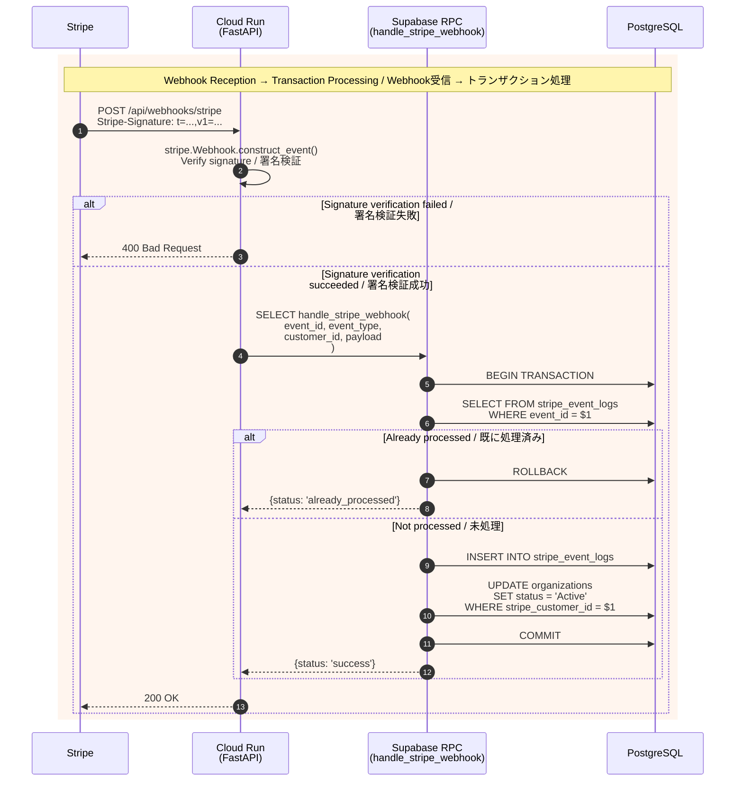

# 6. Payments & Subscriptions / 決済・サブスクリプション

[← Back to Index / 目次に戻る](./index.md)

---

**Design Policy / 設計方針:**
- Stripe Webhook processing uses **Supabase RPC (Stored Function)** to ensure transactions and idempotency
- Stripe Webhook処理は **Supabase RPC (Stored Function)** でトランザクションと冪等性を担保
- FastAPI only handles signature verification and RPC calls (no multiple DB operations)
- FastAPI側は署名検証とRPC呼び出しのみ（複数回のDB操作禁止）
- RPC functions use `SECURITY INVOKER` (DEFINER not needed when using Service Role Key)
- RPC関数は `SECURITY INVOKER` で実装（Service Role Keyで呼び出すためDEFINER不要）

**Table Structure / テーブル構成:**
- `stripe_event_logs`: Records processed event IDs (prevents duplicate processing) / 処理済みイベントID記録（重複処理防止）
- `organizations.stripe_customer_id`: Links to Stripe customer ID / Stripe顧客ID紐付け

---

## Supported Events / 対応イベント

| Event Type | Processing / 処理内容 |
|------------|----------------------|
| `invoice.payment_succeeded` | Update organization status to `Active` / 組織ステータスを `Active` に更新 |
| `invoice.payment_failed` | Update organization status to `PaymentFailed` / 組織ステータスを `PaymentFailed` に更新 |
| `customer.subscription.deleted` | Update organization status to `Cancelled` / 組織ステータスを `Cancelled` に更新 |

---

[← Previous: State Machines / 前へ: 状態遷移](./state-machine.md) | [Next: Software Layers / 次へ: ソフトウェア層 →](./layers.md)
