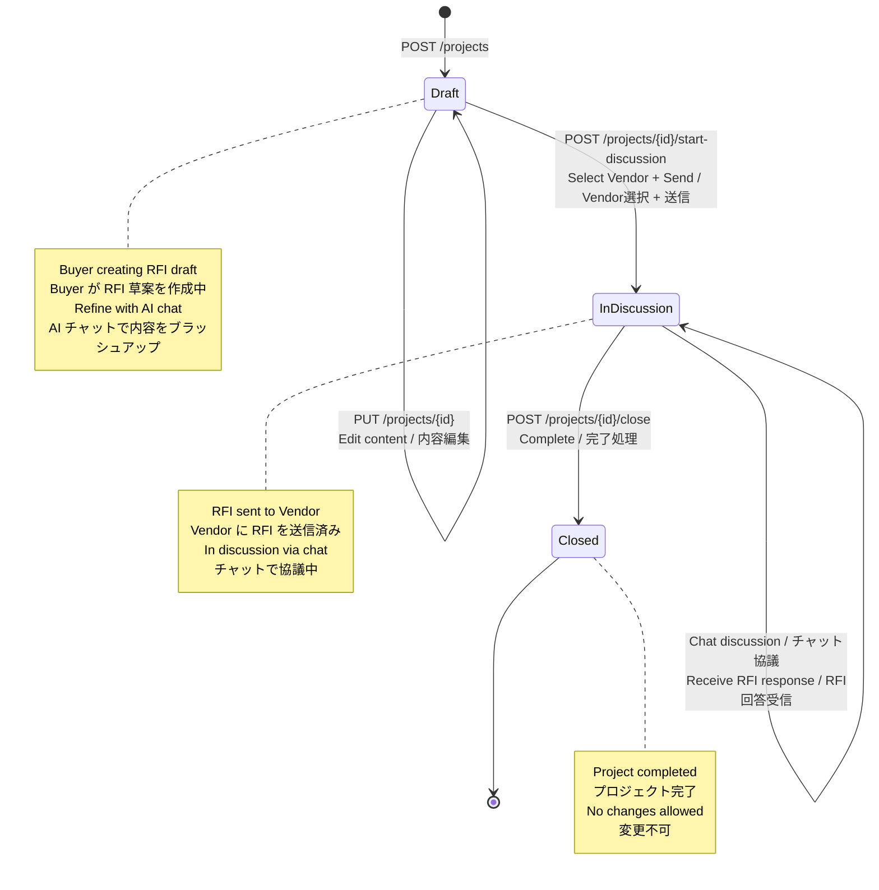
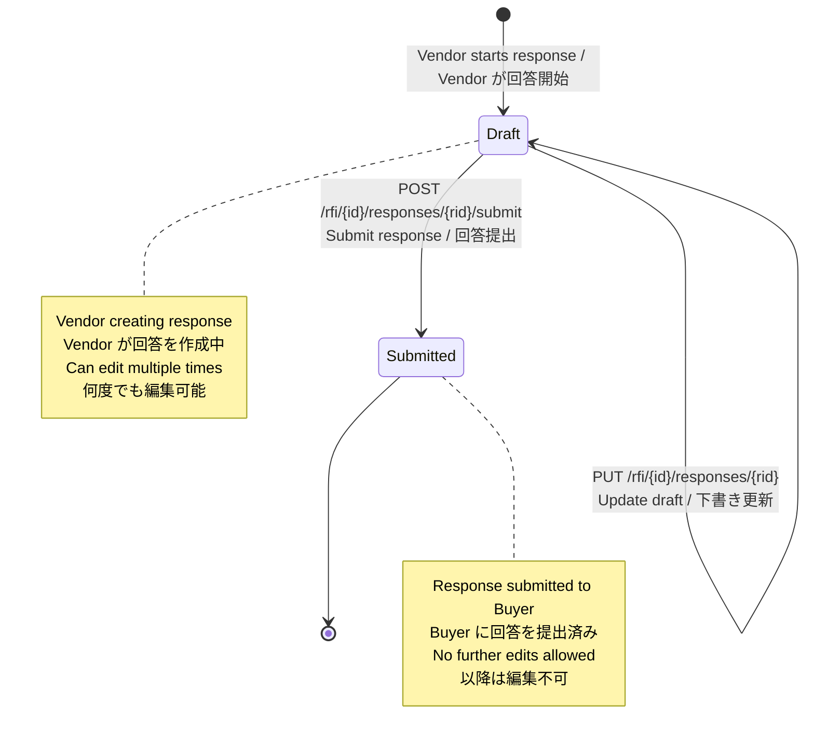
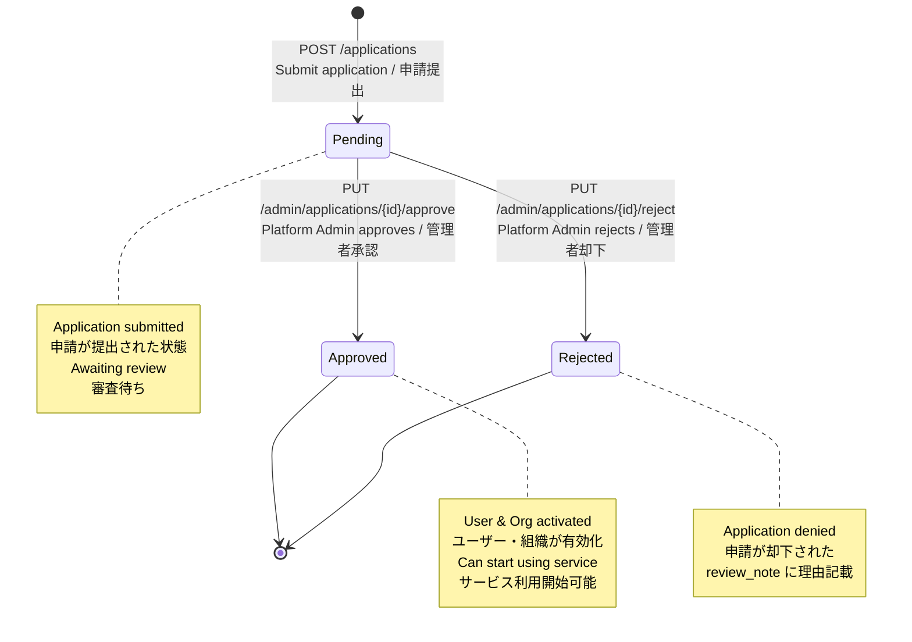
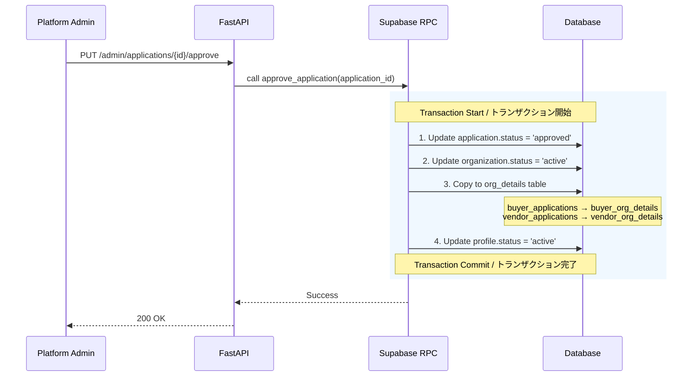
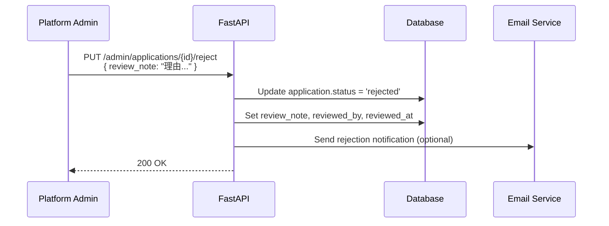
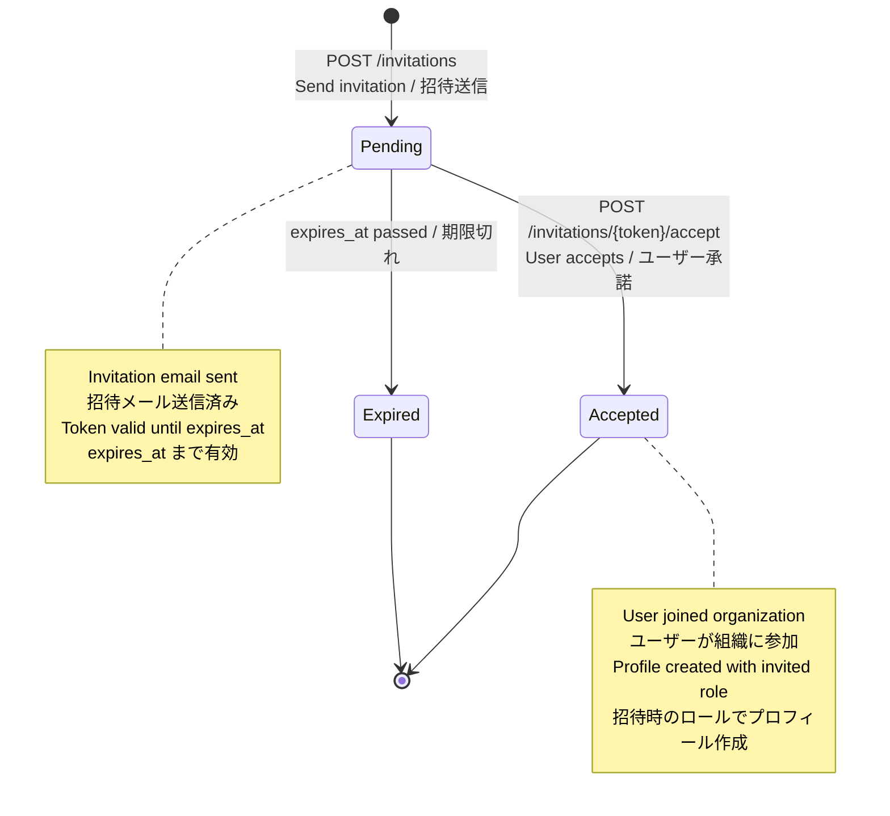
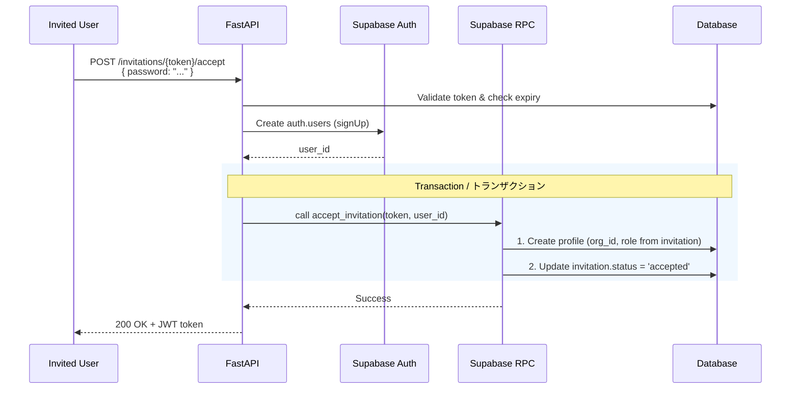

# 5. State Machines / 状態遷移

[← Back to Index / 目次に戻る](./index.md)

---

## 5.1 Project State Transitions / プロジェクト状態遷移

**Constraints / 制約:**
- `Draft → InDiscussion`: Vendor selection required / Vendor選択必須
- `InDiscussion → Closed`: Manual only (no auto-close) / 手動のみ（自動クローズなし）
- Once `Closed`, cannot reopen / 一度 `Closed` になると再オープン不可

---

## 5.2 RFI Response State Transitions / RFI回答の状態遷移

---

## 5.3 Application State Transitions / 利用申請の状態遷移

**Tables / 対象テーブル:**
- `buyer_applications` (Buyer申請)
- `vendor_applications` (Vendor申請)

### 5.3.1 Approval Process / 承認時の処理フロー

**POST /admin/applications/{id}/approve**

承認時は以下の処理を **1トランザクション (RPC)** で実行:

**Data Copy Details / データコピー詳細:**

| Source (申請) | Destination (組織詳細) |
|--------------|----------------------|
| `buyer_applications.industry` | `buyer_org_details.industry` |
| `buyer_applications.employee_count` | `buyer_org_details.employee_count` |
| `buyer_applications.purpose` | `buyer_org_details.purpose` |
| `vendor_applications.industry` | `vendor_org_details.industry` |
| `vendor_applications.employee_count` | `vendor_org_details.employee_count` |
| `vendor_applications.business_description` | `vendor_org_details.business_description` |
| `vendor_applications.service_description` | `vendor_org_details.service_description` |
| `vendor_applications.website_url` | `vendor_org_details.website_url` |

### 5.3.2 Rejection Process / 却下時の処理フロー

**POST /admin/applications/{id}/reject**

**Rejection does NOT change / 却下時に変更しないもの:**
- `organizations.status` (remains 'pending')
- `profiles.status` (remains 'pending')

**Note:** Rejected users can re-apply with a new application.
却下されたユーザーは新しい申請で再申請可能。

---

## 5.4 Invitation State Transitions / 招待の状態遷移

### 5.4.1 Invitation Accept Process / 招待承諾時の処理

**POST /invitations/{token}/accept**

---

[← Previous: AI Integration / 前へ: AI連携](./ai-integration.md) | [Next: Payments / 次へ: 決済 →](./payments.md)
