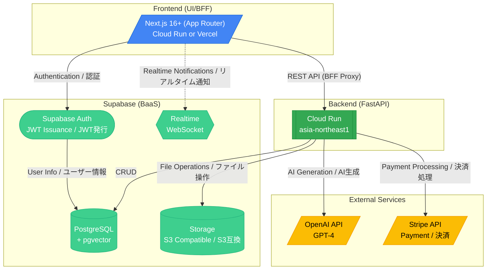

# 1. System Architecture / システム構成図

[← Back to Index / 目次に戻る](./index.md)

---

**Technology Selection Rationale / 技術選定の理由:**
- **Next.js (App Router)**: React-based SSR/SSG, optimized DX, TypeScript-first / Reactベース SSR/SSG、優れたDX、TypeScriptファースト
- **Cloud Run**: Serverless, pay-per-use, auto-scaling (0→N) / サーバーレス・従量課金・自動スケール (0→N)
- **Supabase**: All-in-one DB/Auth/Storage/Realtime, reduced operational costs / DB/Auth/Storage/Realtimeを一括提供、運用コスト削減
- **OpenAI**: Quality of RFI draft generation with GPT-4 / GPT-4によるRFI草案生成の品質

> **Note / 注意**: Next.js has API Routes and Server Actions, but this project **prohibits implementing business logic** in them. Next.js acts only as UI/BFF; all logic must be delegated to FastAPI (`backend/`).
>
> Next.jsにはAPI RoutesやServer Actionsがありますが、本プロジェクトでは**ビジネスロジックの実装を禁止**しています。Next.jsはUI/BFFとしてのみ機能し、ロジックは全てFastAPI (`backend/`) に委譲すること。

---

[Next: Database Design / 次へ: データベース設計 →](./database.md)
