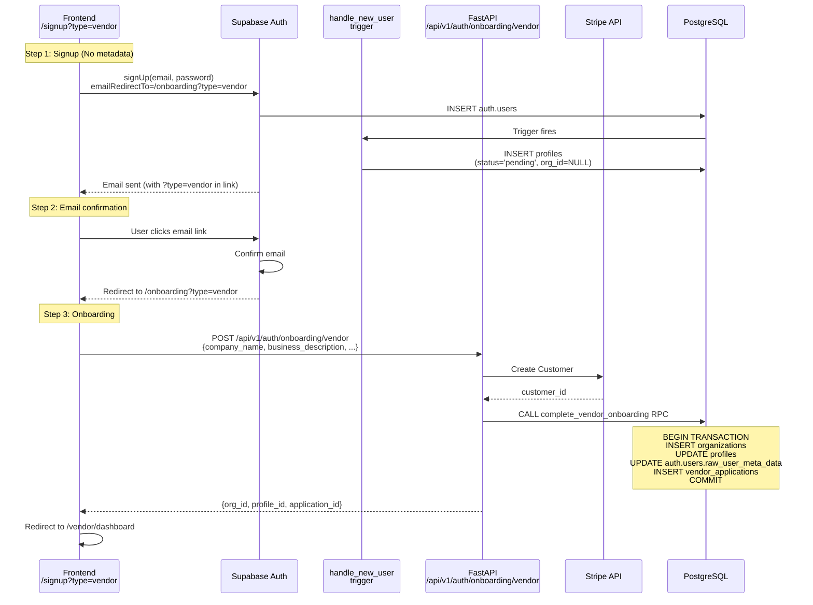

# Task #002: [Backend] User Onboarding Implementation

## Overview / 概要

Implement user registration and onboarding API.
User attributes (Buyer/Vendor) are determined by values passed from the Frontend.

ユーザー登録とオンボーディングAPIを実装する。
ユーザー属性（Buyer/Vendor）はFrontendから渡される値を正とする。

## Design Principles / 設計方針

1. **No Metadata in Signup / メタデータ排除:**
   - Do NOT send `options.data` during signup (keep Frontend simple)
   - Signup時に`options.data`は一切送らない（Frontendをシンプルに保つ）

2. **Maintain Trigger / トリガー維持:**
   - For system robustness, `handle_new_user` trigger creates `profiles` (status='pending') immediately after signup
   - システムの堅牢性のため、Signup直後に`handle_new_user`トリガーで`profiles` (status='pending') を作成する

3. **URL Parameters / URLパラメータ:**
   - Buyer/Vendor distinction is carried through `emailRedirectTo` URL parameters
   - Buyer/Vendorの区別は、`emailRedirectTo`のURLパラメータで引き継ぐ

## Architecture / アーキテクチャ



## Implementation Tasks / 実装タスク

### 1. Database Trigger / DBトリガー

**File:** `supabase/migrations/20260130000000_handle_new_user.sql`

**Purpose / 目的:**
- Guarantee that a `profiles` record always exists for RLS and Frontend state determination
- RLSやFrontendの状態判定のために、必ず`profiles`が存在する状態を保証する

**Logic:**
1. Fires on `auth.users` INSERT
2. Creates `profiles` record with:
   - `status`: 'pending'
   - `role`: 'owner'
   - `org_id`: NULL

```sql
-- =============================================================================
-- handle_new_user Trigger
-- Auth.users作成時に自動的にProfilesを作成
-- =============================================================================

-- Ensure org_id is nullable for pending users
ALTER TABLE profiles ALTER COLUMN org_id DROP NOT NULL;

-- Create or replace trigger function
CREATE OR REPLACE FUNCTION public.handle_new_user()
RETURNS TRIGGER AS $$
DECLARE
    v_org_id UUID;
    v_role TEXT;
    v_status TEXT;
BEGIN
    -- Get org_id from user metadata if provided (for invitation flow)
    -- 招待フローの場合はメタデータからorg_idを取得
    v_org_id := (NEW.raw_user_meta_data->>'org_id')::UUID;

    -- Get role from metadata, default to 'owner' for self-signup
    -- セルフサインアップの場合はデフォルトで'owner'
    v_role := COALESCE(NEW.raw_user_meta_data->>'role', 'owner');
    IF v_role NOT IN ('owner', 'admin', 'member') THEN
        v_role := 'owner';
    END IF;

    -- Set status based on whether org_id is provided
    -- org_idの有無に基づいてステータスを設定
    IF v_org_id IS NOT NULL THEN
        v_status := 'active';  -- Invitation flow
    ELSE
        v_status := 'pending'; -- Self-signup flow
    END IF;

    -- Create profile
    INSERT INTO public.profiles (id, org_id, email, display_name, role, status)
    VALUES (
        NEW.id,
        v_org_id,
        NEW.email,
        COALESCE(NEW.raw_user_meta_data->>'display_name', split_part(NEW.email, '@', 1)),
        v_role,
        v_status
    );

    RETURN NEW;
END;
$$ LANGUAGE plpgsql SECURITY DEFINER;

-- Create trigger if not exists
DROP TRIGGER IF EXISTS on_auth_user_created ON auth.users;
CREATE TRIGGER on_auth_user_created
    AFTER INSERT ON auth.users
    FOR EACH ROW EXECUTE FUNCTION public.handle_new_user();

-- Add index for finding pending users without organization
CREATE INDEX IF NOT EXISTS idx_profiles_pending_no_org
    ON profiles(status)
    WHERE org_id IS NULL AND status = 'pending';

COMMENT ON FUNCTION public.handle_new_user() IS
'Creates profile on user signup. For self-signup, creates pending profile without org_id. For invitation flow, creates active profile with org_id.
ユーザー登録時にプロフィールを作成。セルフサインアップの場合はorg_idなしのpending状態、招待フローの場合はorg_id付きのactive状態で作成。';
```

### 2. Onboarding API / オンボーディングAPI

**Endpoints:**
- `POST /api/v1/auth/onboarding/buyer` - Buyer onboarding
- `POST /api/v1/auth/onboarding/vendor` - Vendor onboarding

**Purpose / 目的:**
- Complete user onboarding after email confirmation
- メール確認後、ユーザーのオンボーディングを完了する

#### 2.1 Request Schema

**File:** `backend/app/schemas/onboarding.py`

```python
"""Onboarding request/response schemas."""

from typing import Literal
from pydantic import BaseModel, Field, EmailStr, HttpUrl


class BuyerOnboardingRequest(BaseModel):
    """Buyer onboarding request from Frontend."""

    company_name: str = Field(..., min_length=1, max_length=255)
    display_name: str = Field(..., min_length=1, max_length=100)
    contact_email: EmailStr
    industry: str = Field(..., min_length=1, max_length=100)
    employee_count: str = Field(..., min_length=1, max_length=50)
    purpose: str = Field(..., min_length=1, max_length=1000, description="利用目的")


class VendorOnboardingRequest(BaseModel):
    """Vendor onboarding request from Frontend."""

    company_name: str = Field(..., min_length=1, max_length=255)
    display_name: str = Field(..., min_length=1, max_length=100)
    contact_email: EmailStr
    industry: str = Field(..., min_length=1, max_length=100)
    employee_count: str = Field(..., min_length=1, max_length=50)
    business_description: str = Field(..., min_length=1, max_length=2000, description="事業内容")
    service_description: str = Field(..., min_length=1, max_length=2000, description="サービス説明")
    website_url: HttpUrl = Field(..., description="WebサイトURL")


class OnboardingResponse(BaseModel):
    """Onboarding response."""

    organization_id: str
    profile_id: str
    application_id: str
    status: Literal["pending", "active"]
```

#### 2.2 API Route

**File:** `backend/app/api/routes/auth/onboarding.py`

```python
"""Onboarding API routes."""

from fastapi import APIRouter, Depends, HTTPException

from app.core.security import get_current_user
from app.schemas.onboarding import (
    BuyerOnboardingRequest,
    VendorOnboardingRequest,
    OnboardingResponse,
)
from app.services.onboarding_service import OnboardingService

router = APIRouter()


@router.post("/onboarding/buyer", response_model=OnboardingResponse, status_code=200)
async def complete_buyer_onboarding(
    request: BuyerOnboardingRequest,
    current_user: dict = Depends(get_current_user),
    service: OnboardingService = Depends(),
) -> OnboardingResponse:
    """
    Complete buyer onboarding.

    Buyerのオンボーディングを完了する。

    - Creates buyer organization
    - Updates profile to active
    - Creates buyer application
    - Creates Stripe customer
    """
    try:
        result = await service.complete_buyer_onboarding(
            user_id=current_user["id"],
            email=current_user["email"],
            request=request,
        )
        return result
    except ValueError as e:
        raise HTTPException(status_code=400, detail=str(e))
    except Exception as e:
        raise HTTPException(status_code=500, detail="Buyer onboarding failed")


@router.post("/onboarding/vendor", response_model=OnboardingResponse, status_code=200)
async def complete_vendor_onboarding(
    request: VendorOnboardingRequest,
    current_user: dict = Depends(get_current_user),
    service: OnboardingService = Depends(),
) -> OnboardingResponse:
    """
    Complete vendor onboarding.

    Vendorのオンボーディングを完了する。

    - Creates vendor organization
    - Updates profile to active
    - Creates vendor application
    - Creates Stripe customer
    """
    try:
        result = await service.complete_vendor_onboarding(
            user_id=current_user["id"],
            email=current_user["email"],
            request=request,
        )
        return result
    except ValueError as e:
        raise HTTPException(status_code=400, detail=str(e))
    except Exception as e:
        raise HTTPException(status_code=500, detail="Vendor onboarding failed")
```

#### 2.3 Service Layer

**File:** `backend/app/services/onboarding_service.py`

```python
"""Onboarding service."""

import stripe
from fastapi import Depends

from app.core.config import get_supabase_client, settings
from app.schemas.onboarding import (
    BuyerOnboardingRequest,
    VendorOnboardingRequest,
    OnboardingResponse,
)


class OnboardingService:
    """Service for user onboarding."""

    def __init__(self, supabase=Depends(get_supabase_client)):
        self.supabase = supabase
        stripe.api_key = settings.STRIPE_SECRET_KEY

    async def complete_buyer_onboarding(
        self,
        user_id: str,
        email: str,
        request: BuyerOnboardingRequest,
    ) -> OnboardingResponse:
        """
        Complete buyer onboarding in a transaction.

        Steps:
        1. Verify user has no organization yet
        2. Create Stripe Customer
        3. Call complete_buyer_onboarding RPC:
           - Create organizations (type='buyer')
           - Update profiles (org_id, status='active', display_name)
           - Update auth.users metadata (org_type='buyer' for audit)
           - Create buyer_application
        """
        await self._verify_no_organization(user_id)

        # Create Stripe Customer
        stripe_customer = stripe.Customer.create(
            email=email,
            name=request.company_name,
            metadata={"user_id": user_id, "org_type": "buyer"},
        )

        # Call RPC to handle transaction
        result = self.supabase.rpc(
            "complete_buyer_onboarding",
            {
                "p_user_id": user_id,
                "p_company_name": request.company_name,
                "p_contact_email": request.contact_email,
                "p_display_name": request.display_name,
                "p_stripe_customer_id": stripe_customer.id,
                "p_industry": request.industry,
                "p_employee_count": request.employee_count,
                "p_purpose": request.purpose,
            },
        ).execute()

        if result.data is None:
            raise ValueError("Buyer onboarding RPC failed")

        return OnboardingResponse(
            organization_id=result.data["organization_id"],
            profile_id=result.data["profile_id"],
            application_id=result.data["application_id"],
            status=result.data["status"],
        )

    async def complete_vendor_onboarding(
        self,
        user_id: str,
        email: str,
        request: VendorOnboardingRequest,
    ) -> OnboardingResponse:
        """
        Complete vendor onboarding in a transaction.

        Steps:
        1. Verify user has no organization yet
        2. Create Stripe Customer
        3. Call complete_vendor_onboarding RPC:
           - Create organizations (type='vendor')
           - Update profiles (org_id, status='active', display_name)
           - Update auth.users metadata (org_type='vendor' for audit)
           - Create vendor_application
        """
        await self._verify_no_organization(user_id)

        # Create Stripe Customer
        stripe_customer = stripe.Customer.create(
            email=email,
            name=request.company_name,
            metadata={"user_id": user_id, "org_type": "vendor"},
        )

        # Call RPC to handle transaction
        result = self.supabase.rpc(
            "complete_vendor_onboarding",
            {
                "p_user_id": user_id,
                "p_company_name": request.company_name,
                "p_contact_email": request.contact_email,
                "p_display_name": request.display_name,
                "p_stripe_customer_id": stripe_customer.id,
                "p_industry": request.industry,
                "p_employee_count": request.employee_count,
                "p_business_description": request.business_description,
                "p_service_description": request.service_description,
                "p_website_url": str(request.website_url),
            },
        ).execute()

        if result.data is None:
            raise ValueError("Vendor onboarding RPC failed")

        return OnboardingResponse(
            organization_id=result.data["organization_id"],
            profile_id=result.data["profile_id"],
            application_id=result.data["application_id"],
            status=result.data["status"],
        )

    async def _verify_no_organization(self, user_id: str) -> None:
        """Verify user has no organization yet."""
        profile = (
            self.supabase.table("profiles")
            .select("org_id, status")
            .eq("id", user_id)
            .single()
            .execute()
        )

        if not profile.data:
            raise ValueError("Profile not found. Please contact support.")

        if profile.data["org_id"] is not None:
            raise ValueError("User already has an organization.")
```

#### 2.4 RPC Functions

**File:** `supabase/migrations/20260130000001_complete_onboarding_rpc.sql`

```sql
-- =============================================================================
-- complete_buyer_onboarding RPC
-- Buyerオンボーディング完了用のRPC関数
-- organizations, profiles更新, buyer_applications を1トランザクションで作成
-- =============================================================================

CREATE OR REPLACE FUNCTION complete_buyer_onboarding(
    p_user_id UUID,
    p_company_name TEXT,
    p_contact_email TEXT,
    p_display_name TEXT,
    p_stripe_customer_id TEXT,
    p_industry TEXT,
    p_employee_count TEXT,
    p_purpose TEXT
)
RETURNS JSONB
LANGUAGE plpgsql
SECURITY DEFINER
AS $$
DECLARE
    v_org_id UUID;
    v_application_id UUID;
BEGIN
    -- Check if user already has organization
    IF EXISTS (SELECT 1 FROM profiles WHERE id = p_user_id AND org_id IS NOT NULL) THEN
        RAISE EXCEPTION 'User already has an organization';
    END IF;

    -- 1. Create organization
    INSERT INTO organizations (
        name,
        type,
        status,
        stripe_customer_id,
        created_at,
        updated_at
    ) VALUES (
        p_company_name,
        'buyer',
        'active',
        p_stripe_customer_id,
        NOW(),
        NOW()
    )
    RETURNING id INTO v_org_id;

    -- 2. Update profile
    UPDATE profiles
    SET
        org_id = v_org_id,
        display_name = p_display_name,
        email = p_contact_email,
        status = 'active',
        updated_at = NOW()
    WHERE id = p_user_id;

    -- 3. Update auth.users metadata (for audit log)
    UPDATE auth.users
    SET
        raw_user_meta_data = jsonb_set(
            COALESCE(raw_user_meta_data, '{}'::jsonb),
            '{org_type}',
            to_jsonb('buyer')
        )
    WHERE id = p_user_id;

    -- 4. Create buyer application
    INSERT INTO buyer_applications (
        org_id,
        company_name,
        contact_email,
        industry,
        employee_count,
        purpose,
        status,
        created_by,
        created_at,
        updated_at
    ) VALUES (
        v_org_id,
        p_company_name,
        p_contact_email,
        p_industry,
        p_employee_count,
        p_purpose,
        'pending',
        p_user_id,
        NOW(),
        NOW()
    )
    RETURNING id INTO v_application_id;

    -- Return created IDs
    RETURN jsonb_build_object(
        'organization_id', v_org_id,
        'profile_id', p_user_id,
        'application_id', v_application_id,
        'status', 'active'
    );

EXCEPTION
    WHEN OTHERS THEN
        -- Re-raise the exception (transaction will be rolled back)
        RAISE;
END;
$$;

-- =============================================================================
-- complete_vendor_onboarding RPC
-- Vendorオンボーディング完了用のRPC関数
-- organizations, profiles更新, vendor_applications を1トランザクションで作成
-- =============================================================================

CREATE OR REPLACE FUNCTION complete_vendor_onboarding(
    p_user_id UUID,
    p_company_name TEXT,
    p_contact_email TEXT,
    p_display_name TEXT,
    p_stripe_customer_id TEXT,
    p_industry TEXT,
    p_employee_count TEXT,
    p_business_description TEXT,
    p_service_description TEXT,
    p_website_url TEXT
)
RETURNS JSONB
LANGUAGE plpgsql
SECURITY DEFINER
AS $$
DECLARE
    v_org_id UUID;
    v_application_id UUID;
BEGIN
    -- Check if user already has organization
    IF EXISTS (SELECT 1 FROM profiles WHERE id = p_user_id AND org_id IS NOT NULL) THEN
        RAISE EXCEPTION 'User already has an organization';
    END IF;

    -- 1. Create organization
    INSERT INTO organizations (
        name,
        type,
        status,
        stripe_customer_id,
        created_at,
        updated_at
    ) VALUES (
        p_company_name,
        'vendor',
        'active',
        p_stripe_customer_id,
        NOW(),
        NOW()
    )
    RETURNING id INTO v_org_id;

    -- 2. Update profile
    UPDATE profiles
    SET
        org_id = v_org_id,
        display_name = p_display_name,
        email = p_contact_email,
        status = 'active',
        updated_at = NOW()
    WHERE id = p_user_id;

    -- 3. Update auth.users metadata (for audit log)
    UPDATE auth.users
    SET
        raw_user_meta_data = jsonb_set(
            COALESCE(raw_user_meta_data, '{}'::jsonb),
            '{org_type}',
            to_jsonb('vendor')
        )
    WHERE id = p_user_id;

    -- 4. Create vendor application
    INSERT INTO vendor_applications (
        org_id,
        company_name,
        contact_email,
        industry,
        employee_count,
        business_description,
        service_description,
        website_url,
        status,
        created_by,
        created_at,
        updated_at
    ) VALUES (
        v_org_id,
        p_company_name,
        p_contact_email,
        p_industry,
        p_employee_count,
        p_business_description,
        p_service_description,
        p_website_url,
        'pending',
        p_user_id,
        NOW(),
        NOW()
    )
    RETURNING id INTO v_application_id;

    -- Return created IDs
    RETURN jsonb_build_object(
        'organization_id', v_org_id,
        'profile_id', p_user_id,
        'application_id', v_application_id,
        'status', 'active'
    );

EXCEPTION
    WHEN OTHERS THEN
        -- Re-raise the exception (transaction will be rolled back)
        RAISE;
END;
$$;

-- Grant execute permissions
GRANT EXECUTE ON FUNCTION complete_buyer_onboarding TO authenticated;
GRANT EXECUTE ON FUNCTION complete_buyer_onboarding TO service_role;
GRANT EXECUTE ON FUNCTION complete_vendor_onboarding TO authenticated;
GRANT EXECUTE ON FUNCTION complete_vendor_onboarding TO service_role;

-- Comments
COMMENT ON FUNCTION complete_buyer_onboarding IS
'Complete buyer onboarding: create organization (type=buyer), update profile to active, create buyer_application, and update user metadata.
Buyerオンボーディング完了: 組織作成(type=buyer)、プロフィールをactiveに更新、buyer_application作成、ユーザーメタデータ更新を1トランザクションで実行。';

COMMENT ON FUNCTION complete_vendor_onboarding IS
'Complete vendor onboarding: create organization (type=vendor), update profile to active, create vendor_application, and update user metadata.
Vendorオンボーディング完了: 組織作成(type=vendor)、プロフィールをactiveに更新、vendor_application作成、ユーザーメタデータ更新を1トランザクションで実行。';
```

### 3. Testing / テスト

#### 3.1 Trigger Test

**File:** `backend/tests/integration/test_handle_new_user_trigger.py`

```python
"""Integration test for handle_new_user trigger."""

import pytest
from supabase import create_client
import os

SUPABASE_URL = os.getenv("SUPABASE_URL")
SUPABASE_SERVICE_KEY = os.getenv("SUPABASE_SERVICE_KEY")


@pytest.mark.integration
def test_handle_new_user_creates_pending_profile():
    """Test that handle_new_user trigger creates pending profile on signup."""
    supabase = create_client(SUPABASE_URL, SUPABASE_SERVICE_KEY)

    # Create user (trigger should fire)
    response = supabase.auth.admin.create_user({
        "email": "test-trigger@example.com",
        "password": "password123",
        "email_confirm": True,
    })

    user_id = response.user.id

    try:
        # Check profile was created with pending status
        profile = (
            supabase.table("profiles")
            .select("*")
            .eq("id", user_id)
            .single()
            .execute()
        )

        assert profile.data is not None
        assert profile.data["status"] == "pending"
        assert profile.data["org_id"] is None
        assert profile.data["role"] == "owner"

    finally:
        # Clean up
        supabase.auth.admin.delete_user(user_id)
```

#### 3.2 Service Test

**File:** `backend/tests/unit/test_services/test_onboarding_service.py`

```python
"""Unit tests for onboarding service."""

import pytest
from unittest.mock import MagicMock, AsyncMock, patch
from app.services.onboarding_service import OnboardingService
from app.schemas.onboarding import BuyerOnboardingRequest, VendorOnboardingRequest


@pytest.fixture
def mock_supabase():
    """Mock Supabase client."""
    mock = MagicMock()
    mock.table.return_value = mock
    mock.select.return_value = mock
    mock.eq.return_value = mock
    mock.single.return_value = mock
    mock.rpc.return_value = mock
    return mock


@pytest.mark.asyncio
async def test_complete_buyer_onboarding_success(mock_supabase):
    """Test successful buyer onboarding completion."""
    # Arrange
    mock_supabase.execute.return_value = MagicMock(
        data={"org_id": None, "status": "pending"}
    )
    mock_supabase.rpc.return_value.execute.return_value = MagicMock(
        data={
            "organization_id": "org-uuid",
            "profile_id": "user-uuid",
            "application_id": "app-uuid",
            "status": "active",
        }
    )

    service = OnboardingService(supabase=mock_supabase)
    request = BuyerOnboardingRequest(
        company_name="Test Corp",
        display_name="Test User",
        contact_email="test@example.com",
        industry="IT",
        employee_count="50-100",
        purpose="RFI management",
    )

    with patch("stripe.Customer.create") as mock_stripe:
        mock_stripe.return_value = MagicMock(id="cus_123")

        # Act
        result = await service.complete_buyer_onboarding(
            user_id="user-uuid",
            email="test@example.com",
            request=request,
        )

        # Assert
        assert result.organization_id == "org-uuid"
        assert result.status == "active"
        mock_stripe.assert_called_once()
        mock_supabase.rpc.assert_called_with(
            "complete_buyer_onboarding",
            {
                "p_user_id": "user-uuid",
                "p_company_name": "Test Corp",
                "p_contact_email": "test@example.com",
                "p_display_name": "Test User",
                "p_stripe_customer_id": "cus_123",
                "p_industry": "IT",
                "p_employee_count": "50-100",
                "p_purpose": "RFI management",
            },
        )


@pytest.mark.asyncio
async def test_complete_vendor_onboarding_success(mock_supabase):
    """Test successful vendor onboarding completion."""
    # Arrange
    mock_supabase.execute.return_value = MagicMock(
        data={"org_id": None, "status": "pending"}
    )
    mock_supabase.rpc.return_value.execute.return_value = MagicMock(
        data={
            "organization_id": "org-uuid",
            "profile_id": "user-uuid",
            "application_id": "app-uuid",
            "status": "active",
        }
    )

    service = OnboardingService(supabase=mock_supabase)
    request = VendorOnboardingRequest(
        company_name="Vendor Corp",
        display_name="Vendor User",
        contact_email="vendor@example.com",
        industry="IT",
        employee_count="10-50",
        business_description="Software development company",
        service_description="Web application development",
        website_url="https://vendor.example.com",
    )

    with patch("stripe.Customer.create") as mock_stripe:
        mock_stripe.return_value = MagicMock(id="cus_456")

        # Act
        result = await service.complete_vendor_onboarding(
            user_id="user-uuid",
            email="vendor@example.com",
            request=request,
        )

        # Assert
        assert result.organization_id == "org-uuid"
        assert result.status == "active"
        mock_stripe.assert_called_once()
        mock_supabase.rpc.assert_called_with(
            "complete_vendor_onboarding",
            {
                "p_user_id": "user-uuid",
                "p_company_name": "Vendor Corp",
                "p_contact_email": "vendor@example.com",
                "p_display_name": "Vendor User",
                "p_stripe_customer_id": "cus_456",
                "p_industry": "IT",
                "p_employee_count": "10-50",
                "p_business_description": "Software development company",
                "p_service_description": "Web application development",
                "p_website_url": "https://vendor.example.com",
            },
        )


@pytest.mark.asyncio
async def test_complete_onboarding_already_has_org(mock_supabase):
    """Test onboarding fails if user already has organization."""
    # Arrange
    mock_supabase.execute.return_value = MagicMock(
        data={"org_id": "existing-org", "status": "active"}
    )

    service = OnboardingService(supabase=mock_supabase)
    request = BuyerOnboardingRequest(
        company_name="Test Corp",
        display_name="Test User",
        contact_email="test@example.com",
        industry="IT",
        employee_count="50-100",
        purpose="RFI management",
    )

    # Act & Assert
    with pytest.raises(ValueError, match="already has an organization"):
        await service.complete_buyer_onboarding(
            user_id="user-uuid",
            email="test@example.com",
            request=request,
        )
```

#### 3.3 API Route Test

**File:** `backend/tests/unit/test_routes/test_onboarding_routes.py`

```python
"""Unit tests for onboarding routes."""

import pytest
from unittest.mock import AsyncMock, MagicMock
from httpx import AsyncClient, ASGITransport
from app.main import app


@pytest.fixture
def mock_onboarding_service():
    """Mock OnboardingService."""
    return AsyncMock()


@pytest.mark.asyncio
async def test_complete_buyer_onboarding_success(mock_current_user, mock_onboarding_service):
    """Test successful buyer onboarding API call."""
    from app.core.security import get_current_user
    from app.services.onboarding_service import OnboardingService
    from app.schemas.onboarding import OnboardingResponse

    # Arrange
    mock_onboarding_service.complete_buyer_onboarding.return_value = OnboardingResponse(
        organization_id="org-uuid",
        profile_id="user-uuid",
        application_id="app-uuid",
        status="active",
    )

    app.dependency_overrides[get_current_user] = lambda: mock_current_user
    app.dependency_overrides[OnboardingService] = lambda: mock_onboarding_service

    try:
        transport = ASGITransport(app=app)
        async with AsyncClient(transport=transport, base_url="http://test") as client:
            response = await client.post(
                "/api/v1/auth/onboarding/buyer",
                json={
                    "company_name": "Test Corp",
                    "display_name": "Test User",
                    "contact_email": "test@example.com",
                    "industry": "IT",
                    "employee_count": "50-100",
                    "purpose": "RFI management",
                },
                headers={"Authorization": "Bearer test-token"},
            )

        # Assert
        assert response.status_code == 200
        data = response.json()
        assert data["organization_id"] == "org-uuid"
        assert data["status"] == "active"

    finally:
        app.dependency_overrides.clear()


@pytest.mark.asyncio
async def test_complete_vendor_onboarding_success(mock_current_user, mock_onboarding_service):
    """Test successful vendor onboarding API call."""
    from app.core.security import get_current_user
    from app.services.onboarding_service import OnboardingService
    from app.schemas.onboarding import OnboardingResponse

    # Arrange
    mock_onboarding_service.complete_vendor_onboarding.return_value = OnboardingResponse(
        organization_id="org-uuid",
        profile_id="user-uuid",
        application_id="app-uuid",
        status="active",
    )

    app.dependency_overrides[get_current_user] = lambda: mock_current_user
    app.dependency_overrides[OnboardingService] = lambda: mock_onboarding_service

    try:
        transport = ASGITransport(app=app)
        async with AsyncClient(transport=transport, base_url="http://test") as client:
            response = await client.post(
                "/api/v1/auth/onboarding/vendor",
                json={
                    "company_name": "Vendor Corp",
                    "display_name": "Vendor User",
                    "contact_email": "vendor@example.com",
                    "industry": "IT",
                    "employee_count": "10-50",
                    "business_description": "Software development company",
                    "service_description": "Web application development",
                    "website_url": "https://vendor.example.com",
                },
                headers={"Authorization": "Bearer test-token"},
            )

        # Assert
        assert response.status_code == 200
        data = response.json()
        assert data["organization_id"] == "org-uuid"
        assert data["status"] == "active"

    finally:
        app.dependency_overrides.clear()


@pytest.mark.asyncio
async def test_buyer_onboarding_missing_required_field():
    """Test buyer onboarding fails with missing required field."""
    from app.core.security import get_current_user

    mock_current_user = {"id": "user-uuid", "email": "test@example.com"}
    app.dependency_overrides[get_current_user] = lambda: mock_current_user

    try:
        transport = ASGITransport(app=app)
        async with AsyncClient(transport=transport, base_url="http://test") as client:
            response = await client.post(
                "/api/v1/auth/onboarding/buyer",
                json={
                    "company_name": "Test Corp",
                    "display_name": "Test User",
                    "contact_email": "test@example.com",
                    "industry": "IT",
                    "employee_count": "50-100",
                    # purpose is missing (required)
                },
                headers={"Authorization": "Bearer test-token"},
            )

        # Assert
        assert response.status_code == 422  # Validation error

    finally:
        app.dependency_overrides.clear()
```

## Acceptance Criteria / 受け入れ基準

### Database
- [ ] `handle_new_user` trigger fires on `auth.users` INSERT
- [ ] Trigger creates `profiles` record with `status='pending'` and `org_id=NULL`
- [ ] `complete_buyer_onboarding` RPC exists and works correctly
- [ ] `complete_vendor_onboarding` RPC exists and works correctly
- [ ] Migration includes rollback instructions

### API
- [ ] `POST /api/v1/auth/onboarding/buyer` endpoint exists
- [ ] `POST /api/v1/auth/onboarding/vendor` endpoint exists
- [ ] Both endpoints require JWT authentication
- [ ] Request validation works (separate Pydantic schemas for buyer/vendor)
- [ ] Required fields are enforced (purpose for buyer, business_description/service_description/website_url for vendor)
- [ ] Stripe Customer is created before transaction
- [ ] RPCs handle transactions atomically (all-or-nothing)
- [ ] Error handling returns appropriate HTTP status codes

### Testing
- [ ] Trigger integration test passes
- [ ] Buyer onboarding service unit tests pass (with mocked Supabase and Stripe)
- [ ] Vendor onboarding service unit tests pass (with mocked Supabase and Stripe)
- [ ] API route unit tests pass for both buyer and vendor endpoints
- [ ] Validation error tests pass (missing required fields)
- [ ] Coverage >= 80% on service layer

### Completion State
- [ ] After signup, `profiles` (pending) exists in DB
- [ ] After buyer onboarding API call, `organizations` (type='buyer') is created
- [ ] After vendor onboarding API call, `organizations` (type='vendor') is created
- [ ] After onboarding API call, `profiles.status` is 'active'
- [ ] `profiles.org_id` is correctly linked to `organizations.id`
- [ ] `auth.users.raw_user_meta_data` contains `org_type` for audit
- [ ] Buyer-specific fields are stored in `buyer_applications`
- [ ] Vendor-specific fields are stored in `vendor_applications`

---

### データベース
- [ ] `handle_new_user`トリガーが`auth.users` INSERT時に発火する
- [ ] トリガーが`status='pending'`、`org_id=NULL`で`profiles`レコードを作成する
- [ ] `complete_buyer_onboarding` RPCが存在し、正しく動作する
- [ ] `complete_vendor_onboarding` RPCが存在し、正しく動作する
- [ ] マイグレーションにロールバック手順が含まれている

### API
- [ ] `POST /api/v1/auth/onboarding/buyer`エンドポイントが存在する
- [ ] `POST /api/v1/auth/onboarding/vendor`エンドポイントが存在する
- [ ] 両エンドポイントがJWT認証を要求する
- [ ] リクエストバリデーションが動作する（buyer/vendor別のPydanticスキーマ）
- [ ] 必須フィールドが強制される（buyerはpurpose、vendorはbusiness_description/service_description/website_url）
- [ ] トランザクション前にStripe Customerが作成される
- [ ] RPCがトランザクションをアトミックに処理する（all-or-nothing）
- [ ] エラーハンドリングが適切なHTTPステータスコードを返す

### テスト
- [ ] トリガーの結合テストが通る
- [ ] Buyerオンボーディングのサービス層ユニットテストが通る（SupabaseとStripeをモック）
- [ ] Vendorオンボーディングのサービス層ユニットテストが通る（SupabaseとStripeをモック）
- [ ] APIルートのユニットテストが両エンドポイントで通る
- [ ] バリデーションエラーのテストが通る（必須フィールド欠落）
- [ ] サービス層のカバレッジが80%以上

### 完了状態
- [ ] サインアップ後、DBに`profiles` (pending) が存在する
- [ ] Buyerオンボーディング実行後、`organizations` (type='buyer') が作成される
- [ ] Vendorオンボーディング実行後、`organizations` (type='vendor') が作成される
- [ ] オンボーディングAPI実行後、`profiles.status`が'active'になる
- [ ] `profiles.org_id`が`organizations.id`に正しく紐付いている
- [ ] `auth.users.raw_user_meta_data`に監査用の`org_type`が含まれている
- [ ] Buyer固有フィールドが`buyer_applications`に保存される
- [ ] Vendor固有フィールドが`vendor_applications`に保存される

## References / 参考資料

- Supabase Auth: Trigger on user signup - https://supabase.com/docs/guides/auth/managing-user-data#advanced-techniques
- Stripe API: Create Customer - https://stripe.com/docs/api/customers/create
- PostgreSQL: Transaction Control - https://www.postgresql.org/docs/current/tutorial-transactions.html
- Migration: `20250107000000_init.sql` (initial schema)
- Migration: `20250108000000_fix_handle_new_user_trigger.sql` (existing trigger)

---

## Design Notes / 設計メモ

### API Design Principle / API設計原則

#### 新規作成 (Onboarding) - 一括作成

- **データ不整合を防ぐため、1つのAPIで一括作成する（トランザクション処理）**
- Buyer/Vendor で API エンドポイントを分離
  - `POST /api/v1/auth/onboarding/buyer`
  - `POST /api/v1/auth/onboarding/vendor`
- RPC 内で以下を **アトミックに** 実行:
  - `organizations` INSERT
  - `profiles` UPDATE
  - `auth.users.raw_user_meta_data` UPDATE
  - `buyer_applications` or `vendor_applications` INSERT

#### 更新 (Update) - API分離

将来的なタスク（01-09, 01-10）では、個人設定と組織設定は API を分離する:

| 対象 | API | タスク | 備考 |
|------|-----|--------|------|
| 個人設定 | `PATCH /api/v1/users/me` | [01-09](./01-09-user-profile-update.md) | `profiles` テーブルのみ |
| 組織基本情報 | `PATCH /api/v1/organizations/{org_id}` | [01-10](./01-10-organization-settings.md) | `organizations` テーブル |
| 組織詳細情報 | `PATCH /api/v1/organizations/{org_id}/details` | 将来のタスク | `buyer_org_details` / `vendor_org_details` |

**重要**: 今回の Onboarding 実装では、Service層をこの将来の分離に備えて構造化すること。

#### Service Layer Structure / Service層の構造

```python
# 現在 (01-02 Onboarding)
class OnboardingService:
    async def complete_buyer_onboarding(...)   # 新規作成: 一括処理
    async def complete_vendor_onboarding(...)  # 新規作成: 一括処理
    async def _verify_no_organization(...)     # 共通ヘルパー

# 将来 (01-09, 01-10, 将来タスク)
# → 専用サービスに分離
class ProfileService:
    async def update_profile(...)              # profiles のみ更新

class OrganizationService:
    async def update_organization(...)         # organizations のみ更新
    async def update_org_details(...)          # buyer_org_details / vendor_org_details のみ更新
```

この設計により、責務が明確になり、将来の拡張や保守が容易になる。
