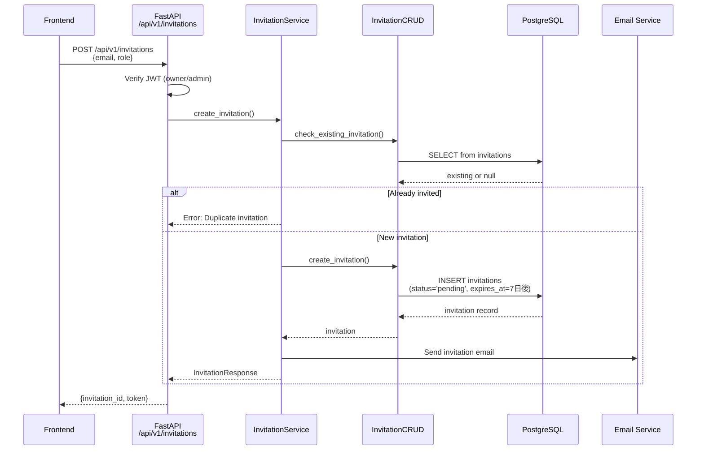
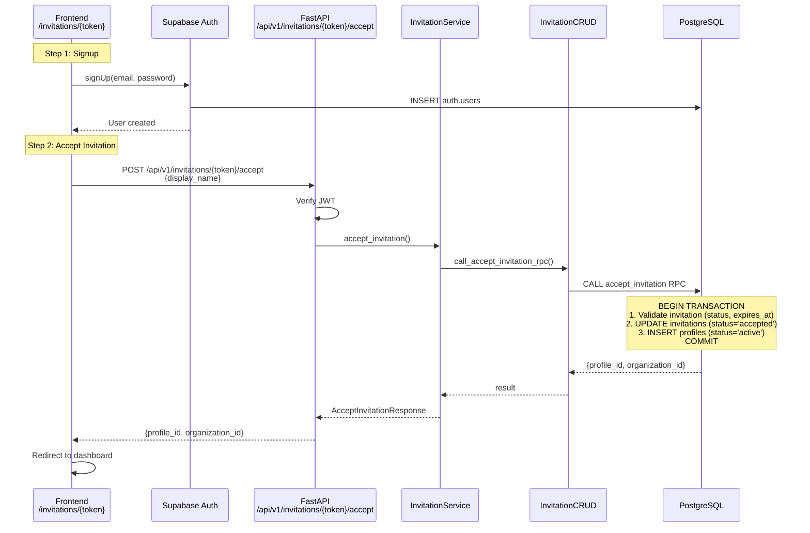

# Task #004: [Backend] Invitation / 招待機能

## Overview / 概要

Implement invitation functionality for organizations.
Owner/Admin can invite members, and invited users can join the organization after signup.

組織の招待機能を実装する。
Owner/Adminがメンバーを招待し、招待されたユーザーがサインアップ後に組織に参加できる。

**Important / 重要**: Invited users are approved automatically. `profiles` are created with `status='active'`.
招待経由で参加するユーザーは承認不要。profiles は `active` 状態で作成される。

## 🔗 GitLab Issue
- Link: https://gitlab.i-stech.net:9080/bbs/pep/-/issues/28

---

## Design Principles / 設計方針

1. **Invitation via RPC / RPC経由の招待承諾:**
   - `accept_invitation` RPC handles invitation acceptance atomically
   - `accept_invitation` RPCで招待承諾をアトミックに処理

2. **【重要】3-Layer Architecture / 3層構造:** *(CLAUDE.md準拠)*
   - Follow `api/routes/` → `services/` → `crud/` call order
   - `api/routes/` → `services/` → `crud/` の呼び出し順序に従う
   - Service layer handles business logic, CRUD layer handles all Supabase operations
   - Service層はビジネスロジックを担当、CRUD層は全Supabase操作を担当

3. **No Application Required / 申請不要:**
   - Invited users skip the application approval process
   - 招待ユーザーは申請承認プロセスをスキップ

---

## 📍 参照ドキュメント

| Document | Section |
|----------|---------|
| [Invitation State Transitions](../workflows/account.md#12-invitation-state-transitions--招待の状態遷移) | ワークフロー詳細 |
| [Record Creation Overview](../workflows/account.md#record-creation-overview--レコード作成タイミング概要) | 作成タイミング |
| [Database Design](../architecture/database.md) | テーブル定義 |
| [Software Layers](../architecture/layers.md) | 3層アーキテクチャ |

---

## Architecture / アーキテクチャ

### Invitation Creation Flow / 招待作成フロー



### Invitation Acceptance Flow / 招待承諾フロー



---

## Implementation Tasks / 実装タスク

### 1. Database Migration / DBマイグレーション

**File:** `supabase/migrations/20260201000000_invitations.sql`

```sql
-- =============================================================================
-- Invitations Table
-- 招待テーブル
-- =============================================================================

CREATE TABLE IF NOT EXISTS invitations (
    id UUID PRIMARY KEY DEFAULT gen_random_uuid(),
    organization_id UUID NOT NULL REFERENCES organizations(id) ON DELETE CASCADE,
    email TEXT NOT NULL,
    role TEXT NOT NULL CHECK (role IN ('admin', 'member')),
    token UUID NOT NULL UNIQUE DEFAULT gen_random_uuid(),
    status TEXT NOT NULL DEFAULT 'pending' CHECK (status IN ('pending', 'accepted', 'expired', 'cancelled')),
    invited_by UUID NOT NULL REFERENCES profiles(id),
    expires_at TIMESTAMPTZ NOT NULL DEFAULT (NOW() + INTERVAL '7 days'),
    accepted_at TIMESTAMPTZ,
    created_at TIMESTAMPTZ NOT NULL DEFAULT NOW(),
    updated_at TIMESTAMPTZ NOT NULL DEFAULT NOW(),

    -- Prevent duplicate invitations to same email in same org
    UNIQUE (organization_id, email)
);

-- Indexes
CREATE INDEX idx_invitations_token ON invitations(token);
CREATE INDEX idx_invitations_org_status ON invitations(organization_id, status);
CREATE INDEX idx_invitations_email ON invitations(email);

-- Updated_at trigger
CREATE TRIGGER update_invitations_updated_at
    BEFORE UPDATE ON invitations
    FOR EACH ROW
    EXECUTE FUNCTION update_updated_at_column();

-- Comments
COMMENT ON TABLE invitations IS 'Organization member invitations / 組織メンバー招待';
COMMENT ON COLUMN invitations.token IS 'Unique token for invitation URL / 招待URL用のユニークトークン';
COMMENT ON COLUMN invitations.expires_at IS 'Invitation expiration (default 7 days) / 招待の有効期限（デフォルト7日）';
```

### 2. RPC Functions / RPC関数

**File:** `supabase/migrations/20260201000001_accept_invitation_rpc.sql`

```sql
-- =============================================================================
-- accept_invitation RPC
-- 招待承諾用のRPC関数
-- invitations更新, profiles作成 を1トランザクションで実行
-- =============================================================================

CREATE OR REPLACE FUNCTION accept_invitation(
    p_token UUID,
    p_user_id UUID,
    p_display_name TEXT
)
RETURNS JSONB
LANGUAGE plpgsql
SECURITY DEFINER
AS $$
DECLARE
    v_invitation RECORD;
    v_profile_id UUID;
BEGIN
    -- 1. Get and validate invitation
    SELECT * INTO v_invitation
    FROM invitations
    WHERE token = p_token
      AND status = 'pending'
      AND expires_at > NOW()
    FOR UPDATE;  -- Lock row for transaction

    IF NOT FOUND THEN
        RAISE EXCEPTION 'Invalid or expired invitation';
    END IF;

    -- 2. Check if user already has a profile in this organization
    IF EXISTS (
        SELECT 1 FROM profiles
        WHERE id = p_user_id
          AND org_id = v_invitation.organization_id
    ) THEN
        RAISE EXCEPTION 'User already belongs to this organization';
    END IF;

    -- 3. Update invitation status
    UPDATE invitations
    SET status = 'accepted',
        accepted_at = NOW(),
        updated_at = NOW()
    WHERE id = v_invitation.id;

    -- 4. Create profile (or update existing pending profile)
    INSERT INTO profiles (
        id,
        org_id,
        email,
        display_name,
        role,
        status,
        created_at,
        updated_at
    ) VALUES (
        p_user_id,
        v_invitation.organization_id,
        v_invitation.email,
        p_display_name,
        v_invitation.role,
        'active',
        NOW(),
        NOW()
    )
    ON CONFLICT (id) DO UPDATE SET
        org_id = EXCLUDED.org_id,
        role = EXCLUDED.role,
        status = 'active',
        updated_at = NOW()
    RETURNING id INTO v_profile_id;

    -- 5. Return result
    RETURN jsonb_build_object(
        'profile_id', v_profile_id,
        'organization_id', v_invitation.organization_id,
        'role', v_invitation.role,
        'status', 'active'
    );

EXCEPTION
    WHEN OTHERS THEN
        RAISE;
END;
$$;

-- Grant permissions
GRANT EXECUTE ON FUNCTION accept_invitation TO authenticated;
GRANT EXECUTE ON FUNCTION accept_invitation TO service_role;

-- Comment
COMMENT ON FUNCTION accept_invitation IS
'Accept invitation and create active profile. Validates invitation status and expiration, then creates profile atomically.
招待を承諾してactiveなprofileを作成。招待の状態と有効期限を検証後、アトミックにprofileを作成。';
```

### 3. RLS Policies / RLSポリシー

**File:** `supabase/migrations/20260201000002_invitations_rls.sql`

```sql
-- Enable RLS
ALTER TABLE invitations ENABLE ROW LEVEL SECURITY;

-- Policy: Owner/Admin can view invitations in their organization
CREATE POLICY "org_members_can_view_invitations"
    ON invitations FOR SELECT
    USING (
        organization_id IN (
            SELECT org_id FROM profiles
            WHERE id = auth.uid()
              AND role IN ('owner', 'admin')
        )
    );

-- Policy: Owner/Admin can create invitations
CREATE POLICY "org_admins_can_create_invitations"
    ON invitations FOR INSERT
    WITH CHECK (
        organization_id IN (
            SELECT org_id FROM profiles
            WHERE id = auth.uid()
              AND role IN ('owner', 'admin')
        )
    );

-- Policy: Owner/Admin can cancel invitations
CREATE POLICY "org_admins_can_cancel_invitations"
    ON invitations FOR UPDATE
    USING (
        organization_id IN (
            SELECT org_id FROM profiles
            WHERE id = auth.uid()
              AND role IN ('owner', 'admin')
        )
    )
    WITH CHECK (status = 'cancelled');

-- Policy: Owner/Admin can delete invitations
CREATE POLICY "org_admins_can_delete_invitations"
    ON invitations FOR DELETE
    USING (
        organization_id IN (
            SELECT org_id FROM profiles
            WHERE id = auth.uid()
              AND role IN ('owner', 'admin')
        )
    );
```

### 4. Pydantic Schemas / スキーマ定義

**File:** `backend/app/schemas/invitation.py`

```python
"""Invitation request/response schemas."""

from datetime import datetime
from typing import Literal, Optional
from uuid import UUID
from pydantic import BaseModel, Field, EmailStr


class InvitationCreateRequest(BaseModel):
    """Request to create an invitation."""

    email: EmailStr = Field(..., description="招待するユーザーのメールアドレス")
    role: Literal["admin", "member"] = Field(..., description="招待するロール")


class InvitationResponse(BaseModel):
    """Response for invitation creation."""

    id: UUID
    organization_id: UUID
    email: str
    role: str
    token: UUID
    status: str
    invited_by: UUID
    expires_at: datetime
    created_at: datetime


class InvitationListResponse(BaseModel):
    """Response for invitation list."""

    invitations: list[InvitationResponse]
    total_count: int


class AcceptInvitationRequest(BaseModel):
    """Request to accept an invitation."""

    display_name: str = Field(..., min_length=1, max_length=100, description="表示名")


class AcceptInvitationResponse(BaseModel):
    """Response for invitation acceptance."""

    profile_id: UUID
    organization_id: UUID
    role: str
    status: str
```

### 5. CRUD Layer / CRUD層

**File:** `backend/app/crud/invitation.py`

```python
"""CRUD layer for invitation operations."""

from typing import Optional
from uuid import UUID
from fastapi import Depends
from app.core.config import get_supabase_client


class InvitationCRUD:
    """CRUD operations for invitations."""

    def __init__(self, supabase=Depends(get_supabase_client)):
        self.supabase = supabase

    async def get_by_token(self, token: UUID) -> dict | None:
        """
        Get invitation by token.
        トークンで招待を取得。
        """
        result = (
            self.supabase.table("invitations")
            .select("*")
            .eq("token", str(token))
            .single()
            .execute()
        )
        return result.data

    async def get_by_org_and_email(
        self, org_id: UUID, email: str
    ) -> dict | None:
        """
        Get invitation by organization and email.
        組織とメールアドレスで招待を取得。
        """
        result = (
            self.supabase.table("invitations")
            .select("*")
            .eq("organization_id", str(org_id))
            .eq("email", email)
            .single()
            .execute()
        )
        return result.data

    async def list_by_org(
        self,
        org_id: UUID,
        status: Optional[str] = None,
        limit: int = 50,
        offset: int = 0,
    ) -> tuple[list[dict], int]:
        """
        List invitations by organization.
        組織の招待一覧を取得。
        """
        query = (
            self.supabase.table("invitations")
            .select("*", count="exact")
            .eq("organization_id", str(org_id))
            .order("created_at", desc=True)
        )

        if status:
            query = query.eq("status", status)

        result = query.range(offset, offset + limit - 1).execute()
        return result.data or [], result.count or 0

    async def create(self, data: dict) -> dict | None:
        """
        Create a new invitation.
        新しい招待を作成。
        """
        result = (
            self.supabase.table("invitations")
            .insert(data)
            .execute()
        )
        return result.data[0] if result.data else None

    async def update_status(
        self, invitation_id: UUID, status: str
    ) -> dict | None:
        """
        Update invitation status (for cancellation).
        招待ステータスを更新（キャンセル用）。
        """
        result = (
            self.supabase.table("invitations")
            .update({"status": status, "updated_at": "now()"})
            .eq("id", str(invitation_id))
            .execute()
        )
        return result.data[0] if result.data else None

    async def delete(self, invitation_id: UUID) -> bool:
        """
        Delete an invitation.
        招待を削除。
        """
        result = (
            self.supabase.table("invitations")
            .delete()
            .eq("id", str(invitation_id))
            .execute()
        )
        return len(result.data) > 0 if result.data else False

    async def call_accept_invitation_rpc(self, params: dict) -> dict | None:
        """
        Call accept_invitation RPC.
        accept_invitation RPCを呼び出し。
        """
        result = self.supabase.rpc("accept_invitation", params).execute()
        return result.data
```

### 6. Service Layer / Service層

**File:** `backend/app/services/invitation_service.py`

```python
"""Invitation service."""

from typing import Optional
from uuid import UUID
from fastapi import Depends, HTTPException

from app.crud.invitation import InvitationCRUD
from app.schemas.invitation import (
    InvitationCreateRequest,
    InvitationResponse,
    InvitationListResponse,
    AcceptInvitationRequest,
    AcceptInvitationResponse,
)


class InvitationService:
    """Service for invitation operations."""

    def __init__(self, crud: InvitationCRUD = Depends()):
        self.crud = crud

    async def create_invitation(
        self,
        org_id: UUID,
        user_id: UUID,
        request: InvitationCreateRequest,
    ) -> InvitationResponse:
        """
        Create a new invitation.

        Steps:
        1. Check if invitation already exists for this email (via CRUD)
        2. Create invitation record (via CRUD)
        3. Send invitation email (future: integrate email service)

        招待を作成する。
        1. 同じメールアドレスへの招待が存在するか確認
        2. 招待レコードを作成
        3. 招待メールを送信（将来: メールサービス連携）
        """
        # Check for existing invitation
        existing = await self.crud.get_by_org_and_email(org_id, request.email)
        if existing and existing["status"] == "pending":
            raise ValueError("Invitation already sent to this email")

        # Create invitation
        invitation_data = {
            "organization_id": str(org_id),
            "email": request.email,
            "role": request.role,
            "invited_by": str(user_id),
        }

        result = await self.crud.create(invitation_data)
        if not result:
            raise ValueError("Failed to create invitation")

        # TODO: Send invitation email
        # await self.email_service.send_invitation_email(...)

        return InvitationResponse(**result)

    async def list_invitations(
        self,
        org_id: UUID,
        status: Optional[str] = None,
        limit: int = 50,
        offset: int = 0,
    ) -> InvitationListResponse:
        """
        List invitations for an organization.
        組織の招待一覧を取得。
        """
        invitations, total = await self.crud.list_by_org(
            org_id, status, limit, offset
        )

        return InvitationListResponse(
            invitations=[InvitationResponse(**inv) for inv in invitations],
            total_count=total,
        )

    async def accept_invitation(
        self,
        token: UUID,
        user_id: UUID,
        request: AcceptInvitationRequest,
    ) -> AcceptInvitationResponse:
        """
        Accept an invitation.

        Steps:
        1. Call accept_invitation RPC (via CRUD)
           - RPC validates invitation (status, expires_at)
           - RPC updates invitation status
           - RPC creates active profile
        2. Return result

        招待を承諾する。
        1. accept_invitation RPCを呼び出し（CRUD経由）
           - RPCが招待を検証（status, expires_at）
           - RPCが招待ステータスを更新
           - RPCがactiveなprofileを作成
        2. 結果を返す
        """
        result = await self.crud.call_accept_invitation_rpc({
            "p_token": str(token),
            "p_user_id": str(user_id),
            "p_display_name": request.display_name,
        })

        if not result:
            raise ValueError("Failed to accept invitation")

        return AcceptInvitationResponse(
            profile_id=result["profile_id"],
            organization_id=result["organization_id"],
            role=result["role"],
            status=result["status"],
        )

    async def cancel_invitation(
        self,
        invitation_id: UUID,
        org_id: UUID,
    ) -> bool:
        """
        Cancel an invitation.
        招待をキャンセル。
        """
        result = await self.crud.update_status(invitation_id, "cancelled")
        return result is not None

    async def delete_invitation(
        self,
        invitation_id: UUID,
        org_id: UUID,
    ) -> bool:
        """
        Delete an invitation.
        招待を削除。
        """
        return await self.crud.delete(invitation_id)
```

### 7. API Routes / APIルート

**File:** `backend/app/api/routes/invitations.py`

```python
"""Invitation API routes."""

from typing import Optional
from uuid import UUID
from fastapi import APIRouter, Depends, HTTPException, Query

from app.core.security import get_current_user, require_role
from app.schemas.invitation import (
    InvitationCreateRequest,
    InvitationResponse,
    InvitationListResponse,
    AcceptInvitationRequest,
    AcceptInvitationResponse,
)
from app.services.invitation_service import InvitationService

router = APIRouter()


@router.post("", response_model=InvitationResponse, status_code=201)
async def create_invitation(
    request: InvitationCreateRequest,
    current_user: dict = Depends(require_role(["owner", "admin"])),
    service: InvitationService = Depends(),
) -> InvitationResponse:
    """
    Create a new invitation.

    招待を作成する（Owner/Admin のみ）。

    - Requires owner or admin role
    - Sends invitation email to the specified address
    """
    try:
        result = await service.create_invitation(
            org_id=current_user["org_id"],
            user_id=current_user["id"],
            request=request,
        )
        return result
    except ValueError as e:
        raise HTTPException(status_code=400, detail=str(e))
    except Exception as e:
        raise HTTPException(status_code=500, detail="Failed to create invitation")


@router.get("", response_model=InvitationListResponse)
async def list_invitations(
    status: Optional[str] = Query(None, description="Filter by status"),
    limit: int = Query(50, ge=1, le=100),
    offset: int = Query(0, ge=0),
    current_user: dict = Depends(require_role(["owner", "admin"])),
    service: InvitationService = Depends(),
) -> InvitationListResponse:
    """
    List invitations for the organization.

    組織の招待一覧を取得（Owner/Admin のみ）。
    """
    return await service.list_invitations(
        org_id=current_user["org_id"],
        status=status,
        limit=limit,
        offset=offset,
    )


@router.post("/{token}/accept", response_model=AcceptInvitationResponse)
async def accept_invitation(
    token: UUID,
    request: AcceptInvitationRequest,
    current_user: dict = Depends(get_current_user),
    service: InvitationService = Depends(),
) -> AcceptInvitationResponse:
    """
    Accept an invitation.

    招待を承諾する。

    - Creates active profile in the organization
    - Marks invitation as accepted
    """
    try:
        result = await service.accept_invitation(
            token=token,
            user_id=current_user["id"],
            request=request,
        )
        return result
    except ValueError as e:
        raise HTTPException(status_code=400, detail=str(e))
    except Exception as e:
        raise HTTPException(status_code=500, detail="Failed to accept invitation")


@router.delete("/{invitation_id}", status_code=204)
async def delete_invitation(
    invitation_id: UUID,
    current_user: dict = Depends(require_role(["owner", "admin"])),
    service: InvitationService = Depends(),
) -> None:
    """
    Delete an invitation.

    招待を削除（Owner/Admin のみ）。
    """
    success = await service.delete_invitation(
        invitation_id=invitation_id,
        org_id=current_user["org_id"],
    )
    if not success:
        raise HTTPException(status_code=404, detail="Invitation not found")
```

---

## Testing / テスト

**Test execution order / テスト実行順序:** CRUD → Service → Routes

### 1. CRUD Layer Tests / CRUD層テスト

**File:** `backend/tests/unit/test_crud/test_invitation_crud.py`

```python
"""CRUD layer tests for Invitation / Invitation CRUD層テスト"""

import pytest
from unittest.mock import MagicMock
from uuid import uuid4
from app.crud.invitation import InvitationCRUD


@pytest.fixture
def mock_supabase():
    """Mock Supabase client / Supabaseクライアントのモック"""
    mock = MagicMock()
    return mock


@pytest.fixture
def invitation_crud(mock_supabase):
    """InvitationCRUD instance with mock."""
    return InvitationCRUD(supabase=mock_supabase)


# ===========================================
# get_by_token Tests / トークン取得テスト
# ===========================================

@pytest.mark.asyncio
async def test_get_by_token_found(mock_supabase, invitation_crud):
    """Test get invitation by token / トークンで招待取得テスト"""
    # Arrange
    token = uuid4()
    mock_supabase.table.return_value.select.return_value.eq.return_value.single.return_value.execute.return_value = MagicMock(
        data={"id": str(uuid4()), "token": str(token), "status": "pending"}
    )

    # Act
    result = await invitation_crud.get_by_token(token)

    # Assert
    assert result is not None
    assert result["status"] == "pending"
    mock_supabase.table.assert_called_with("invitations")


@pytest.mark.asyncio
async def test_get_by_token_not_found(mock_supabase, invitation_crud):
    """Test get invitation when not found / 招待未存在時テスト"""
    # Arrange
    mock_supabase.table.return_value.select.return_value.eq.return_value.single.return_value.execute.return_value = MagicMock(
        data=None
    )

    # Act
    result = await invitation_crud.get_by_token(uuid4())

    # Assert
    assert result is None


# ===========================================
# create Tests / 作成テスト
# ===========================================

@pytest.mark.asyncio
async def test_create_invitation(mock_supabase, invitation_crud):
    """Test create invitation / 招待作成テスト"""
    # Arrange
    org_id = uuid4()
    invitation_data = {
        "organization_id": str(org_id),
        "email": "test@example.com",
        "role": "member",
        "invited_by": str(uuid4()),
    }
    mock_supabase.table.return_value.insert.return_value.execute.return_value = MagicMock(
        data=[{**invitation_data, "id": str(uuid4()), "status": "pending"}]
    )

    # Act
    result = await invitation_crud.create(invitation_data)

    # Assert
    assert result is not None
    assert result["status"] == "pending"
    mock_supabase.table.assert_called_with("invitations")


# ===========================================
# call_accept_invitation_rpc Tests / RPC呼び出しテスト
# ===========================================

@pytest.mark.asyncio
async def test_call_accept_invitation_rpc_success(mock_supabase, invitation_crud):
    """Test accept invitation RPC / 招待承諾RPC呼び出しテスト"""
    # Arrange
    token = uuid4()
    user_id = uuid4()
    org_id = uuid4()
    profile_id = uuid4()

    mock_supabase.rpc.return_value.execute.return_value = MagicMock(
        data={
            "profile_id": str(profile_id),
            "organization_id": str(org_id),
            "role": "member",
            "status": "active",
        }
    )

    # Act
    result = await invitation_crud.call_accept_invitation_rpc({
        "p_token": str(token),
        "p_user_id": str(user_id),
        "p_display_name": "Test User",
    })

    # Assert
    assert result["profile_id"] == str(profile_id)
    assert result["status"] == "active"
    mock_supabase.rpc.assert_called_once_with("accept_invitation", {
        "p_token": str(token),
        "p_user_id": str(user_id),
        "p_display_name": "Test User",
    })


@pytest.mark.asyncio
async def test_call_accept_invitation_rpc_expired(mock_supabase, invitation_crud):
    """Test accept expired invitation / 期限切れ招待承諾テスト"""
    # Arrange
    mock_supabase.rpc.return_value.execute.side_effect = Exception(
        "Invalid or expired invitation"
    )

    # Act & Assert
    with pytest.raises(Exception, match="Invalid or expired invitation"):
        await invitation_crud.call_accept_invitation_rpc({
            "p_token": str(uuid4()),
            "p_user_id": str(uuid4()),
            "p_display_name": "Test User",
        })


# ===========================================
# list_by_org Tests / 一覧取得テスト
# ===========================================

@pytest.mark.asyncio
async def test_list_by_org(mock_supabase, invitation_crud):
    """Test list invitations by organization / 組織別招待一覧テスト"""
    # Arrange
    org_id = uuid4()
    mock_supabase.table.return_value.select.return_value.eq.return_value.order.return_value.range.return_value.execute.return_value = MagicMock(
        data=[
            {"id": str(uuid4()), "email": "user1@example.com", "status": "pending"},
            {"id": str(uuid4()), "email": "user2@example.com", "status": "pending"},
        ],
        count=2
    )

    # Act
    invitations, total = await invitation_crud.list_by_org(org_id)

    # Assert
    assert len(invitations) == 2
    assert total == 2
```

### 2. Service Layer Tests / Service層テスト

**File:** `backend/tests/unit/test_services/test_invitation_service.py`

```python
"""Unit tests for invitation service."""

import pytest
from unittest.mock import AsyncMock
from uuid import uuid4
from app.services.invitation_service import InvitationService
from app.schemas.invitation import (
    InvitationCreateRequest,
    AcceptInvitationRequest,
)


@pytest.fixture
def mock_invitation_crud():
    """Mock InvitationCRUD / InvitationCRUDのモック"""
    return AsyncMock()


# ===========================================
# create_invitation Tests / 招待作成テスト
# ===========================================

@pytest.mark.asyncio
async def test_create_invitation_success(mock_invitation_crud):
    """Test successful invitation creation / 招待作成成功テスト"""
    # Arrange
    org_id = uuid4()
    user_id = uuid4()
    invitation_id = uuid4()

    mock_invitation_crud.get_by_org_and_email.return_value = None
    mock_invitation_crud.create.return_value = {
        "id": str(invitation_id),
        "organization_id": str(org_id),
        "email": "test@example.com",
        "role": "member",
        "token": str(uuid4()),
        "status": "pending",
        "invited_by": str(user_id),
        "expires_at": "2026-02-08T00:00:00Z",
        "created_at": "2026-02-01T00:00:00Z",
    }

    service = InvitationService(crud=mock_invitation_crud)
    request = InvitationCreateRequest(email="test@example.com", role="member")

    # Act
    result = await service.create_invitation(org_id, user_id, request)

    # Assert
    assert result.email == "test@example.com"
    assert result.status == "pending"
    mock_invitation_crud.get_by_org_and_email.assert_called_once_with(org_id, "test@example.com")
    mock_invitation_crud.create.assert_called_once()


@pytest.mark.asyncio
async def test_create_invitation_duplicate(mock_invitation_crud):
    """Test duplicate invitation error / 重複招待エラーテスト"""
    # Arrange
    mock_invitation_crud.get_by_org_and_email.return_value = {
        "id": str(uuid4()),
        "status": "pending",
    }

    service = InvitationService(crud=mock_invitation_crud)
    request = InvitationCreateRequest(email="test@example.com", role="member")

    # Act & Assert
    with pytest.raises(ValueError, match="already sent"):
        await service.create_invitation(uuid4(), uuid4(), request)


# ===========================================
# accept_invitation Tests / 招待承諾テスト
# ===========================================

@pytest.mark.asyncio
async def test_accept_invitation_success(mock_invitation_crud):
    """Test successful invitation acceptance / 招待承諾成功テスト"""
    # Arrange
    token = uuid4()
    user_id = uuid4()
    org_id = uuid4()
    profile_id = uuid4()

    mock_invitation_crud.call_accept_invitation_rpc.return_value = {
        "profile_id": str(profile_id),
        "organization_id": str(org_id),
        "role": "member",
        "status": "active",
    }

    service = InvitationService(crud=mock_invitation_crud)
    request = AcceptInvitationRequest(display_name="Test User")

    # Act
    result = await service.accept_invitation(token, user_id, request)

    # Assert
    assert str(result.profile_id) == str(profile_id)
    assert result.status == "active"
    mock_invitation_crud.call_accept_invitation_rpc.assert_called_once_with({
        "p_token": str(token),
        "p_user_id": str(user_id),
        "p_display_name": "Test User",
    })


@pytest.mark.asyncio
async def test_accept_invitation_expired(mock_invitation_crud):
    """Test accepting expired invitation / 期限切れ招待承諾テスト"""
    # Arrange
    mock_invitation_crud.call_accept_invitation_rpc.return_value = None

    service = InvitationService(crud=mock_invitation_crud)
    request = AcceptInvitationRequest(display_name="Test User")

    # Act & Assert
    with pytest.raises(ValueError, match="Failed to accept"):
        await service.accept_invitation(uuid4(), uuid4(), request)


# ===========================================
# list_invitations Tests / 招待一覧テスト
# ===========================================

@pytest.mark.asyncio
async def test_list_invitations(mock_invitation_crud):
    """Test list invitations / 招待一覧テスト"""
    # Arrange
    org_id = uuid4()
    mock_invitation_crud.list_by_org.return_value = (
        [
            {
                "id": str(uuid4()),
                "organization_id": str(org_id),
                "email": "user1@example.com",
                "role": "member",
                "token": str(uuid4()),
                "status": "pending",
                "invited_by": str(uuid4()),
                "expires_at": "2026-02-08T00:00:00Z",
                "created_at": "2026-02-01T00:00:00Z",
            }
        ],
        1
    )

    service = InvitationService(crud=mock_invitation_crud)

    # Act
    result = await service.list_invitations(org_id)

    # Assert
    assert result.total_count == 1
    assert len(result.invitations) == 1
    assert result.invitations[0].email == "user1@example.com"
```

### 3. Routes Layer Tests / Routes層テスト

**File:** `backend/tests/unit/test_routes/test_invitations.py`

```python
"""Unit tests for invitation routes."""

import pytest
from unittest.mock import AsyncMock
from uuid import uuid4
from httpx import AsyncClient, ASGITransport
from app.main import app


@pytest.fixture
def mock_current_user_admin():
    """Mock authenticated admin user / 認証済みAdminユーザーのモック"""
    return {
        "id": str(uuid4()),
        "email": "admin@example.com",
        "org_id": str(uuid4()),
        "role": "admin",
    }


@pytest.fixture
def mock_current_user_member():
    """Mock authenticated member user / 認証済みMemberユーザーのモック"""
    return {
        "id": str(uuid4()),
        "email": "member@example.com",
        "org_id": str(uuid4()),
        "role": "member",
    }


@pytest.fixture
def mock_invitation_service():
    """Mock InvitationService."""
    return AsyncMock()


# ===========================================
# POST /invitations Tests / 招待作成テスト
# ===========================================

@pytest.mark.asyncio
async def test_create_invitation_success(mock_current_user_admin, mock_invitation_service):
    """Test successful invitation creation via API / API経由の招待作成成功テスト"""
    from app.core.security import require_role
    from app.services.invitation_service import InvitationService
    from app.schemas.invitation import InvitationResponse
    from datetime import datetime

    # Arrange
    invitation_id = uuid4()
    mock_invitation_service.create_invitation.return_value = InvitationResponse(
        id=invitation_id,
        organization_id=uuid4(),
        email="test@example.com",
        role="member",
        token=uuid4(),
        status="pending",
        invited_by=uuid4(),
        expires_at=datetime.now(),
        created_at=datetime.now(),
    )

    app.dependency_overrides[require_role(["owner", "admin"])] = lambda: mock_current_user_admin
    app.dependency_overrides[InvitationService] = lambda: mock_invitation_service

    try:
        transport = ASGITransport(app=app)
        async with AsyncClient(transport=transport, base_url="http://test") as client:
            response = await client.post(
                "/api/v1/invitations",
                json={"email": "test@example.com", "role": "member"},
                headers={"Authorization": "Bearer test-token"},
            )

        # Assert
        assert response.status_code == 201
        data = response.json()
        assert data["email"] == "test@example.com"
        assert data["status"] == "pending"

    finally:
        app.dependency_overrides.clear()


@pytest.mark.asyncio
async def test_create_invitation_forbidden_for_member(mock_current_user_member):
    """Test that members cannot create invitations / Memberは招待作成不可テスト"""
    from app.core.security import require_role

    # This test verifies that the require_role dependency rejects members
    # In actual implementation, this would return 403 Forbidden
    pass  # Implementation depends on require_role implementation


# ===========================================
# POST /invitations/{token}/accept Tests / 招待承諾テスト
# ===========================================

@pytest.mark.asyncio
async def test_accept_invitation_success(mock_invitation_service):
    """Test successful invitation acceptance via API / API経由の招待承諾成功テスト"""
    from app.core.security import get_current_user
    from app.services.invitation_service import InvitationService
    from app.schemas.invitation import AcceptInvitationResponse

    # Arrange
    token = uuid4()
    user_id = uuid4()
    org_id = uuid4()
    profile_id = uuid4()

    mock_current_user = {"id": str(user_id), "email": "test@example.com"}
    mock_invitation_service.accept_invitation.return_value = AcceptInvitationResponse(
        profile_id=profile_id,
        organization_id=org_id,
        role="member",
        status="active",
    )

    app.dependency_overrides[get_current_user] = lambda: mock_current_user
    app.dependency_overrides[InvitationService] = lambda: mock_invitation_service

    try:
        transport = ASGITransport(app=app)
        async with AsyncClient(transport=transport, base_url="http://test") as client:
            response = await client.post(
                f"/api/v1/invitations/{token}/accept",
                json={"display_name": "Test User"},
                headers={"Authorization": "Bearer test-token"},
            )

        # Assert
        assert response.status_code == 200
        data = response.json()
        assert data["status"] == "active"
        assert data["role"] == "member"

    finally:
        app.dependency_overrides.clear()


# ===========================================
# Validation Tests / バリデーションテスト
# ===========================================

@pytest.mark.asyncio
async def test_create_invitation_invalid_email():
    """Test invitation with invalid email / 無効なメールアドレステスト"""
    from app.core.security import require_role

    mock_current_user = {
        "id": str(uuid4()),
        "email": "admin@example.com",
        "org_id": str(uuid4()),
        "role": "admin",
    }

    app.dependency_overrides[require_role(["owner", "admin"])] = lambda: mock_current_user

    try:
        transport = ASGITransport(app=app)
        async with AsyncClient(transport=transport, base_url="http://test") as client:
            response = await client.post(
                "/api/v1/invitations",
                json={"email": "invalid-email", "role": "member"},
                headers={"Authorization": "Bearer test-token"},
            )

        # Assert
        assert response.status_code == 422  # Validation error

    finally:
        app.dependency_overrides.clear()


@pytest.mark.asyncio
async def test_create_invitation_invalid_role():
    """Test invitation with invalid role / 無効なロールテスト"""
    from app.core.security import require_role

    mock_current_user = {
        "id": str(uuid4()),
        "email": "admin@example.com",
        "org_id": str(uuid4()),
        "role": "admin",
    }

    app.dependency_overrides[require_role(["owner", "admin"])] = lambda: mock_current_user

    try:
        transport = ASGITransport(app=app)
        async with AsyncClient(transport=transport, base_url="http://test") as client:
            response = await client.post(
                "/api/v1/invitations",
                json={"email": "test@example.com", "role": "superadmin"},
                headers={"Authorization": "Bearer test-token"},
            )

        # Assert
        assert response.status_code == 422  # Validation error

    finally:
        app.dependency_overrides.clear()
```

---

## Acceptance Criteria / 受け入れ基準

### Database
- [ ] `invitations` テーブルが作成済み
- [ ] `accept_invitation` RPCが存在し、正しく動作する
- [ ] RLSポリシーが設定済み（Owner/Adminのみ操作可能）
- [ ] マイグレーションにロールバック手順が含まれている

### API 【CLAUDE.md準拠: 3層構造】
- [ ] `POST /api/v1/invitations` エンドポイント（Owner/Admin only）
- [ ] `GET /api/v1/invitations` エンドポイント（Owner/Admin only）
- [ ] `POST /api/v1/invitations/{token}/accept` エンドポイント
- [ ] `DELETE /api/v1/invitations/{id}` エンドポイント（Owner/Admin only）
- [ ] リクエストバリデーションが動作する
- [ ] **3層構造に従う: routes/ → services/ → crud/**
- [ ] **CRUD層が全Supabase操作を担当する（RPC呼び出し、テーブルクエリ）**
- [ ] **Service層がビジネスロジックを担当する（重複チェック、エラーハンドリング）**

### Testing 【CLAUDE.md準拠: テスト構成】
- [ ] **CRUD層のユニットテストが通る（Supabaseをモック）**
- [ ] **Service層のユニットテストが通る（CRUDをモック）**
- [ ] **Routes層のユニットテストが通る（Serviceをモック）**
- [ ] バリデーションエラーのテストが通る
- [ ] Service層のカバレッジが80%以上
- [ ] **テスト実行順序: CRUD → Service → Routes**

### Completion State / 完了状態
- [ ] 招待作成 → メール送信 → 招待一覧に表示の流れが動作
- [ ] 招待承諾後、`profiles.status = 'active'`
- [ ] 招待承諾後、`invitations.status = 'accepted'`
- [ ] 有効期限切れ招待の承諾がエラーになる
- [ ] 同じメールアドレスへの重複招待がエラーになる
- [ ] Member ロールからの招待作成が 403 Forbidden

---

## 🔗 関連タスク

- 前提: [01-01 Signup](./01-01-signup.md)
- 前提: [01-02 Backend Onboarding](./01-02-backend-onboarding.md)
- 後続: [01-05 Role Change](./01-05-role-change.md)

---

## Design Notes / 設計メモ

### 3-Layer Architecture Compliance / 3層構造準拠

```
┌─────────────────────────────────────────────────────────────┐
│                      Routes Layer                            │
│  (api/routes/invitations.py)                                │
│  - HTTP リクエスト/レスポンス処理                            │
│  - 認証・認可チェック (require_role)                         │
│  - Service層への委譲                                         │
└─────────────────────────────────────────────────────────────┘
                              │
                              ▼
┌─────────────────────────────────────────────────────────────┐
│                     Service Layer                            │
│  (services/invitation_service.py)                           │
│  - ビジネスロジック (重複チェック、バリデーション)           │
│  - エラーハンドリング                                        │
│  - CRUD層への委譲                                            │
└─────────────────────────────────────────────────────────────┘
                              │
                              ▼
┌─────────────────────────────────────────────────────────────┐
│                      CRUD Layer                              │
│  (crud/invitation.py)                                        │
│  - 全Supabase操作 (table queries, RPC calls)                │
│  - データアクセスのみ、ビジネスロジックなし                  │
└─────────────────────────────────────────────────────────────┘
```

### Self-Signup vs Invitation / セルフサインアップ vs 招待

| 項目 | Self-Signup | Invitation |
|------|-------------|------------|
| 組織作成 | ✅ 新規作成 | ❌ 既存組織に参加 |
| 申請 | ✅ buyer/vendor_applications 作成 | ❌ なし |
| 承認 | ✅ 管理者による承認が必要 | ❌ 即時 active |
| profiles.status | `pending` → 承認後 `active` | 即時 `active` |
| RPC | `complete_buyer/vendor_onboarding` | `accept_invitation` |

### Transaction Handling / トランザクション処理

招待承諾は `accept_invitation` RPC 内でアトミックに実行:

1. 招待の検証 (`status='pending'`, `expires_at > now()`)
2. `invitations` テーブル更新 (`status='accepted'`)
3. `profiles` テーブル挿入 (`status='active'`)

→ いずれかが失敗した場合、全てロールバック

---

## 📝 メモ

- トークンは `gen_random_uuid()` で生成
- 招待メールURL: `{FRONTEND_URL}/invitations/{token}`
- **Self-Signup との違い**: 招待経由は承認不要で即 active
- 有効期限: デフォルト7日間
