# 1. Account & Organization Workflows / アカウント・組織ワークフロー

[← Back to Workflows Index / ワークフロー目次に戻る](./index.md)

---

## 1.1 Application State Transitions / 利用申請の状態遷移

**Tables / 対象テーブル:**
- `buyer_applications` (Buyer申請)
- `vendor_applications` (Vendor申請)

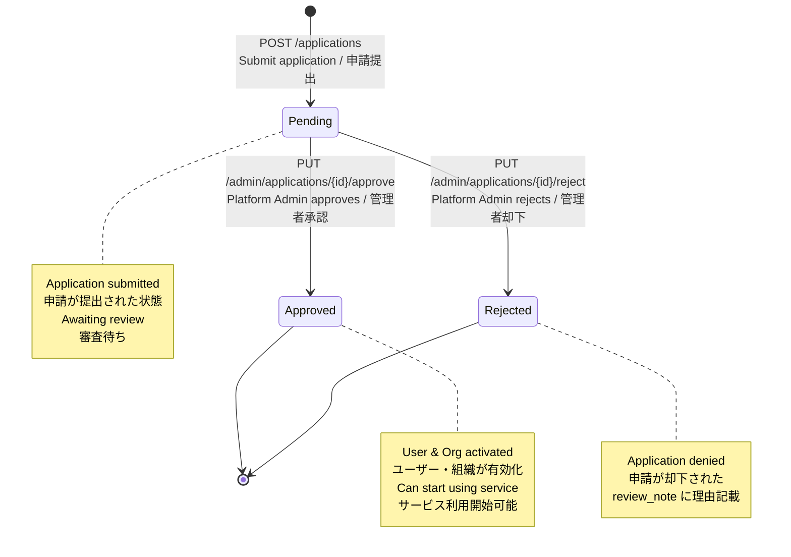
```mermaid
stateDiagram-v2
    [*] --> Pending: POST /applications<br/>Submit application / 申請提出

    Pending --> Approved: PUT /admin/applications/{id}/approve<br/>Platform Admin approves / 管理者承認
    Pending --> Rejected: PUT /admin/applications/{id}/reject<br/>Platform Admin rejects / 管理者却下

    Approved --> [*]
    Rejected --> [*]

    note right of Pending
        Application submitted
        申請が提出された状態
        Awaiting review
        審査待ち
    end note

    note right of Approved
        User & Org activated
        ユーザー・組織が有効化
        Can start using service
        サービス利用開始可能
    end note

    note right of Rejected
        Application denied
        申請が却下された
        review_note に理由記載
    end note
```

### 1.1.1 Approval Process / 承認時の処理フロー

**POST /admin/applications/{id}/approve**

承認時は以下の処理を **1トランザクション (RPC)** で実行:

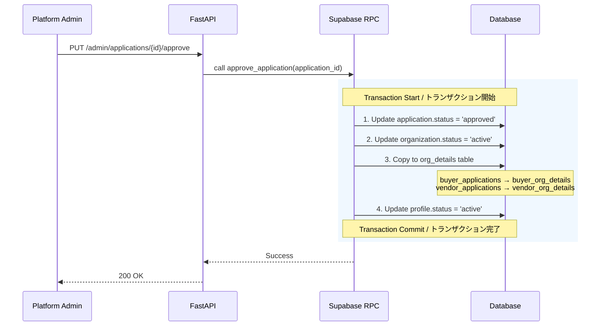
```mermaid
sequenceDiagram
    participant Admin as Platform Admin
    participant API as FastAPI
    participant RPC as Supabase RPC
    participant DB as Database

    Admin->>API: PUT /admin/applications/{id}/approve
    API->>RPC: call approve_application(application_id)

    rect rgb(240, 248, 255)
        Note over RPC,DB: Transaction Start / トランザクション開始
        RPC->>DB: 1. Update application.status = 'approved'
        RPC->>DB: 2. Update organization.status = 'active'
        RPC->>DB: 3. Copy to org_details table
        Note over DB: buyer_applications → buyer_org_details<br/>vendor_applications → vendor_org_details
        RPC->>DB: 4. Update profile.status = 'active'
        Note over RPC,DB: Transaction Commit / トランザクション完了
    end

    RPC-->>API: Success
    API-->>Admin: 200 OK
```

**Data Copy Details / データコピー詳細:**

| Source (申請) | Destination (組織詳細) |
|--------------|----------------------|
| `buyer_applications.industry` | `buyer_org_details.industry` |
| `buyer_applications.employee_count` | `buyer_org_details.employee_count` |
| `buyer_applications.purpose` | `buyer_org_details.purpose` |
| `vendor_applications.industry` | `vendor_org_details.industry` |
| `vendor_applications.employee_count` | `vendor_org_details.employee_count` |
| `vendor_applications.business_description` | `vendor_org_details.business_description` |
| `vendor_applications.service_description` | `vendor_org_details.service_description` |
| `vendor_applications.website_url` | `vendor_org_details.website_url` |

### 1.1.2 Rejection Process / 却下時の処理フロー

**POST /admin/applications/{id}/reject**

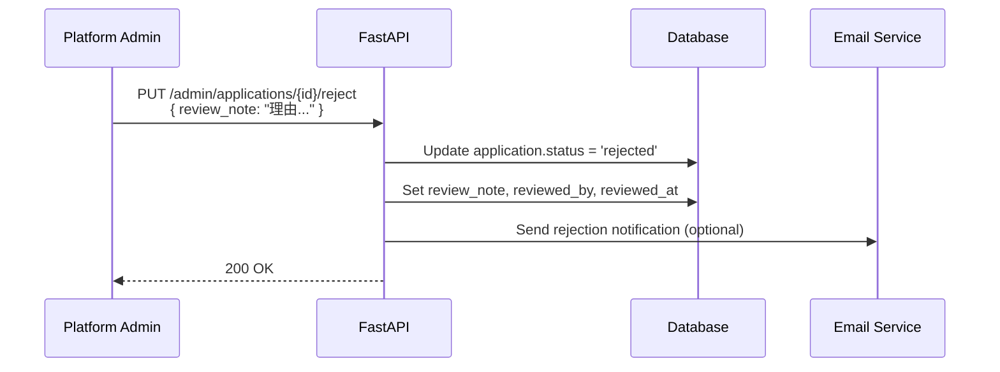
```mermaid
sequenceDiagram
    participant Admin as Platform Admin
    participant API as FastAPI
    participant DB as Database
    participant Email as Email Service

    Admin->>API: PUT /admin/applications/{id}/reject<br/>{ review_note: "理由..." }
    API->>DB: Update application.status = 'rejected'
    API->>DB: Set review_note, reviewed_by, reviewed_at
    API->>Email: Send rejection notification (optional)
    API-->>Admin: 200 OK
```

**Rejection does NOT change / 却下時に変更しないもの:**
- `organizations.status` (remains 'pending')
- `profiles.status` (remains 'pending')

**Note:** Rejected users can re-apply with a new application.
却下されたユーザーは新しい申請で再申請可能。

---

## 1.2 Invitation State Transitions / 招待の状態遷移

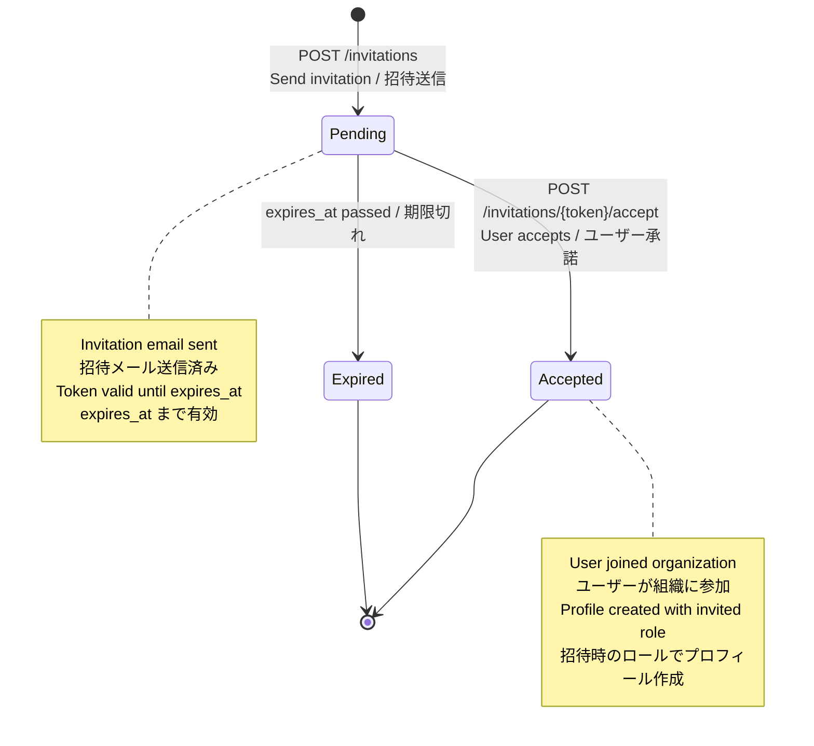
```mermaid
stateDiagram-v2
    [*] --> Pending: POST /invitations<br/>Send invitation / 招待送信

    Pending --> Accepted: POST /invitations/{token}/accept<br/>User accepts / ユーザー承諾
    Pending --> Expired: expires_at passed / 期限切れ

    Accepted --> [*]
    Expired --> [*]

    note right of Pending
        Invitation email sent
        招待メール送信済み
        Token valid until expires_at
        expires_at まで有効
    end note

    note right of Accepted
        User joined organization
        ユーザーが組織に参加
        Profile created with invited role
        招待時のロールでプロフィール作成
    end note
```

### 1.2.1 Invitation Accept Process / 招待承諾時の処理

**POST /invitations/{token}/accept**

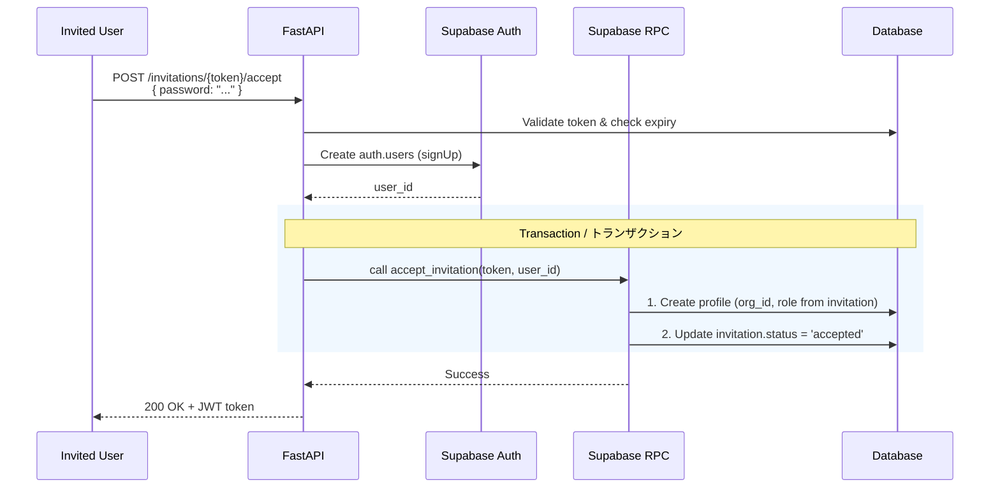
```mermaid
sequenceDiagram
    participant User as Invited User
    participant API as FastAPI
    participant Auth as Supabase Auth
    participant RPC as Supabase RPC
    participant DB as Database

    User->>API: POST /invitations/{token}/accept<br/>{ password: "..." }
    API->>DB: Validate token & check expiry
    API->>Auth: Create auth.users (signUp)
    Auth-->>API: user_id

    rect rgb(240, 248, 255)
        Note over API,DB: Transaction / トランザクション
        API->>RPC: call accept_invitation(token, user_id)
        RPC->>DB: 1. Create profile (org_id, role from invitation)
        RPC->>DB: 2. Update invitation.status = 'accepted'
    end

    RPC-->>API: Success
    API-->>User: 200 OK + JWT token
```

---

## 1.3 Self-Signup Process / 新規登録フロー

新規Buyer/Vendorが自己登録する際の処理フロー。複数テーブルを作成するため **RPC** でトランザクション管理。

**POST /auth/signup**

### 1.3.1 Signup Sequence / 登録シーケンス

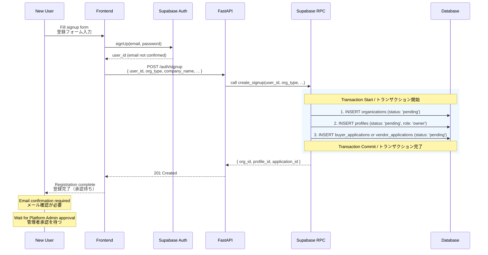
```mermaid
sequenceDiagram
    participant User as New User
    participant FE as Frontend
    participant Auth as Supabase Auth
    participant API as FastAPI
    participant RPC as Supabase RPC
    participant DB as Database

    User->>FE: Fill signup form<br/>登録フォーム入力
    FE->>Auth: signUp(email, password)
    Auth-->>FE: user_id (email not confirmed)

    FE->>API: POST /auth/signup<br/>{ user_id, org_type, company_name, ... }
    API->>RPC: call create_signup(user_id, org_type, ...)

    rect rgb(240, 248, 255)
        Note over RPC,DB: Transaction Start / トランザクション開始
        RPC->>DB: 1. INSERT organizations (status: 'pending')
        RPC->>DB: 2. INSERT profiles (status: 'pending', role: 'owner')
        RPC->>DB: 3. INSERT buyer_applications or vendor_applications (status: 'pending')
        Note over RPC,DB: Transaction Commit / トランザクション完了
    end

    RPC-->>API: { org_id, profile_id, application_id }
    API-->>FE: 201 Created
    FE-->>User: Registration complete<br/>登録完了（承認待ち）

    Note over User: Email confirmation required<br/>メール確認が必要
    Note over User: Wait for Platform Admin approval<br/>管理者承認を待つ
```

### 1.3.2 Created Records / 作成されるレコード

| Table | Key Fields | Status | Notes |
|-------|------------|--------|-------|
| `auth.users` | id, email | - | Created by Supabase Auth |
| `organizations` | id, name, type | `pending` | type = 'buyer' or 'vendor' |
| `profiles` | id (= auth.users.id), org_id | `pending` | role = 'owner' |
| `buyer_applications` | org_id, company_name, ... | `pending` | Only if type = 'buyer' |
| `vendor_applications` | org_id, company_name, ... | `pending` | Only if type = 'vendor' |

### 1.3.3 Request Body / リクエストボディ

**Buyer Signup:**
```json
{
  "user_id": "uuid",
  "org_type": "buyer",
  "company_name": "株式会社サンプル",
  "contact_email": "contact@example.com",
  "display_name": "山田太郎",
  "industry": "製造業",
  "employee_count": "100-500",
  "purpose": "サービス選定のため"
}
```

**Vendor Signup:**
```json
{
  "user_id": "uuid",
  "org_type": "vendor",
  "company_name": "株式会社ベンダー",
  "contact_email": "contact@vendor.com",
  "display_name": "鈴木花子",
  "industry": "IT・ソフトウェア",
  "employee_count": "50-100",
  "business_description": "クラウドサービスの開発・提供",
  "service_description": "SaaS型業務管理システム",
  "website_url": "https://vendor.example.com"
}
```

### 1.3.4 Post-Signup Flow / 登録後のフロー

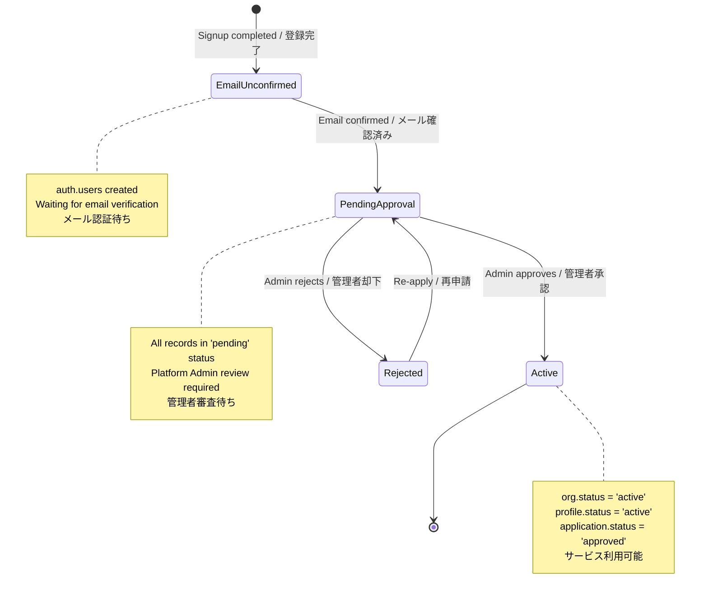
```mermaid
stateDiagram-v2
    [*] --> EmailUnconfirmed: Signup completed / 登録完了

    EmailUnconfirmed --> PendingApproval: Email confirmed / メール確認済み

    PendingApproval --> Active: Admin approves / 管理者承認
    PendingApproval --> Rejected: Admin rejects / 管理者却下

    Rejected --> PendingApproval: Re-apply / 再申請

    Active --> [*]

    note right of EmailUnconfirmed
        auth.users created
        Waiting for email verification
        メール認証待ち
    end note

    note right of PendingApproval
        All records in 'pending' status
        Platform Admin review required
        管理者審査待ち
    end note

    note right of Active
        org.status = 'active'
        profile.status = 'active'
        application.status = 'approved'
        サービス利用可能
    end note
```

### 1.3.5 Error Handling / エラーハンドリング

| Error | Handling | Notes |
|-------|----------|-------|
| Email already exists | Return 409 Conflict | Supabase Auth handles this |
| Auth user created but RPC fails | Rollback: Delete auth.users | API must handle cleanup |
| Duplicate company name | Allow (not unique constraint) | Same company can have multiple applications |

**Important:** If the RPC transaction fails after auth.users is created, the API must delete the auth.users record to maintain consistency.

RPCトランザクションが失敗した場合、APIは auth.users レコードを削除して整合性を保つ必要がある。

---

## 1.4 Role Change / ロール変更

組織内でのメンバーロール変更処理。

**Roles / ロール:**
- `owner`: 組織オーナー（1組織に1人のみ）
- `admin`: 管理者（複数可）
- `member`: 一般メンバー（複数可）

### 1.4.1 Role Hierarchy / ロール階層

```
owner (最高権限)
  ↓ can manage
admin (管理権限)
  ↓ can manage
member (一般権限)
```

### 1.4.2 Permission Matrix / 権限マトリクス

| Action | owner | admin | member |
|--------|-------|-------|--------|
| Change member → admin | ✅ | ✅ | ❌ |
| Change admin → member | ✅ | ❌ | ❌ |
| Change admin → owner | ✅ | ❌ | ❌ |
| Remove member | ✅ | ✅ | ❌ |
| Remove admin | ✅ | ❌ | ❌ |
| Transfer ownership | ✅ | ❌ | ❌ |

### 1.4.3 Standard Role Change / 通常のロール変更

**PUT /organizations/{org_id}/members/{user_id}/role**

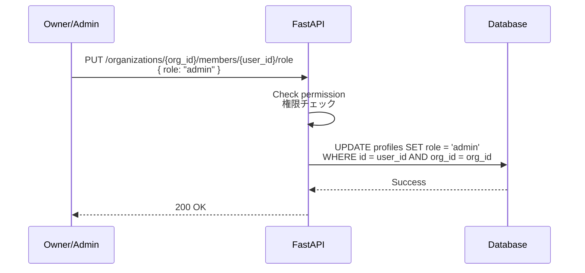
```mermaid
sequenceDiagram
    participant Admin as Owner/Admin
    participant API as FastAPI
    participant DB as Database

    Admin->>API: PUT /organizations/{org_id}/members/{user_id}/role<br/>{ role: "admin" }
    API->>API: Check permission<br/>権限チェック
    API->>DB: UPDATE profiles SET role = 'admin'<br/>WHERE id = user_id AND org_id = org_id
    DB-->>API: Success
    API-->>Admin: 200 OK
```

**Constraints / 制約:**
- Cannot change own role / 自分のロールは変更不可
- Cannot change to `owner` (use transfer instead) / `owner` への変更は不可（移譲を使用）

### 1.4.4 Owner Transfer / オーナー移譲

**POST /organizations/{org_id}/transfer-ownership**

オーナー権限を別メンバーに移譲。**RPC** でトランザクション管理。

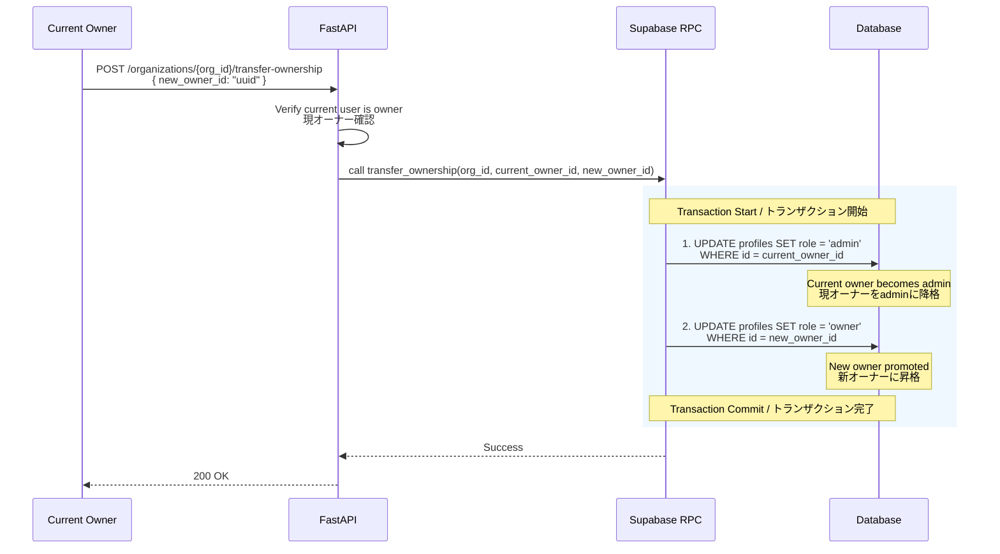
```mermaid
sequenceDiagram
    participant Owner as Current Owner
    participant API as FastAPI
    participant RPC as Supabase RPC
    participant DB as Database

    Owner->>API: POST /organizations/{org_id}/transfer-ownership<br/>{ new_owner_id: "uuid" }
    API->>API: Verify current user is owner<br/>現オーナー確認

    API->>RPC: call transfer_ownership(org_id, current_owner_id, new_owner_id)

    rect rgb(240, 248, 255)
        Note over RPC,DB: Transaction Start / トランザクション開始
        RPC->>DB: 1. UPDATE profiles SET role = 'admin'<br/>WHERE id = current_owner_id
        Note over DB: Current owner becomes admin<br/>現オーナーをadminに降格
        RPC->>DB: 2. UPDATE profiles SET role = 'owner'<br/>WHERE id = new_owner_id
        Note over DB: New owner promoted<br/>新オーナーに昇格
        Note over RPC,DB: Transaction Commit / トランザクション完了
    end

    RPC-->>API: Success
    API-->>Owner: 200 OK
```

**Constraints / 制約:**
- Only current owner can transfer / 現オーナーのみ実行可能
- New owner must be existing member of the organization / 新オーナーは組織の既存メンバーである必要あり
- New owner must have `active` status / 新オーナーは `active` ステータスである必要あり
- Transaction ensures exactly one owner / トランザクションで必ず1人のオーナーを保証

### 1.4.5 Role Change State Diagram / ロール変更状態図

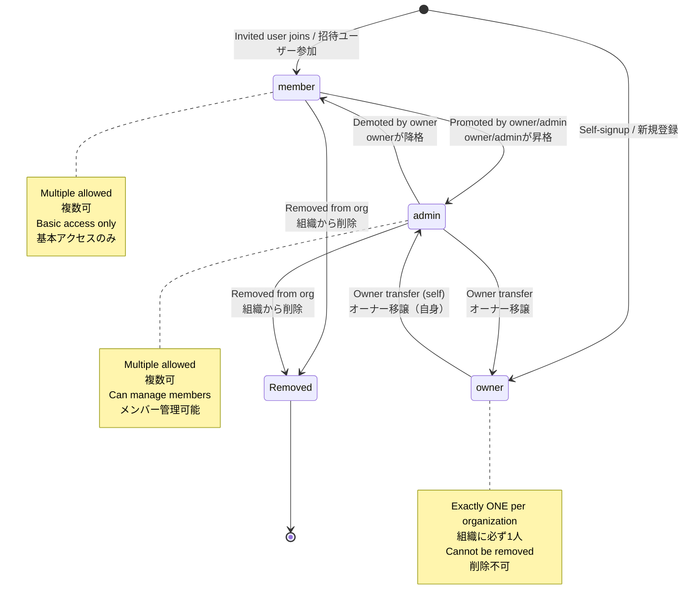
```mermaid
stateDiagram-v2
    [*] --> member: Invited user joins / 招待ユーザー参加
    [*] --> owner: Self-signup / 新規登録

    member --> admin: Promoted by owner/admin<br/>owner/adminが昇格
    admin --> member: Demoted by owner<br/>ownerが降格

    admin --> owner: Owner transfer<br/>オーナー移譲
    owner --> admin: Owner transfer (self)<br/>オーナー移譲（自身）

    member --> Removed: Removed from org<br/>組織から削除
    admin --> Removed: Removed from org<br/>組織から削除

    Removed --> [*]

    note right of owner
        Exactly ONE per organization
        組織に必ず1人
        Cannot be removed
        削除不可
    end note

    note right of admin
        Multiple allowed
        複数可
        Can manage members
        メンバー管理可能
    end note

    note right of member
        Multiple allowed
        複数可
        Basic access only
        基本アクセスのみ
    end note
```

### 1.4.6 Error Cases / エラーケース

| Error | HTTP Status | Condition |
|-------|-------------|-----------|
| Forbidden | 403 | Insufficient permission to change role / ロール変更権限なし |
| Bad Request | 400 | Cannot change own role / 自分のロールは変更不可 |
| Bad Request | 400 | Cannot directly assign owner role / owner ロールは直接割当不可 |
| Not Found | 404 | Target user not in organization / 対象ユーザーが組織に存在しない |
| Conflict | 409 | Target user is the only owner / 対象が唯一のオーナー |

---

## 1.5 Account Suspension / アカウント停止

Platform Admin による組織・ユーザーの停止処理。

### 1.5.1 Organization Status / 組織ステータス

| Status | Description | User Can Login |
|--------|-------------|----------------|
| `active` | 正常稼働中 | ✅ Yes |
| `pending` | 承認待ち | ❌ No |
| `inactive` | 非アクティブ（自主停止） | ❌ No |
| `suspended` | 停止（管理者による） | ❌ No |

### 1.5.2 Suspend Organization / 組織停止

**PUT /admin/organizations/{org_id}/suspend**

Platform Admin が組織を停止。配下の全ユーザーがログイン不可になる。

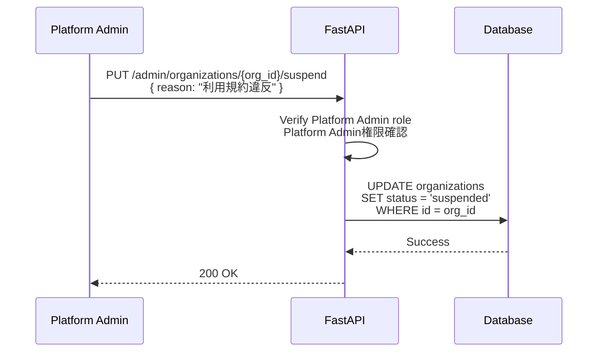
```mermaid
sequenceDiagram
    participant Admin as Platform Admin
    participant API as FastAPI
    participant DB as Database

    Admin->>API: PUT /admin/organizations/{org_id}/suspend<br/>{ reason: "利用規約違反" }
    API->>API: Verify Platform Admin role<br/>Platform Admin権限確認
    API->>DB: UPDATE organizations<br/>SET status = 'suspended'<br/>WHERE id = org_id
    DB-->>API: Success
    API-->>Admin: 200 OK
```

**Effects / 影響:**
- `organizations.status = 'suspended'`
- 配下の全ユーザーがログイン時に 403 Forbidden
- 進行中のプロジェクトは閲覧のみ可能（操作不可）
- `profiles.status` は変更しない（組織レベルで制御）

### 1.5.3 Reactivate Organization / 組織再開

**PUT /admin/organizations/{org_id}/reactivate**

停止した組織を再開。

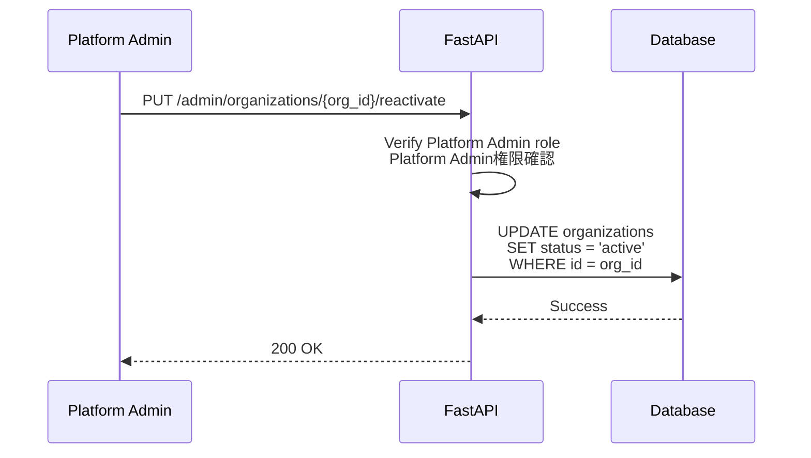
```mermaid
sequenceDiagram
    participant Admin as Platform Admin
    participant API as FastAPI
    participant DB as Database

    Admin->>API: PUT /admin/organizations/{org_id}/reactivate
    API->>API: Verify Platform Admin role<br/>Platform Admin権限確認
    API->>DB: UPDATE organizations<br/>SET status = 'active'<br/>WHERE id = org_id
    DB-->>API: Success
    API-->>Admin: 200 OK
```

### 1.5.4 Organization Status State Diagram / 組織ステータス状態図

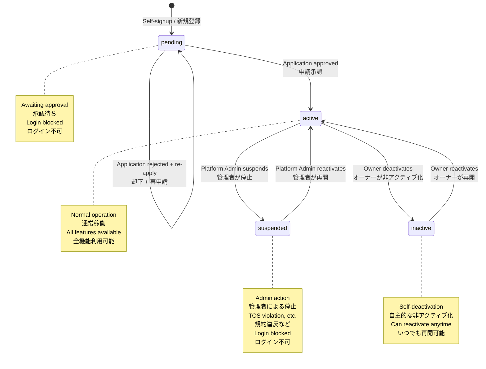
```mermaid
stateDiagram-v2
    [*] --> pending: Self-signup / 新規登録

    pending --> active: Application approved<br/>申請承認
    pending --> pending: Application rejected + re-apply<br/>却下 + 再申請

    active --> suspended: Platform Admin suspends<br/>管理者が停止
    active --> inactive: Owner deactivates<br/>オーナーが非アクティブ化

    suspended --> active: Platform Admin reactivates<br/>管理者が再開

    inactive --> active: Owner reactivates<br/>オーナーが再開

    note right of pending
        Awaiting approval
        承認待ち
        Login blocked
        ログイン不可
    end note

    note right of active
        Normal operation
        通常稼働
        All features available
        全機能利用可能
    end note

    note right of suspended
        Admin action
        管理者による停止
        TOS violation, etc.
        規約違反など
        Login blocked
        ログイン不可
    end note

    note right of inactive
        Self-deactivation
        自主的な非アクティブ化
        Can reactivate anytime
        いつでも再開可能
    end note
```

### 1.5.5 Login Check Flow / ログイン時チェックフロー

ユーザーログイン時に組織ステータスをチェック。

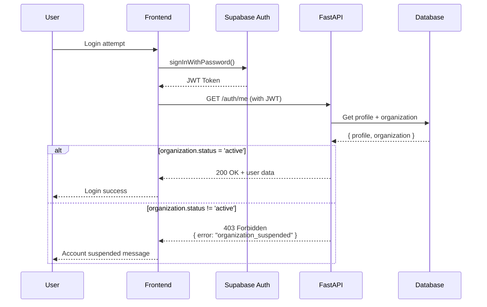
```mermaid
sequenceDiagram
    participant User
    participant FE as Frontend
    participant Auth as Supabase Auth
    participant API as FastAPI
    participant DB as Database

    User->>FE: Login attempt
    FE->>Auth: signInWithPassword()
    Auth-->>FE: JWT Token

    FE->>API: GET /auth/me (with JWT)
    API->>DB: Get profile + organization
    DB-->>API: { profile, organization }

    alt organization.status = 'active'
        API-->>FE: 200 OK + user data
        FE-->>User: Login success
    else organization.status != 'active'
        API-->>FE: 403 Forbidden<br/>{ error: "organization_suspended" }
        FE-->>User: Account suspended message
    end
```

### 1.5.6 Suspension Reasons / 停止理由

| Reason Code | Description |
|-------------|-------------|
| `tos_violation` | Terms of Service violation / 利用規約違反 |
| `payment_issue` | Payment failure / 支払い問題 |
| `security_concern` | Security incident / セキュリティ懸念 |
| `admin_request` | Administrative action / 管理上の措置 |
| `other` | Other reasons / その他 |

### 1.5.7 API Summary / API一覧

| Method | Endpoint | Actor | Description |
|--------|----------|-------|-------------|
| PUT | `/admin/organizations/{id}/suspend` | Platform Admin | Suspend organization |
| PUT | `/admin/organizations/{id}/reactivate` | Platform Admin | Reactivate organization |
| PUT | `/organizations/{id}/deactivate` | Owner | Self-deactivate (inactive) |
| PUT | `/organizations/{id}/activate` | Owner | Self-reactivate |

---

## 1.6 Member Removal / メンバー削除

組織からメンバーを削除する処理。

### 1.6.1 Removal Rules / 削除ルール

| Target Role | Can be removed by | Notes |
|-------------|-------------------|-------|
| `member` | owner, admin | 一般メンバーは owner/admin が削除可能 |
| `admin` | owner only | 管理者は owner のみ削除可能 |
| `owner` | ❌ Cannot remove | オーナーは削除不可（先に移譲が必要） |

### 1.6.2 Remove Member / メンバー削除

**DELETE /organizations/{org_id}/members/{user_id}**

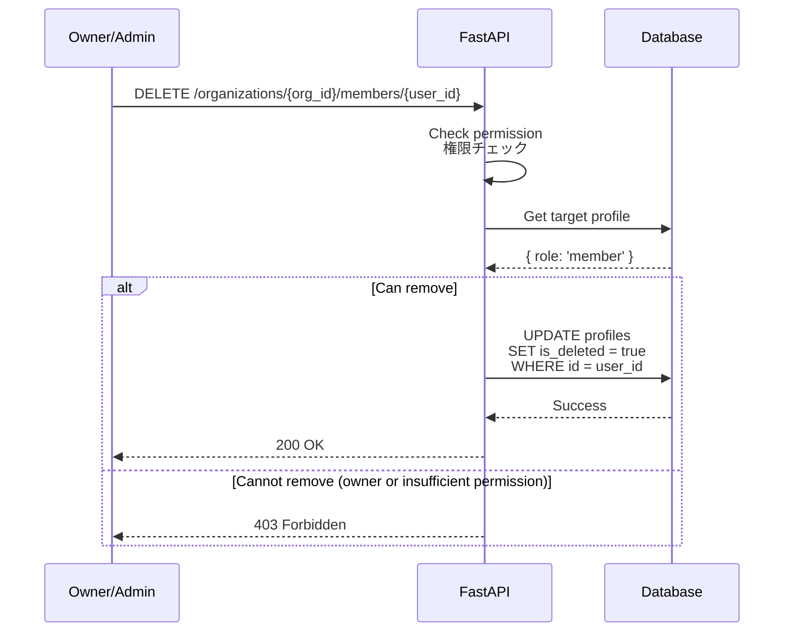
```mermaid
sequenceDiagram
    participant Admin as Owner/Admin
    participant API as FastAPI
    participant DB as Database

    Admin->>API: DELETE /organizations/{org_id}/members/{user_id}
    API->>API: Check permission<br/>権限チェック
    API->>DB: Get target profile
    DB-->>API: { role: 'member' }

    alt Can remove
        API->>DB: UPDATE profiles<br/>SET is_deleted = true<br/>WHERE id = user_id
        DB-->>API: Success
        API-->>Admin: 200 OK
    else Cannot remove (owner or insufficient permission)
        API-->>Admin: 403 Forbidden
    end
```

### 1.6.3 Soft Delete vs Hard Delete / 論理削除 vs 物理削除

**方針: Soft Delete（論理削除）**

| Table | Action | Reason |
|-------|--------|--------|
| `profiles` | `is_deleted = true` | 監査ログ、データ整合性のため |
| `auth.users` | Keep (no deletion) | 再登録時のメール重複防止 |
| `chat_messages` | Keep (no deletion) | メッセージ履歴の保持 |
| `chat_room_members` | `is_deleted = true` | チャットルームから退出扱い |

**Note:** 完全削除が必要な場合は、別途「アカウント完全削除」機能として実装。

### 1.6.4 Post-Removal Effects / 削除後の影響

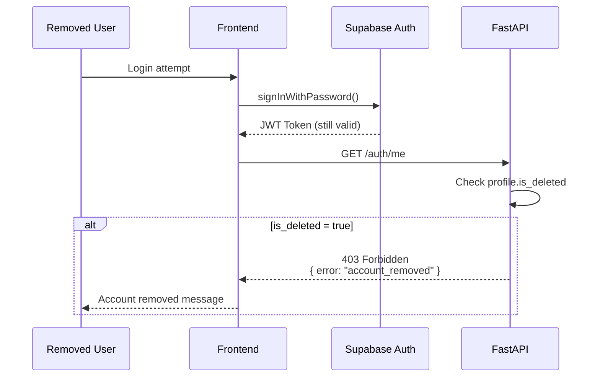
```mermaid
sequenceDiagram
    participant Removed as Removed User
    participant FE as Frontend
    participant Auth as Supabase Auth
    participant API as FastAPI

    Removed->>FE: Login attempt
    FE->>Auth: signInWithPassword()
    Auth-->>FE: JWT Token (still valid)

    FE->>API: GET /auth/me
    API->>API: Check profile.is_deleted

    alt is_deleted = true
        API-->>FE: 403 Forbidden<br/>{ error: "account_removed" }
        FE-->>Removed: Account removed message
    end
```

**Effects / 影響:**
- 削除されたユーザーはログイン不可
- 過去のチャットメッセージは表示される（送信者名は残る）
- プロジェクト作成者などの `created_by` は保持

### 1.6.5 Self-Removal / 自主退会

**DELETE /organizations/{org_id}/members/me**

メンバー自身が組織から退会。

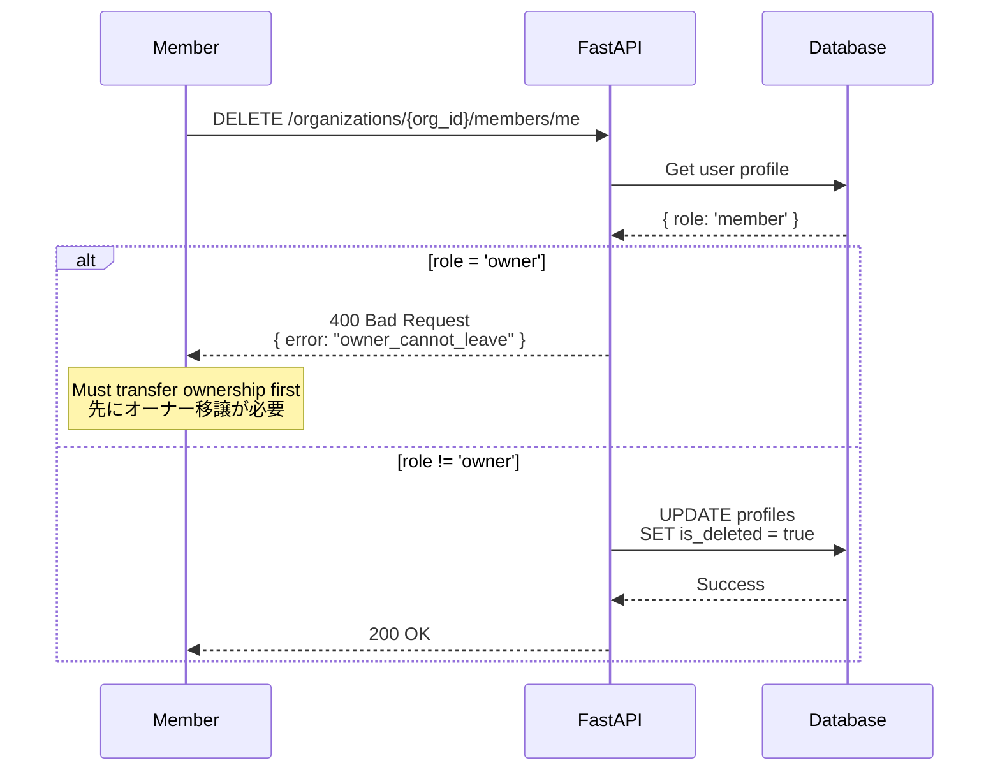
```mermaid
sequenceDiagram
    participant User as Member
    participant API as FastAPI
    participant DB as Database

    User->>API: DELETE /organizations/{org_id}/members/me
    API->>DB: Get user profile
    DB-->>API: { role: 'member' }

    alt role = 'owner'
        API-->>User: 400 Bad Request<br/>{ error: "owner_cannot_leave" }
        Note over User: Must transfer ownership first<br/>先にオーナー移譲が必要
    else role != 'owner'
        API->>DB: UPDATE profiles<br/>SET is_deleted = true
        DB-->>API: Success
        API-->>User: 200 OK
    end
```

### 1.6.6 Error Cases / エラーケース

| Error | HTTP Status | Condition |
|-------|-------------|-----------|
| Forbidden | 403 | Insufficient permission / 削除権限なし |
| Forbidden | 403 | Admin trying to remove another admin / adminが他のadminを削除 |
| Forbidden | 403 | Trying to remove owner / ownerを削除しようとした |
| Bad Request | 400 | Owner trying to leave / ownerが自主退会しようとした |
| Not Found | 404 | User not in organization / 対象が組織に存在しない |

### 1.6.7 API Summary / API一覧

| Method | Endpoint | Actor | Description |
|--------|----------|-------|-------------|
| DELETE | `/organizations/{org_id}/members/{user_id}` | owner, admin | Remove member |
| DELETE | `/organizations/{org_id}/members/me` | member, admin | Self-removal (leave org) |

---

[← Back to Workflows Index / ワークフロー目次に戻る](./index.md)
